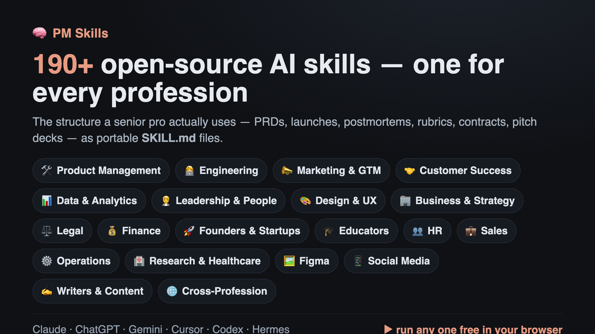
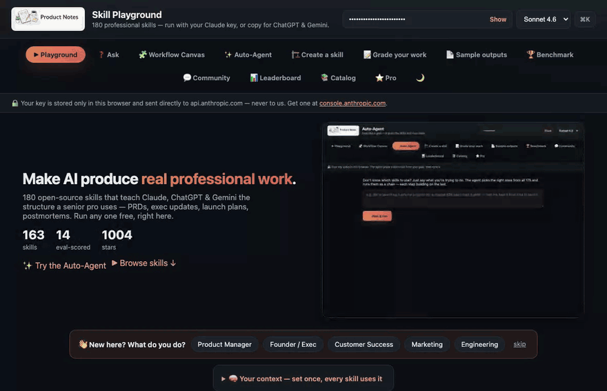
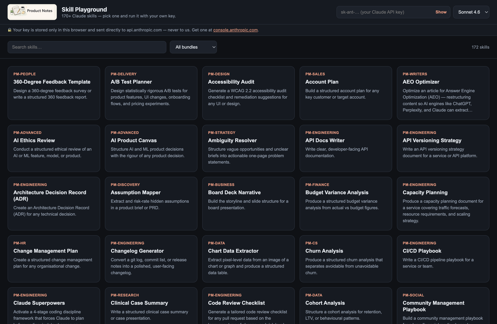

<p align="center">
  <a href="https://mohitagw15856.github.io/pm-claude-skills/">
    
  </a>
</p>

# 🧠 PM Skills — 205 Professional Agent Skills for Claude, ChatGPT, Gemini, Cursor, Codex & Hermes

<p align="center">
  <a href="https://mohitagw15856.github.io/pm-claude-skills/">
    
  </a>
</p>

> **Generic AI gives you filler. These give you the structure a senior pro actually uses** — PRDs, exec updates, launch plans, postmortems — as open-source `SKILL.md` files. Across **21 professions**, not just product management. One source, every AI tool.

[](https://github.com/mohitagw15856/pm-claude-skills/stargazers)
[](https://www.npmjs.com/package/pm-claude-skills)
[](https://www.npmjs.com/package/pm-claude-skills)
[](https://github.com/mohitagw15856/pm-claude-skills)
[](agents/)
[](commands/)
[](output-styles/)
[](#-works-with--cross-tool-compatibility)
[](.github/workflows/skillcheck.yml)
[](.github/workflows/skill-audit.yml)
[](https://github.com/mohitagw15856/pm-claude-skills/releases)
[](https://github.com/mohitagw15856/pm-claude-skills#-quick-install-2-minutes)
[](LICENSE)
[](https://github.com/sponsors/mohitagw15856)

### ⭐ If this saves you time, [star the repo](https://github.com/mohitagw15856/pm-claude-skills) — it's the #1 way to help others find it.

> **PM stands for Professional, not just Product Management.**
> 205 professional skills + 4 agent templates across 28 bundles covering 21 professions. Built for Claude Code — and now portable to ChatGPT, Gemini, and Hermes Agent. Built by a PM, used by everyone.

A community-built library of professional skills for every field — product management, engineering, customer success, marketing, social media, writers, design, legal, finance, HR, sales, operations, research, and more. Each skill is a structured `SKILL.md` file that teaches an AI assistant how to produce professional-grade outputs for your workflows. Skills run natively in **Claude Code** and **Hermes Agent** (same open `SKILL.md` standard), and ship as ready-to-paste exports for **ChatGPT** and **Gemini** — see [Works With](#-works-with--cross-tool-compatibility).

**🆕 Latest release (v26.0.0 — the Creator stack):** a new **🎬 [`pm-creator`](plugins/pm-creator)** bundle for content creators — `content-repurposer` (one piece → thread + LinkedIn + newsletter + carousel + Reel), `hook-writer`, `short-form-script`, `newsletter-writer`, `creator-brand-kit`, `creator-media-kit` — plus a **`/repurpose`** workflow, a **🔥 Viral Score** mode in the [Grade tool](https://mohitagw15856.github.io/pm-claude-skills/grade.html) (score any hook/post for reach), and tie-in with **[ContentGoldMine](https://github.com/mohitagw15856/ContentGoldMine)**, the app that automates the whole pipeline. Builds on v25 (the `skills` CLI, meta-skill, related-skills graph, Learn page). **205 skills**, 20 eval-scored. See the [changelog](#-changelog).

### ▶ See it in action — [try the live Skill Playground](https://mohitagw15856.github.io/pm-claude-skills/)

<!-- Demo GIF generated by web/docs-assets/record-demo.mjs (Playwright). The streamed
     output is a representative mock so no API key is needed; re-run with a live key
     for a real call. Static fallback: web/docs-assets/playground.png -->
[](https://mohitagw15856.github.io/pm-claude-skills/)

<sub>👆 Pick any skill, fill a short form, and run it with your own key — no install required.</sub>

---

## 👋 New here? Start in 30 seconds

**The problem:** Ask any AI for a PRD, an exec update, or a launch plan and you get *generic* — plausible-sounding filler you still have to rewrite from scratch. The model doesn't know what "good" actually looks like for professional work.

**What this fixes:** Each skill is a battle-tested `SKILL.md` that teaches the AI the real structure, rigour, and judgement a senior professional uses — so the first draft is one you can *ship*, not one you have to redo.

**Try these 5 first** — no install needed, run them right in the [live Playground](https://mohitagw15856.github.io/pm-claude-skills/):

| Skill | Give it… | Get back… |
|-------|----------|-----------|
| 📊 [Executive Update](skills/executive-update) | messy progress notes | a tight 250-word briefing for your CEO or board |
| 📋 [PRD Template](skills/prd-template) | a vague feature idea | a structured PRD with scope, success metrics & risks |
| 🎯 [RICE Prioritisation](skills/rice-prioritisation) | a pile of backlog ideas | a ranked, defensible priority list |
| 🔭 [Competitor Teardown](skills/competitor-teardown) | "what are rivals up to?" | a positioning map, feature gaps & strategy |
| 📝 [Meeting Notes](skills/meeting-notes) | a raw transcript | decisions, owners & next steps |

→ Want proof first? See [**real sample outputs**](https://mohitagw15856.github.io/pm-claude-skills/examples.html) from each skill. Like what you see? [**Install in 2 minutes**](#-quick-install-2-minutes) · [browse all 205 skills](#️-all-205-skills) · [**⭐ star the repo**](https://github.com/mohitagw15856/pm-claude-skills/stargazers) so others find it.

---

## 🔄 One library, the whole professional workflow

These 205 skills aren't a random catalog — they cover the **full arc of professional work**, end to end. Wherever you are in the loop, there's a skill for it:


| Phase | What you're doing | Start with these skills |
|-------|-------------------|--------------------------|
| **🔍 Discover** | Frame the problem, research, validate | `ambiguity-resolver` · `user-research-synthesis` · `competitive-analysis` · `discovery-interview-guide` |
| **🎯 Decide** | Prioritise, spec, set goals | `rice-prioritisation` · `prd-template` · `okr-builder` · `roadmap-narrative` |
| **🔨 Build** | Design & engineer the work | `technical-spec-template` · `design-critique` · `sprint-planning` · `architecture-decision-record` |
| **🚀 Ship** | Launch & release | `go-to-market` · `launch-readiness` · `product-launch-checklist` · `runbook-writer` |
| **📊 Measure** | Track outcomes & analyse | `metrics-framework` · `cohort-analysis` · `ab-test-planner` · `churn-analysis` |
| **📣 Communicate** | Report up and out | `executive-update` · `board-deck-narrative` · `stakeholder-update` · `qbr-deck` |

> New here? Start with the [**top-tier skills**](#️-skill-tiers--start-with-the-strongest), or jump straight to [**all 205 skills**](#️-all-205-skills) grouped by profession.

---

## 🧩 Workflow Recipes — chain skills into one flow

Individual skills are great. **Chaining** them is the superpower. A *recipe* runs several skills in sequence and **passes each output forward as context** — so a fuzzy idea comes out the other end as a finished, joined-up set of artifacts. No other skills library chains across professions like this.

```
/ship-a-feature  "a referral program for B2B users"

  ambiguity-resolver → prd-template → rice-prioritisation → roadmap-narrative → go-to-market
   frame the problem    spec it        prioritise it        place on roadmap     launch plan
        └──────────────── each stage's output feeds the next ────────────────┘
```

| Recipe | What it does | Lifecycle |
|--------|--------------|-----------|
| `/ship-a-feature` | idea → PRD → priority → roadmap → launch plan | Discover → Ship |
| `/close-the-quarter` | metrics → churn → exec update → board deck | Measure → Communicate |
| `/launch-a-product` | competitors → positioning → GTM → checklist → press release | Decide → Ship |
| `/rescue-an-account` | health score → churn cause → escalation → renewal plan | Measure → Communicate |
| `/run-discovery` | frame → interview guide → synthesis → prioritise | Discover → Decide |

→ Full detail and how to add your own in [**WORKFLOWS.md**](WORKFLOWS.md). Recipes run as slash commands in Claude Code, or over MCP via the `get_workflow` tool.

**Got a coding question?** Just [**❓ Ask**](https://mohitagw15856.github.io/pm-claude-skills/ask.html) — an error, a regex, a git mess, a dependency conflict, *"what does this code do?"* — and the right developer skill answers instantly (like StackOverflow, but the answer's already written), with a one-click path to the community [Q&A](https://github.com/mohitagw15856/pm-claude-skills/discussions) for a human follow-up.

**Or build your own visually.** The [**Workflow Canvas**](https://mohitagw15856.github.io/pm-claude-skills/canvas.html) lets you drag any skills into a custom chain and run it in the browser — each step's output feeds the next. Like n8n, but for professional thinking. Don't know which skills to use? The [**✨ Auto-Agent**](https://mohitagw15856.github.io/pm-claude-skills/agent.html) takes a plain-English goal, **plans which skills to chain**, and runs them for you — each step feeding the next:

[](https://mohitagw15856.github.io/pm-claude-skills/agent.html)

[](https://mohitagw15856.github.io/pm-claude-skills/canvas.html)

---

## 🧠 Skill Memory — set your context once, every skill uses it

Generic output is the #1 complaint with AI. **Skill Memory** fixes it: tell the skills who you are *once*, and every skill and recipe produces output already tuned to your product, audience, and voice — no re-typing.

- **In Claude Code:** run [`/setup-context`](commands/setup-context.md) (or copy [`templates/pm-context.example.md`](templates/pm-context.example.md) → `pm-context.md`). Skills read it as standing context.
- **In the [Playground](https://mohitagw15856.github.io/pm-claude-skills/):** fill the **🧠 Your context** box — it's saved in your browser and prepended to every run.

```
Without context:  "write an exec update" → generic, you rewrite it
With context:      "write an exec update" → your voice, your metrics,
                    your audience — shippable on the first try
```

---

## 🤖 Run a skill from a GitHub comment (ChatOps)

This repo ships a [**Skill Bot**](.github/workflows/skill-bot.yml): comment on any issue or PR and a skill runs and replies inline.

```
/skill executive-update
Audience: CEO. Period: Q2. Shipped onboarding redesign; activation up; hiring behind plan.
```

The bot runs the skill and posts the result as a reply. `/skill list` shows usage. It's gated to repo collaborators (so random commenters can't trigger paid API calls) and needs an `ANTHROPIC_API_KEY` secret. Copy the workflow into your own repo to give your whole team skill-powered ChatOps.

---

## ✅ Eval-verified quality — not just quantity

**Grounded in canonical frameworks.** These aren't invented prompts — each skill encodes a proven method and cites it: RICE (Intercom), Jobs-to-be-Done (Christensen), Continuous Discovery (Teresa Torres), Porter's Five Forces, the Pyramid Principle (Minto), Google SRE, WCAG, *Obviously Awesome* (April Dunford), and more. The source shows as a **"📚 Based on"** line on every [skill page](https://mohitagw15856.github.io/pm-claude-skills/skill/rice-prioritisation.html) and in the Playground.

**And measured, not just claimed.** An [eval harness](evals/) runs each skill against a held-out test case, then an LLM judge (Opus 4.8) rates the output on four dimensions — **structure, completeness, usefulness, grounding** — averaged across two models. **15 skills are eval-scored** today (and climbing); the rest are reviewed against the [authoring standard](SKILL-AUTHORING-STANDARD.md).

**The loop actually catches bad skills.** A recent run flagged three skills scoring ~2/5 because they asked for missing inputs instead of delivering. We added a "work from a brief" rule, re-ran, and they jumped to **4.75/5**:

| Skill | Before | After |
|-------|:------:|:-----:|
| `go-to-market` | 🔴 2.0 | 🟢 **4.75** |
| `okr-builder` | 🔴 2.25 | 🟢 **4.75** |
| `roadmap-narrative` | 🟡 2.75 | 🟢 **4.75** |

That's not luck — it's a [self-improving pipeline](scripts/improve-skill.mjs) (`/improve`) that critiques and rewrites a skill, keeping the change only if the score goes up. See the [🏆 leaderboard](https://mohitagw15856.github.io/pm-claude-skills/leaderboard.html) for live scores; run it yourself with `node evals/run-evals.mjs`.

**See the difference for yourself.** The Playground's *Compare* toggle runs the same inputs with and without the skill, side by side — structured, shippable output on the left; generic mush on the right:

[](https://mohitagw15856.github.io/pm-claude-skills/)

**Already have a draft?** Flip on **📝 Critique mode** in the Playground — or use the standalone [**Grade your work**](https://mohitagw15856.github.io/pm-claude-skills/grade.html) tool — to paste an existing PRD/roadmap/update and get a rubric score, ranked gaps, and a redline graded against the skill's framework. Before you ship, run [**`/red-team`**](skills/red-team-review/SKILL.md) to stress-test the plan against a room of hostile expert personas.

This whole thing is an open, reproducible **[benchmark for AI professional work](https://mohitagw15856.github.io/pm-claude-skills/benchmark.html)** — and it's *eval-gated*: every contributed skill is auto-checked for structure and scored on the rubric. The easiest way to add one is **[Skill Studio](https://mohitagw15856.github.io/pm-claude-skills/studio.html)** — describe a skill in your browser, generate a compliant `SKILL.md`, and open a pull request in one click ([or use the form →](https://github.com/mohitagw15856/pm-claude-skills/issues/new?template=submit-skill.yml)).

---

## ⚖️ How it compares

Most skill repos are a folder of prompts. This one is a **system** — measured, composable, and usable in the browser:

| | **PM Skills** | Typical skill repo |
|---|:---:|:---:|
| Skills | **205**, across 21 professions | a handful → dozens, usually one domain |
| Quality | **eval-scored** on a rubric + a public [benchmark](https://mohitagw15856.github.io/pm-claude-skills/benchmark.html) | trust the README |
| Improves itself | ✅ eval → critique → rewrite (kept only if it scores higher) | ✗ |
| Grounded in frameworks | ✅ each cites its source (RICE, JTBD, Pyramid Principle…) | rarely |
| Run without installing | ✅ [browser playground](https://mohitagw15856.github.io/pm-claude-skills/) + your key | ✗ copy-paste |
| Compose / orchestrate | ✅ [recipes](WORKFLOWS.md), a [visual canvas](https://mohitagw15856.github.io/pm-claude-skills/canvas.html), an [auto-agent](https://mohitagw15856.github.io/pm-claude-skills/agent.html) | ✗ |
| Works beyond Claude | ✅ MCP · ChatGPT/Gemini exports · VS Code extension | usually one tool |
| Community | ✅ per-skill discussions + a [hub](https://mohitagw15856.github.io/pm-claude-skills/community.html) | issues only |

---

## Contents

- [👋 New here? Start in 30 seconds](#-new-here-start-in-30-seconds)
- [🔄 One library, the whole professional workflow](#-one-library-the-whole-professional-workflow)
- [🧩 Workflow Recipes — chain skills into one flow](#-workflow-recipes--chain-skills-into-one-flow)
- [🧠 Skill Memory — set your context once](#-skill-memory--set-your-context-once-every-skill-uses-it)
- [✅ Eval-verified quality](#-eval-verified-quality--not-just-quantity)
- [🚀 Quick Install](#-quick-install-2-minutes)
- [🔌 Works With — Cross-Tool Compatibility](#-works-with--cross-tool-compatibility)
- [🤖 Subagents & Slash Commands](#-subagents--slash-commands)
- [🌐 Skill Playground — try any skill in your browser](#-skill-playground--try-any-skill-in-your-browser)
- [📦 Plugin Directory](#-plugin-directory)
- [🤖 Building Blocks for Agent Templates](#-building-blocks-for-agent-templates)
- [🏷️ Skill Tiers — start with the strongest](#️-skill-tiers--start-with-the-strongest)
- [🗂️ All 205 Skills](#️-all-205-skills)
- [📋 Changelog](#-changelog)
- [🤝 Contributing](#-contributing--add-your-skill)
- [🔗 Related Projects](#-related-projects)

---

## 🚀 Quick Install (2 minutes)

**With the [`skills`](https://github.com/vercel-labs/skills) CLI** (the open agent-skills installer that works across Claude Code, Cursor, Codex, OpenCode & 60+ agents) — pick from all 205 interactively:

```bash
npx skills add mohitagw15856/pm-claude-skills            # browse & pick (auto-detects your agent)
npx skills add mohitagw15856/pm-claude-skills --list     # just preview the catalog
npx skills add mohitagw15856/pm-claude-skills --skill prd-template   # grab one
npx skills add mohitagw15856/pm-claude-skills --skill '*'            # install all 205
```

**Or our own installer** — via the [`pm-claude-skills`](https://www.npmjs.com/package/pm-claude-skills) npm package (Windows/macOS/Linux, needs Node), which also installs subagents, slash commands & cross-tool exports:

```bash
npx pm-claude-skills add --agent claude     # or: codex · cursor · hermes · openclaw
```

**Or one-line MCP** — make all 205 skills + 5 workflow recipes available in *every* session of any MCP client (Claude Code, Claude Desktop, Cursor, Windsurf), no per-file install:

```bash
claude mcp add pm-skills -- npx -y pm-claude-skills-mcp
```

Your assistant can then *"search the skills for churn"* or *"run the ship-a-feature workflow"* on demand. Details: [mcp/README.md](mcp/README.md).

**In [Claude Cowork](https://www.anthropic.com/claude)** — open the plugin browser → **Add from GitHub** → enter `mohitagw15856/pm-claude-skills`, then add the bundles you want. No CLI needed.

**In Claude Code**, run:

/plugin marketplace add mohitagw15856/pm-claude-skills

Or install by profession:

claude plugin install pm-essentials@pm-claude-skills     # Core PM + Word tracked changes

claude plugin install pm-delivery@pm-claude-skills       # Delivery + PowerPoint auditor

claude plugin install pm-engineering@pm-claude-skills    # Engineering (35 skills) 🆕

claude plugin install pm-cs@pm-claude-skills             # Customer Success 🆕

claude plugin install pm-data@pm-claude-skills           # Data + chart data extractor

claude plugin install pm-legal@pm-claude-skills          # Legal

claude plugin install pm-finance@pm-claude-skills        # Finance

claude plugin install pm-hr@pm-claude-skills             # HR

claude plugin install pm-sales@pm-claude-skills          # Sales

claude plugin install pm-operations@pm-claude-skills     # Operations

claude plugin install pm-research@pm-claude-skills       # Research & Healthcare

claude plugin install pm-cross@pm-claude-skills          # Cross-profession

claude plugin install pm-figma@pm-claude-skills          # Figma

claude plugin install pm-social@pm-claude-skills         # Social Media 🆕

claude plugin install pm-writers@pm-claude-skills        # Writers & Content Creators 🆕


Or clone and symlink for auto-updates:

git clone https://github.com/mohitagw15856/pm-claude-skills.git ~/pm-claude-skills
mkdir -p ~/.claude/skills
ln -s ~/pm-claude-skills/skills/* ~/.claude/skills/

---

## 🔌 Works With — Cross-Tool Compatibility

These skills were built for Claude Code, but they aren't locked to it. Each `SKILL.md` is
two portable parts: a small **frontmatter** block (`name` + `description`) and a
**markdown body** that is just a well-structured set of instructions and output templates.
The body is plain English — so it works anywhere a capable model reads instructions.

There are two kinds of support. **Native `SKILL.md` agents** read the file as-is and
auto-discover skills from the `description` frontmatter. **Other tools** take the markdown
body as a system prompt — for those we ship ready-made [exports](#ready-to-use-exports).

**In your editor (VS Code / Cursor):** the [**`vscode-extension/`**](vscode-extension/) brings all 205 skills into the Command Palette — search and *insert a skill as context* for Copilot/Cursor chat, copy it, or open it in the Playground.

| Platform | How it works | Auto-trigger? |
|---|---|---|
| **Claude Code** (CLI / desktop / web / IDE) | Native. Install via the plugin marketplace; Claude loads a skill automatically when your request matches its description. | ✅ Yes |
| **Hermes Agent** (Nous Research) | Native — same open `SKILL.md` standard. Run `python3 scripts/sync-hermes-skills.py` to install into `~/.hermes/skills/`; Hermes auto-discovers them. | ✅ Yes |
| **OpenAI Codex · OpenClaw** | Native `SKILL.md`. One-line install (see [below](#one-line-install-for-coding-agents)) or `./scripts/install.sh --agent codex`. | ✅ Yes |
| **Cursor** | Generated `.mdc` rules → `.cursor/rules/`. `npx pm-claude-skills add --agent cursor`. | ⚙️ By description |
| **Windsurf** | Generated `.md` workspace rules → `.windsurf/rules/`. `npx pm-claude-skills add --agent windsurf`. | ⚙️ By description |
| **Aider** | Generated conventions files you load with `aider --read`. `npx pm-claude-skills add --agent aider`. | ⚙️ `--read` |
| **MCP clients** (Claude Desktop, Cline, …) | Run the [MCP server](mcp/) — the assistant searches & pulls skills on demand via `npx -y pm-claude-skills-mcp`. | ✅ On demand |
| **Claude.ai & Claude API** | Upload a skill, or paste the body in as a system prompt / project instruction. | ⚙️ Manual |
| **ChatGPT & Gemini** | Copy a ready-made [export](#ready-to-use-exports) into a Custom GPT or Gem's instructions. You keep the full framework and output format. | ❌ Paste per use |

**What's verified vs. what varies:** the skill **bodies** — the frameworks, rubrics, and
output templates that do the actual work — are model-agnostic and have been used across
Claude and other chat LLMs. Native `SKILL.md` agents (Claude Code, Hermes) also get the
convenience layer: automatic skill discovery from the `description`. On chat LLMs you paste
the body in manually and lose only the auto-triggering, not the substance.

### Ready-to-use exports

You don't have to strip frontmatter by hand. Every skill is exported to platform-ready
files under [`exports/`](exports/), generated from the same source so nothing is
maintained twice:

- **ChatGPT** — copy any [`exports/chatgpt/<bundle>/<skill>/SYSTEM_PROMPT.md`](exports/chatgpt/) straight into a Custom GPT's instructions.
- **Google Gemini** — copy any [`exports/gemini/<bundle>/<skill>/GEM_INSTRUCTIONS.md`](exports/gemini/) into a Gem's instructions.
- **Cursor** (`.mdc`) · **Windsurf** (`.md`) · **Aider** (`.md`) — generated rule/conventions files in [`exports/cursor/`](exports/cursor/), [`exports/windsurf/`](exports/windsurf/), [`exports/aider/`](exports/aider/) (or use the installers below).

### One-command install for coding agents

**Cross-platform (Windows, macOS, Linux) — recommended.** One Node command installs every skill where your agent discovers them. No git, no bash:

```bash
npx pm-claude-skills add --agent claude     # skills + subagents + commands → ~/.claude/
npx pm-claude-skills add --agent codex      # OpenAI Codex (or: hermes · openclaw)
npx pm-claude-skills add --agent cursor     # .mdc rules → ./.cursor/rules
npx pm-claude-skills add --agent windsurf   # .md rules → ./.windsurf/rules
npx pm-claude-skills add --agent aider      # conventions → load with: aider --read
npx pm-claude-skills list                   # all supported agents + default paths
```

Add `--link` (symlink), `--target <path>`, or `--dry-run` to any `add`.

**Shell one-liners** (macOS / Linux / Git Bash / WSL — *not* PowerShell):

```bash
bash <(curl -fsSL https://raw.githubusercontent.com/mohitagw15856/pm-claude-skills/main/scripts/codex-install.sh)
bash <(curl -fsSL https://raw.githubusercontent.com/mohitagw15856/pm-claude-skills/main/scripts/openclaw-install.sh)
bash <(curl -fsSL https://raw.githubusercontent.com/mohitagw15856/pm-claude-skills/main/scripts/cursor-install.sh)
```

> **Windows / PowerShell:** use the `npx` command above (the `bash <(curl …)` form is a Unix idiom and won't run in PowerShell).

Already cloned? `./scripts/install.sh --agent <name>` (or `python3 scripts/sync-hermes-skills.py` for Hermes) does the same from your checkout.

The skill body in `skills/<name>/SKILL.md` is the single source of truth. Regenerate the
chat-LLM / Cursor exports (or add a new platform — it's a few lines in the `PLATFORMS` registry) with:

```bash
node scripts/build-exports.mjs            # regenerate all platform exports
node scripts/build-exports.mjs --check    # CI: fail if exports are stale
```

> Prefer a hand-curated ChatGPT collection? There's also a [companion Custom GPT library](#-companion-repository--chatgpt-custom-gpts) built from the same frameworks.

---

## 🤖 Subagents & Slash Commands

It's not just skills. The library also ships **Claude Code subagents** and **slash commands** built on top of the strongest skills, so common workflows are one delegation or one command away.

**Subagents** ([`agents/`](agents/)) — focused personas Claude delegates to automatically by description:

| Agent | Use it for |
|---|---|
| [`pm-partner`](agents/pm-partner.md) | PRDs, prioritisation, stakeholder updates, exec summaries |
| [`sprint-master`](agents/sprint-master.md) | Sprint planning, retros, velocity, user stories |
| [`cs-guardian`](agents/cs-guardian.md) | Account health, churn, renewals, escalations, QBRs |
| [`launch-captain`](agents/launch-captain.md) | Positioning, GTM, launch checklists, competitor teardowns |

**Slash commands** ([`commands/`](commands/)) — run a skill on whatever you pass:

`/prd` · `/rice` · `/sprint-plan` · `/health-scorecard` · `/retro` · `/exec-summary`

**Personas** ([`output-styles/`](output-styles/)) — Claude Code output styles that change the assistant's whole voice and default skill loadout. Switch with `/output-style`:

`Startup CTO` · `Growth Marketer` · `Solo Founder` · `Product Leader`

Install everything for Claude Code in one go (skills **+** subagents **+** commands **+** personas):

```bash
npx pm-claude-skills add --agent claude   # ~/.claude/{skills,agents,commands,output-styles}
```

Commands whose skill ships a Python helper (RICE, sprint capacity, customer health) run it to **compute** results, not estimate them. To string these together, see the [orchestration patterns](ORCHESTRATION.md) (skill chains & multi-agent handoffs).

---

## 🧩 MCP Server — Skills on Demand

For MCP clients (Claude Desktop, Cline, …), there's a zero-dependency [**MCP server**](mcp/) so your assistant **searches and pulls skills on demand** instead of installing 172 files. It exposes three tools — `list_skills`, `search_skills`, `get_skill` — over stdio (no network, nothing leaves your machine).

```json
{
  "mcpServers": {
    "pm-claude-skills": { "command": "npx", "args": ["-y", "pm-claude-skills-mcp"] }
  }
}
```

Then ask: *"search the skills for customer churn, then apply the best one to my account."* Full setup in [`mcp/README.md`](mcp/).

**🔌 Skills that *act* on your data.** Run `pm-skills` alongside a data server (filesystem, GitHub, Postgres, Drive…) and a skill works on your *real* sources: *"draft the PRD **from** GitHub issue #123,"* *"run `churn-analysis` on `exports/q2.csv`,"* *"open an issue per `product-launch-checklist` item."* Copy-paste configs + worked recipes in [**`connectors/`**](connectors/).

> `pm-skills` needs **no auth**. To connect GitHub, Slack, Notion, etc., you add *that* provider's MCP server with its own token/OAuth **once** in your client — then every skill can use it. (filesystem = a folder you grant; GitHub = a PAT; Slack/Notion = OAuth.)

---

## ⚙️ AI-Powered Tooling

Three ways to put the library to work beyond installing files:

**🤖 Run a skill in your CI — [GitHub Action](action/).** Auto-write PR descriptions, changelogs, release notes, or run a code-review checklist on every PR:

```yaml
- uses: mohitagw15856/pm-claude-skills/action@main
  with:
    skill: pr-description-writer
    input: ${{ steps.diff.outputs.text }}
    api_key: ${{ secrets.ANTHROPIC_API_KEY }}
```

**🏗️ Turn your docs into a skill — `generate`.** Point it at a URL or file and it writes a `SKILL.md` that follows the authoring standard:

```bash
ANTHROPIC_API_KEY=sk-ant-… npx pm-claude-skills generate --from ./team-process.md
```

**🏆 Skill Leaderboard — [evals](evals/).** An LLM-as-judge harness scores each skill across Claude models on structure, completeness, usefulness, and grounding. **[View the leaderboard →](https://mohitagw15856.github.io/pm-claude-skills/leaderboard.html)**

> **Score the *whole* library, cheaply.** `npm run eval:gen-cases` writes a representative input for **all 205 skills** (curated cases kept verbatim; the rest auto-generated), then `npm run eval:all` runs the full pass on Haiku for **~$2** total. The weakest scorers can then be auto-rewritten with **`npm run improve -- <skill>`** (`/improve`), which keeps a change only if the score goes up.

---

## 🌐 Skill Playground — Try Any Skill in Your Browser

**▶ Live: [mohitagw15856.github.io/pm-claude-skills](https://mohitagw15856.github.io/pm-claude-skills/)** · 📚 [Browse the full skill catalog](https://mohitagw15856.github.io/pm-claude-skills/catalog.html)

Don't want to install anything yet? Run any of these skills from a **zero-backend web app** using **your own Claude, OpenAI, or Gemini key**. Pick a provider, pick a skill, fill in the auto-generated form, and the result streams back live. Your key is stored only in your browser (`localStorage`) and sent **directly to the provider you chose** — nothing touches a server we own.



**Run it locally:**

```bash
git clone https://github.com/mohitagw15856/pm-claude-skills.git
cd pm-claude-skills
node web/build-skills.mjs               # generate the skill index (skills.json)
cd web && python3 -m http.server 8000   # serve over HTTP (not file://)
# open http://localhost:8000 and paste a key from console.anthropic.com
```

It's fully static — deploy the `web/` folder to GitHub Pages, Netlify, or Vercel with no environment variables. Full details in [`web/README.md`](web/README.md).

---

## 📦 Plugin Directory

Not sure which plugin to install? Here's what each one covers:

| Plugin | Skills | Best for |
|---|---|---|
| **pm-essentials** | competitive-analysis, meeting-notes, prd-template, stakeholder-update, user-research-synthesis, docx-tracked-changes | The core PM toolkit — start here if you're new. Covers the documents you write every week: PRDs, stakeholder updates, meeting notes, and competitive analysis. |
| **pm-advanced** | ai-ethics-review, ai-product-canvas, experiment-designer, design-handoff-brief, multi-source-signal-synthesiser | For PMs working on AI products or running sophisticated experiments. Covers ethical review of AI features, AI-native product canvases, and experiment design. |
| **pm-analytics** | data-analysis-standard, product-health-analysis, retention-analysis | Turn raw data into PM-ready narratives. Use when you need to frame an analysis, explain health metrics to leadership, or diagnose retention drop-offs. |
| **pm-business** | board-deck-narrative, investor-update, job-application | For PMs operating at the business layer — writing board narratives, investor updates, or crafting a standout job application. |
| **pm-cross** | executive-summary, grant-proposal, last-30-days-research, notebooklm-connector, press-release, sycophancy-challenger, teaching-lesson-plan | Cross-profession utility skills that work outside a single domain — writing executive summaries, press releases, running research, and challenging sycophantic AI output. |
| **pm-cs** | churn-analysis, cs-escalation-brief, cs-health-scorecard, customer-success-plan, qbr-deck, renewal-playbook | For PMs or CSMs responsible for retention. Covers churn diagnosis, escalation briefs, QBR decks, health scorecards, and renewal plays. |
| **pm-data** | chart-data-extractor, cohort-analysis, dashboard-brief, data-pipeline-spec, metrics-framework, sql-query-explainer | Data-heavy work: extracting insights from charts, building metrics frameworks, explaining SQL queries, designing dashboards, and speccing data pipelines. |
| **pm-delivery** | ab-test-planner, go-to-market-planner, pptx-slide-auditor, product-launch-checklist, retro-analysis, sprint-brief, sprint-planning, technical-spec-template, user-story-writer | Everything you need to ship: sprint planning, user stories, launch checklists, A/B test design, retros, and PowerPoint auditing. The most-used plugin for day-to-day delivery. |
| **pm-design** | accessibility-audit, design-critique, design-system-audit, ux-research-plan | For PMs who work closely with design. Covers accessibility audits, structured design critiques, design system reviews, and UX research planning. |
| **pm-discovery** | assumption-mapper, customer-journey-map, discovery-interview-guide, job-story-mapper, user-interview-synthesis | The discovery toolkit: map assumptions, build journey maps, write interview guides, synthesise user interviews, and reframe features as job stories. |
| **pm-engineering** | 37 skills across API docs, architecture, CI/CD, incident response, security, observability, and more | The largest plugin — built for PMs embedded in engineering teams. Covers technical specs, runbooks, on-call processes, architecture decisions, and engineering hiring. |
| **pm-figma** | figma-annotation-guide, figma-component-audit, figma-design-brief, figma-design-critique-pm, figma-design-qa, figma-design-review, figma-prototype-plan, figma-spacing-system, figma-user-flow-planner, figma-variant-matrix | Purpose-built for Figma workflows. Covers design QA, component audits, spacing systems, user flow planning, variant matrices, and design briefs — all from a PM perspective. |
| **pm-finance** | budget-variance-analysis, financial-due-diligence, financial-model-narrative, investor-pitch-deck, tax-planning-checklist | For PMs who touch financials — explaining budget variances, building investor pitch decks, narrating financial models, and running due diligence reviews. |
| **pm-gtm** | competitor-teardown, content-calendar, email-campaign, go-to-market, media-pitch, product-positioning-doc, seo-content-brief, social-media-strategy | The go-to-market toolkit: positioning docs, competitor teardowns, GTM plans, content calendars, email campaigns, and SEO briefs. Best for PMs who own launch and demand. |
| **pm-hr** | change-management-plan, employee-engagement-survey, job-description-writer, onboarding-plan, redundancy-consultation | People operations skills — writing job descriptions, managing change, designing onboarding, running engagement surveys, and handling redundancy consultations. |
| **pm-legal** | compliance-checklist, contract-review, legal-brief, nda-analyser | For PMs navigating legal and compliance work: reviewing NDAs, summarising contracts, creating compliance checklists, and preparing legal briefs. |
| **pm-operations** | email-triage, morning-intelligence, process-documentation, project-status-report, raci-matrix, risk-register, sop-writer, vendor-evaluation, workshop-facilitation-guide | Operational efficiency skills — managing your inbox, running status reports, documenting processes, evaluating vendors, writing SOPs, and facilitating workshops. |
| **pm-people** | 360-feedback-template, hiring-rubric, performance-review, team-health-check, team-offsite-planner | For people managers and team leads: writing performance reviews, running 360 feedback, designing hiring rubrics, checking team health, and planning offsites. |
| **pm-planning** | feature-prioritisation, okr-builder, pricing-strategy, rice-impact-matrix, rice-prioritisation, roadmap-narrative, roadmap-presentation | Strategic planning from roadmaps to OKRs — prioritising features with RICE, writing roadmap narratives, setting pricing, building OKRs, and presenting strategy to stakeholders. |
| **pm-research** | clinical-case-summary, literature-review, patient-communication, research-protocol | For PMs in healthcare and research settings. Covers clinical case summaries, literature reviews, research protocols, and patient-facing communication. |
| **pm-rituals** | pm-weekly-review | A single powerful skill for the PM weekly review ritual — reflecting on progress, blockers, and priorities in a structured, consistent format. |
| **pm-sales** | account-plan, discovery-call-prep, partnership-proposal, proposal-writer, sales-battlecard, sales-forecasting-model | For PMs who work alongside sales — writing battlecards, preparing for discovery calls, building account plans, crafting partnership proposals, and forecasting. |
| **pm-social** | community-management-playbook, influencer-brief, social-ad-campaign, social-media-audit, viral-content-framework | Social media and community skills: running ad campaigns, briefing influencers, auditing social presence, building community playbooks, and designing viral content. |
| **pm-strategy** | ambiguity-resolver, competitive-intelligence-monitor, competitor-signal-tracker, executive-update, stakeholder-influence-mapper, strategic-narrative-generator | Senior PM and strategic work — resolving ambiguity, tracking competitive signals, mapping stakeholder influence, writing executive updates, and building strategic narratives. |
| **pm-writers** | aeo-optimizer, instagram-post-downloader, notes-humanizer, substack-notes-scraper, thumbnail-creator | For content creators and writers using Claude: optimising for AI search engines, humanising notes, scraping research from Substack, and generating thumbnail concepts. |

---

## 🎬 See It in Action

**Debugging Log Analyser** — paste a stack trace or error log, get a structured root cause diagnosis with probable cause, affected code path, a specific fix, and next debugging steps.

**PR Description Writer** — share your diff or commit list, get a reviewer-friendly PR description with summary, changes made, testing steps, and reviewer notes.

**Sprint Planning Skill** — paste your sprint goals and backlog items, get a complete structured sprint plan with capacity, commitments, risks, and a day-one kickoff agenda.

> 📹 Drop a demo in [Discussions](../../discussions) and we'll feature it here.

---

## 🤖 Building Blocks for Agent Templates

On May 5, 2026, Anthropic [released their first agent templates](https://www.anthropic.com/news/finance-agents) — pre-packaged Claude agents that combine **skills, connectors, and subagents** into ready-to-run workflows for financial services.

This library is the largest open-source collection of professional skills available — covering 20 professions beyond financial services. **The 205 skills here are the building blocks for agent templates outside of finance.**

### What is an agent template?

An agent template packages three things into one runnable workflow:

| Component | What it is | Example from this library |
|---|---|---|
| **Skills** | Markdown files that teach Claude how to produce structured professional outputs | `sprint-planning`, `contract-review`, `investor-update` |
| **Connectors** | Governed access to your team's data sources | Linear, Jira, Slack, Google Drive, Notion |
| **Subagents** | Focused Claude models for sub-tasks within the larger workflow | Capacity analyst, risk scorer, comparables selector |

A skill alone gives Claude a structured output format. An agent template gives Claude a complete workflow — pulling data, running specialised analysis, producing the output, and routing it where it needs to go.

### How to use this library to build your own agent template

Pick a recurring workflow on your team. Identify which existing skills cover the structured outputs that workflow needs. Add the connectors that let Claude reach the data. Add subagents for the analytical sub-tasks. That's the template.

Examples of agent templates this library supports:

| Template | Skills used | Connectors needed | Subagents |
|---|---|---|---|
| **PM Sprint Agent** | sprint-planning, sprint-brief, retro, project-status-report | Linear or Jira, Slack | Capacity analyst, risk scorer |
| **Legal Contract Review Agent** | contract-review, nda-analyser, compliance-checklist | Google Drive or SharePoint | Clause-by-clause risk scorer |
| **PM Discovery Agent** | discovery-interview-guide, user-interview-synthesis, assumption-mapper | Granola or Otter, Notion | Theme synthesiser |
| **Sales Pursuit Agent** | sales-battlecard, discovery-call-prep, proposal-writer, account-plan | Salesforce or HubSpot, Gong | Competitive intel analyst |
| **HR Onboarding Agent** | onboarding-plan, job-description-writer, change-management-plan | Workday or BambooHR, Slack | First-week scheduler |
| **Finance Board Pack Agent** | investor-update, board-deck-narrative, financial-model-narrative | NetSuite or Xero, Google Drive | KPI variance analyst |
| **Marketing Launch Agent** | go-to-market, content-calendar, email-campaign, media-pitch | HubSpot, Notion | Channel strategist |


### Available agent templates

The pm-claude-skills library now includes four working agent templates, each built from existing skills in this library combined with subagents and connectors. All four follow the architecture Anthropic introduced for [financial services agent templates](https://www.anthropic.com/news/finance-agents) on May 5, 2026.

| Template | What it does | Skills used | Connectors | Time saved |
|---|---|---|---|---|
| **[PM Sprint Agent](./templates/pm-sprint-agent/)** | End-to-end sprint planning — pulls backlog, calculates capacity, drafts plan, scores risks | sprint-planning, sprint-brief | Linear, Jira | 90 min → 90 sec |
| **[PM Discovery Agent](./templates/pm-discovery-agent/)** | Customer discovery synthesis — reads interview notes, finds themes, scores assumption confidence | user-interview-synthesis, job-story-mapper | Notion, Google Drive | 1 day → 5 min |
| **[PM Stakeholder Comms Agent](./templates/pm-stakeholder-comms-agent/)** | Audience-tailored stakeholder updates — exec, investor, cross-functional, or board | executive-update, investor-update, stakeholder-update, board-deck-narrative | Linear, Jira, Google Drive | 90 min → 1 min |
| **[PM Launch Agent](./templates/pm-launch-agent/)** | End-to-end launch coordination — content for every channel, calendar, metrics, checklist | go-to-market, content-calendar, media-pitch, email-campaign, launch-checklist | Notion (optional) | 4-6 hours → 3 min |

Each template includes:
- Working orchestration script
- Two or more focused subagents
- Connector configurations with documented setup
- Working examples (input + output)
- Smoke test for verifying installations

### How to install a template

All templates are part of the main library — installing the marketplace gives you all four.

/plugin marketplace add mohitagw15856/pm-claude-skills


Then navigate to the template you want and follow its README:

cd templates/pm-sprint-agent      # or pm-discovery-agent, etc.
cat README.md                       # full setup instructions


### Building your own template

If you want to build a template for a workflow not covered above — Legal Contract Review, Sales Pursuit, Finance Board Pack, HR Onboarding, Marketing Campaign — see the [template contribution guide](./templates/CONTRIBUTING.md).

The pattern is consistent: pick a multi-step workflow, identify which existing skills cover the structured outputs, add connectors for data access, and define subagents for specialised analysis. The four templates above are reference implementations.


It combines four skills, two connectors, and two subagents into a single workflow that handles end-to-end sprint planning.

Documentation, working orchestration script, and example outputs are included in the template folder.

More templates will follow. If you want to contribute one, see the [template contribution guide](./templates/CONTRIBUTING.md).

---

## 📋 Changelog

**Latest: v26.0.0 — the Creator stack.** A new **🎬 `pm-creator`** bundle (content-repurposer, hook-writer, short-form-script, newsletter-writer, creator-brand-kit, creator-media-kit), a **`/repurpose`** workflow recipe, a **🔥 Viral Score** mode in the Grade tool (score any post/hook for social reach), and cross-promotion with **[ContentGoldMine](https://github.com/mohitagw15856/ContentGoldMine)** (the app that automates the repurposing pipeline) via [connectors/contentgoldmine.md](connectors/contentgoldmine.md). Builds on **v25.0.0** (the `skills` CLI, `writing-great-skills`, related-skills graph, Learn page). Now **205 skills** across **28 bundles** and **21 professions**, 20 eval-scored.

Full [Keep a Changelog](https://keepachangelog.com/)-format history — every release back to the start — is in **[CHANGELOG.md](CHANGELOG.md)**.

→ Earlier releases (v20 and before — the road from 6 to 205 skills) are in **[CHANGELOG.md](CHANGELOG.md)**.

---

## 📚 The Article Series

This repo was built alongside a published 16-part article series on Medium.

<details>
<summary><strong>Read the full story — 16 articles</strong> (click to expand)</summary>

| Part | Title | Link |
|---|---|---|
| Part 1 | Claude Skills: The AI Feature That's Quietly Changing How PMs Work | [Read →](https://medium.com/product-powerhouse/claude-skills-the-ai-feature-thats-quietly-changing-how-product-managers-work-aad5d8d0640a) |
| Part 2 | Claude Skills vs Prompts: How PMs and Developers Can 10x Their AI Productivity | [Read →](https://medium.com/@mohit15856/claude-skills-vs-prompts-how-pms-and-developers-can-10x-their-ai-productivity-facb5eed5b12) |
| Part 3 | 12 Claude Skills for Product Managers: The Complete Toolkit | [Read →](https://medium.com/@mohit15856/12-claude-skills-for-product-managers-the-complete-toolkit-with-skill-files-for-jira-figma-fcc73a4c1e58) |
| Part 4 | Claude Skills: Advanced Guide — What 3 Months of Daily PM Use Actually Taught Me | [Read →](https://medium.com/@mohit15856/claude-skills-advanced-guide-what-3-months-of-daily-pm-use-actually-taught-me-18324d6ef7bc) |
| Part 5 | What Google, Meta and Anthropic Want From PMs — And the Claude Skills That Deliver It | [Read →](https://medium.com/@mohit15856/what-google-meta-and-anthropic-want-from-pms-and-the-claude-skills-that-deliver-it-b0f2b6cd9340) |
| Part 6 | I Tested Anthropic's Skill Creator Plugin on My Own Skills | [Read →](https://medium.com/all-about-claude/i-tested-anthropics-skill-creator-plugin-on-my-own-skills-here-s-what-i-found-23ad406b0825) |
| Part 7 | 33 Claude Skills for PMs Are Now in the Claude Code Marketplace | [Read →](https://medium.com/product-powerhouse/33-claude-skills-for-pms-are-now-in-the-claude-code-marketplace-heres-how-to-install-them-7968ab6bb1e1) |
| Part 8 | I Added 20 New Claude Skills Beyond Product Management | [Read →](https://medium.com/product-powerhouse/i-built-20-new-claude-skills-for-every-profession-heres-the-full-library-50278e00bf72) |
| Part 9 | 80 Claude Skills for Every Profession — Lawyers, Doctors, Finance, HR, Sales and More | [Read →](https://medium.com/@mohit15856/80-claude-skills-for-every-profession-lawyers-doctors-finance-hr-sales-and-more-3dfde9ec0033) |
| Part 10 | A Day in the Life With 80 Claude Skills | [Read →](https://medium.com/@mohit15856/a-day-in-the-life-with-80-claude-skills-what-actually-gets-triggered-7caf9f5c159e) |
| Part 11 | 10 Figma Claude Skills for PMs and Designers | [Read →](https://medium.com/@mohit15856/10-figma-claude-skills-for-pms-and-designers-the-complete-figma-toolkit-784441d07a78)|
| Part 12 | I Built the Same Skills Library for ChatGPT — Here's What's Different | [Read →](https://medium.com/product-powerhouse/i-built-the-same-skills-library-for-chatgpt-heres-what-s-different-a9305f9c20b9) |
| Part 13 | I Re-Tested My 90 Claude Skills on Opus 4.7 — Here's What Got Better | [Read →](https://medium.com/all-about-claude/i-re-tested-my-90-claude-skills-on-opus-4-7-heres-what-actually-got-better-dd4b9369329e)|
| Part 14 | I Rebuilt All 93 Skills and Added 7 More: What 100 Skills Taught Me About What Makes a Great Skill | [Read →](https://medium.com/product-powerhouse/a-pull-request-made-me-rebuild-all-93-of-my-claude-skills-then-i-added-7-more-16d5fe3e7f85) |
| Part 15 | I’m a Product Manager. I Just Shipped 6 Engineering Skills to My Open-Source Claude Library. | [Read →](https://medium.com/product-powerhouse/im-a-product-manager-i-just-shipped-6-engineering-skills-to-my-open-source-claude-library-8745aaa2ecf9) |
| Part 16 | Anthropic Just Released 10 Agent Templates. Here’s the First One I Built Using My 106 Skills. | [Read →](https://medium.com/product-powerhouse/anthropic-just-released-10-agent-templates-heres-the-first-one-i-built-using-my-106-skills-a6708f9bd3ea) |

</details>

---

## 🏷️ Skill Tiers — Start With the Strongest

A 205-skill library doesn't have 205 equally-mature skills, and pretending otherwise
wastes your time. Skills are tiered honestly so you can start with the best work:

- 🟢 **Production-Ready (50)** — battle-tested, stable output, used in real work. Includes the three skills with computed Python helpers (sprint planning, RICE, customer health). **Start here.**
- 🔵 **Stable** — solid, reliable, well-structured; the default for most of the library.
- 🟡 **Experimental** — newer or dependent on an external tool/API/scrape (Gemini, Gmail, browser automation, social scraping). Useful, but more setup and more moving parts.

**👉 Full breakdown: [TIERS.md](TIERS.md)** — every Production-Ready and Experimental skill listed by name.

If you're new, install `pm-essentials` and try a couple of Production-Ready skills before going wide.

---

## 🗂️ All 205 Skills

Every skill, grouped by profession. **[Browse the full per-skill catalog → SKILLS.md](SKILLS.md)** · **[searchable live catalog](https://mohitagw15856.github.io/pm-claude-skills/catalog.html)** · **[run any skill in the browser](https://mohitagw15856.github.io/pm-claude-skills/)**

| Profession | Bundles | Skills | Try this first |
|---|---|---|---|
| 🛠️ Product Management | `pm-essentials` · `pm-discovery` · `pm-planning` · `pm-delivery` · `pm-strategy` · `pm-advanced` · `pm-rituals` | 37 | `/prd` · `/rice` |
| 📣 Marketing & GTM | `pm-gtm` | 8 | `go-to-market` |
| 👩‍💻 Engineering & Tech | `pm-engineering` | 43 | `incident-postmortem` |
| 🤝 Customer Success | `pm-cs` | 6 | `cs-health-scorecard` |
| 📊 Data & Analytics | `pm-data` · `pm-analytics` | 12 | `metric-tree-builder` · `ab-test-readout` |
| 🧑‍💼 Leadership & People | `pm-people` | 5 | `executive-update` |
| 🎨 Design & UX | `pm-design` | 4 | `design-critique` |
| 🏢 Business & Strategy | `pm-business` | 3 | `competitor-teardown` |
| ⚖️ Legal | `pm-legal` | 7 | `contract-review` · `clause-explainer` |
| 💰 Finance | `pm-finance` | 5 | `investor-pitch-deck` |
| 🚀 Founders & Startups | `pm-founders` | 6 | `startup-idea-validator` · `cap-table-explainer` |
| 🎓 Educators | `pm-education` | 6 | `lesson-plan` · `rubric-builder` |
| 🎬 Content Creators | `pm-creator` | 6 | `content-repurposer` · `hook-writer` |
| 👥 HR | `pm-hr` | 5 | `job-description-writer` |
| 🤝 Sales | `pm-sales` | 6 | `sales-battlecard` |
| ⚙️ Operations | `pm-operations` | 10 | `sop-writer` |
| 🏥 Research & Healthcare | `pm-research` | 4 | `literature-review` |
| 🌐 Cross-Profession | `pm-cross` | 8 | `meeting-notes` · `red-team-review` |
| 🖼️ Figma | `pm-figma` | 10 | `figma-design-review` |
| 📱 Social Media | `pm-social` | 5 | `social-media-strategy` |
| ✍️ Writers & Content | `pm-writers` | 6 | `aeo-optimizer` |

> Full per-skill detail (folder paths, descriptions, "🆕" markers) lives in **[SKILLS.md](SKILLS.md)**.

---

## ❤️ Sponsor This Work

Building and maintaining 205 skills across 28 bundles takes real time — testing skills against new model releases, building new ones from community requests, writing the article series, and keeping documentation current.

If these skills save you time at work — or you're a company that wants your logo in front of the PMs, engineers, and operators who use them daily — **[become a sponsor →](https://github.com/sponsors/mohitagw15856)** (or [☕ buy me a coffee](https://www.buymeacoffee.com/mohit15856)).

| Tier | / mo | What you get |
|------|----:|--------------|
| ☕ **Supporter** | $5 | Name in [SPONSORS.md](SPONSORS.md) · sponsor badge |
| 🚀 **Backer** | $25 | + priority on your skill requests · roadmap vote |
| 🏢 **Sustaining** | $100 | + **your logo + link here and on the site** · one custom skill / quarter |
| 💎 **Partner** | $500 | + logo on **every skill page** · a **private skill pack for your team** · priority support |

Full details and where the money goes: **[SPONSORS.md](SPONSORS.md)**.

**Our sponsors:** *be the [first](https://github.com/sponsors/mohitagw15856) — your logo goes right here.*

---

## 🤝 Contributing — Add Your Skill

This is an open-source community library. If you've built a skill that saves you time, share it here.

**New here?** See the [Roadmap & good first issues](ROADMAP.md#-good-first-issues) for starter tasks. **Found a bug?** [Open a bug report →](../../issues/new?template=bug-report.md).

**How to contribute:**

1. Fork this repo
2. Scaffold a skill that already passes validation: `npm run new-skill -- --name your-skill-name`
   (or copy the template below into `skills/your-skill-name/SKILL.md`)
3. Fill in the sections, then check it: `npm run skillcheck`
4. Raise a pull request with a short description of what the skill does and why you built it

> Every PR is gated by **SkillCheck** (structure — `node scripts/skillcheck.mjs`) and the **Skill Security Auditor** (safety — `node scripts/skill-audit.mjs`, which flags prompt-injection / exfiltration / unsafe code). Both must pass.

**SKILL.md template:**
---
name: your-skill-name
description: "One sentence. Use when [trigger condition]. Produces [output description]."
---

# Skill Title

[Instructions for Claude to follow when this skill is invoked]


**What makes a good skill:**
- Solves a recurring professional workflow (not a one-off task)
- Has a clear trigger description so Claude knows when to activate it
- Produces consistent, structured output
- Works without needing extensive setup or context

**Before you submit:** read the **[Skill Authoring Standard](SKILL-AUTHORING-STANDARD.md)** — it documents the exact section structure, frontmatter rules, and quality bar every skill in this library follows (including optional stdlib-only helper scripts).

**Skills wishlist** (most requested — up for grabs):

| Skill | Profession | Use Case |
|---|---|---|
| `grant-report` | Non-profit | Funder progress reports against grant objectives |
| `architectural-spec` | Architecture | Project specifications and technical drawing briefs |
| `clinical-guideline-summary` | Healthcare | Plain English summaries of clinical guidelines |
| `pitch-deck-feedback` | Startup | Investor-perspective critique of a pitch deck |
| `board-minutes` | Governance | Formal board meeting minutes from discussion notes |

Have a skill idea? Add it to [SKILL_REQUEST.md](SKILL_REQUEST.md), [open an issue](../../issues), or raise it in [Discussions](../../discussions). Most-voted requests get built first.

**Contributors** get credited in this README and in the article series. 🙌

---

## 📦 All Plugin Bundles

Install the whole library or just the bundles you need:

# Install everything
/plugin marketplace add mohitagw15856/pm-claude-skills

# Install by profession
claude plugin install pm-essentials@pm-claude-skills

claude plugin install pm-discovery@pm-claude-skills

claude plugin install pm-planning@pm-claude-skills

claude plugin install pm-delivery@pm-claude-skills

claude plugin install pm-analytics@pm-claude-skills

claude plugin install pm-strategy@pm-claude-skills

claude plugin install pm-advanced@pm-claude-skills

claude plugin install pm-rituals@pm-claude-skills

claude plugin install pm-gtm@pm-claude-skills

claude plugin install pm-engineering@pm-claude-skills    # Engineering (35 skills)

claude plugin install pm-cs@pm-claude-skills             # Customer Success

claude plugin install pm-data@pm-claude-skills

claude plugin install pm-people@pm-claude-skills

claude plugin install pm-design@pm-claude-skills

claude plugin install pm-business@pm-claude-skills

claude plugin install pm-legal@pm-claude-skills

claude plugin install pm-finance@pm-claude-skills

claude plugin install pm-hr@pm-claude-skills

claude plugin install pm-sales@pm-claude-skills

claude plugin install pm-operations@pm-claude-skills

claude plugin install pm-research@pm-claude-skills

claude plugin install pm-cross@pm-claude-skills

claude plugin install pm-figma@pm-claude-skills

claude plugin install pm-social@pm-claude-skills         # Social Media 🆕

claude plugin install pm-writers@pm-claude-skills        # Writers & Content Creators 🆕

---

## 🤖 Companion Repository — ChatGPT Custom GPTs

If you use ChatGPT instead of Claude Code, there's a companion repo with the same professional frameworks built as Custom GPT system prompts:

**[professional-gpt-library](https://github.com/mohitagw15856/professional-gpt-library)** — 10 starter GPTs across 8 professions, MIT licence.

Read the full breakdown: [Part 12 — I Built the Same Skills Library for ChatGPT](https://medium.com/product-powerhouse/i-built-the-same-skills-library-for-chatgpt-heres-what-s-different-a9305f9c20b9)

---

## 🔗 Related Projects

Claude Skills is a fast-growing open ecosystem. If this library doesn't have what you
need, these community projects are worth a look — and if you maintain one of the lists
below, a reciprocal link is always welcome. 🙌

**Other skill libraries**

- **[alirezarezvani/claude-skills](https://github.com/alirezarezvani/claude-skills)** — a large engineering-leaning library (300+ skills, agents, and commands) with explicit multi-tool support across Claude Code, Codex, Gemini CLI, Cursor, and more.

**Curated "awesome" lists** (great for discovery)

- **[hesreallyhim/awesome-claude-code](https://github.com/hesreallyhim/awesome-claude-code)** — the broad list of skills, hooks, slash-commands, and plugins for Claude Code.
- **[travisvn/awesome-claude-skills](https://github.com/travisvn/awesome-claude-skills)** — curated Claude Skills, resources, and tools.
- **[karanb192/awesome-claude-skills](https://github.com/karanb192/awesome-claude-skills)** — verified skills for Claude Code, Claude.ai, and the API.
- **[ComposioHQ/awesome-claude-skills](https://github.com/ComposioHQ/awesome-claude-skills)** — skills and tools for customizing Claude workflows.

**From this author**

- **[ContentGoldMine](https://github.com/mohitagw15856/ContentGoldMine)** — the *automation* layer of the creator stack. This library teaches the craft (`pm-creator`: hooks, repurposing, short-form, newsletters); ContentGoldMine runs it end-to-end — one URL → 5 platform formats, viral-scored, with carousel images and auto-publishing to X/LinkedIn. See the [cross-tool recipe](connectors/contentgoldmine.md).
- **[professional-gpt-library](https://github.com/mohitagw15856/professional-gpt-library)** — the same frameworks rebuilt as ChatGPT Custom GPTs.

> Maintain a Claude Skills project and want to be listed here? [Open a PR](../../pulls) or an [issue](../../issues).

---

## 🛠️ Custom Skills for Your Team

The 155 skills in this library are built for general professional workflows. But the most powerful version of Claude Skills is one built specifically for *your* team — your templates, your terminology, your processes, your quality standards.

**What custom skills look like in practice:**

- A law firm's contract review skill trained on their specific clause library and risk tolerance
- A SaaS company's sprint brief skill that knows their engineering conventions and definition of done
- A finance team's board pack skill that follows their exact narrative structure and slide format
- An HR team's job description skill that reflects their values language and includes their specific benefits

The difference between a generic skill and one built for your context is significant. Generic skills eliminate the blank page. Custom skills eliminate the rework.

**If you want skills built for your team's specific workflows — [get in touch](mailto:mohit15856@gmail.com).**

Include a brief description of your team, the workflows you want to automate, and the tools you use. I'll come back to you within 48 hours.

---

## 📖 How Skills Work

Skills are markdown files that Claude reads dynamically. When you describe a task, Claude scans available skill descriptions (~100 tokens) and loads the full skill only when relevant. This means:

- Skills are efficient — they only use tokens when triggered
- Multiple skills can coexist without slowing Claude down
- Personal skills (`~/.claude/skills/`) work across all your projects
- Plugin skills install via the Claude Code marketplace with one command

Learn more: [Anthropic's Skills documentation](https://code.claude.com/docs/en/skills)

---

## ⭐ Star Milestones

Stars unlock the next wave of skills and features. We've hit every milestone so far — here's the track record, and what's next:

| Milestone | Unlocks | Status |
|---|---|---|
| 100 ⭐ | 10 Figma skills + a quality rebuild across the whole library | ✅ Shipped (v6.0.0) |
| 250 ⭐ | Customer Success bundle (health scorecard, QBR deck, escalation brief, churn analysis) | ✅ Shipped (v8.0.0) |
| 500 ⭐ | Engineering bundle — 40+ skills (CI/CD, SLOs, onboarding, threat models, capacity & DR planning) | ✅ Shipped (v11.0.0) |
| 1,000 ⭐ | Startup Founder kit — *delivered, and then some: the Founders **and** Educators bundles + a browser extension for ChatGPT/Claude.ai/Gemini* | ✅ Shipped (v24.0.0) |
| **2,000 ⭐** | 2 community-voted profession bundles + the browser & VS Code extensions published to their stores | 🔓 **Current goal** |
| 3,500 ⭐ | Community **skill packs** (curated role/industry bundles) + internationalised skill descriptions | 🔒 Locked |
| 5,000 ⭐ | Public **contributor leaderboard** + the push to 300 skills | 🔒 Locked |

**[⭐ Star this repo to unlock the next milestone →](https://github.com/mohitagw15856/pm-claude-skills)** — we're at **2,000⭐** next.

Want a specific skill built? [Vote or request in SKILL_REQUEST.md](SKILL_REQUEST.md).

### 📈 Star History

[](https://star-history.com/#mohitagw15856/pm-claude-skills&Date)

---

*Built and maintained by [Mohit Aggarwal](https://medium.com/@mohit15856) | [Product Notes publication](https://medium.com/product-powerhouse) | [💖 Sponsor my work](https://github.com/sponsors/mohitagw15856)*
