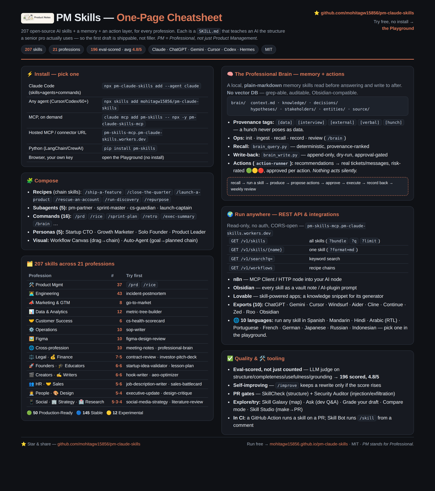

# 🧠 PM Skills — 466 Professional Agent Skills for Claude, ChatGPT, Gemini, Cursor, Codex & Hermes

[](#-quick-install-2-minutes)
[](https://github.com/mohitagw15856/pm-claude-skills/stargazers)
[](https://www.npmjs.com/package/pm-claude-skills)
[](https://www.npmjs.com/package/pm-claude-skills)
[](https://pypi.org/project/pm-skills/)
[](https://pypi.org/project/pm-skills/)
[](https://github.com/mohitagw15856/pm-claude-skills#-use-it-anywhere--the-ai-ecosystem)
[](mcp-remote/)
[](https://smithery.ai/servers/mohit15856/pm-skills)
[](https://github.com/mohitagw15856/pm-claude-skills)
[](https://mohitagw15856.github.io/pm-claude-skills/)
[](https://github.com/sponsors/mohitagw15856)

> **Big repo?** It's a monorepo on purpose — but you probably need one folder. **[REPO-MAP.md](REPO-MAP.md)** tells you which, and the skills-only clone is 10 seconds: `git clone --filter=blob:none --sparse <url> && git sparse-checkout set skills`

> 💛 **The free runs are sponsor-funded.** Every sponsor dollar visibly raises the daily cap on the counter above — and sponsors get [naming rights, not influence](docs/SPONSORSHIP.md): your name in this README, your logo on the playground, or **a Boardroom bench carrying your company's name**. → [Become a sponsor](https://github.com/sponsors/mohitagw15856)
[](https://mohitagw15856.github.io/pm-claude-skills/leaderboard.html)
[](agents/)
[](commands/)
[](output-styles/)
[](#-works-with--cross-tool-compatibility)
[](connectors/)
[](.github/workflows/skillcheck.yml)
[](.github/workflows/skill-audit.yml)
[](https://github.com/mohitagw15856/pm-claude-skills/releases)
[](https://github.com/mohitagw15856/pm-claude-skills#-quick-install-2-minutes)
[](LICENSE)
[](https://github.com/sponsors/mohitagw15856)

<p align="center">
  <a href="https://mohitagw15856.github.io/pm-claude-skills/">
    
  </a>
</p>

<p align="center">
  <a href="https://mohitagw15856.github.io/pm-claude-skills/">
    
  </a>
</p>

<p align="center">
  <strong>🎉 Now published in the official <a href="https://www.anthropic.com/">Anthropic</a> Claude plugin directory</strong> — install it straight from the <code>/plugin</code> marketplace in Claude Code.
</p>

> **Generic AI gives you filler. These give you the structure a senior pro actually uses** — PRDs, exec updates, launch plans, postmortems — as open-source `SKILL.md` files. Across **25 professions**, not just product management. One source, every AI tool.

> **🆕 Now plugs into your stack** — automate skills in **[n8n](connectors/n8n.md)**, build apps on **[Lovable](connectors/lovable.md)**, and run them in your **[Obsidian](connectors/obsidian.md)** vault, all via a read-only **[REST API](mcp-remote/#rest-api-for-n8n-lovable-make-any-http-tool)** on the hosted Worker.

### ⭐ If this saves you time, [star the repo](https://github.com/mohitagw15856/pm-claude-skills) — it's the #1 way to help others find it.

## ⚡ Use it in 30 seconds — pick one

| You want to… | Do this |
|---|---|
| **Just try it** (no install) | Open the **[Playground](https://mohitagw15856.github.io/pm-claude-skills/)** → pick a skill → run it in your browser. |
| **Use it in Claude Code / Cursor / Codex** | `npx pm-claude-skills add --agent claude` &nbsp;*(or `cursor`, `codex`, `windsurf`…)* |
| **Have it in every AI session** | `claude mcp add pm-skills -- npx -y pm-claude-skills-mcp` |

*Not sure? Start with the Playground.* This is a **CLI, not a library** — you don't need `npm install`; `npx pm-claude-skills …` always runs the latest. Browse everything first with `npx pm-claude-skills list`.

<details>
<summary>📚 <b>Documentation map</b> — this README is the trailer; the details live in focused docs</summary>

| Topic | Doc |
|---|---|
| Install on any tool | [docs/installation.md](docs/installation.md) · [QUICKSTART.md](QUICKSTART.md) · [CHEATSHEET.md](CHEATSHEET.md) |
| Write / contribute a skill | [SKILL-AUTHORING-STANDARD.md](SKILL-AUTHORING-STANDARD.md) · [CONTRIBUTING.md](CONTRIBUTING.md) · the [`SKILLSPEC`](SKILLSPEC.md) |
| The full skill listing | [SKILLS.md](SKILLS.md) (auto-generated) · [TIERS.md](TIERS.md) |
| Chained recipes & orchestration | [WORKFLOWS.md](WORKFLOWS.md) · [ORCHESTRATION.md](ORCHESTRATION.md) |
| Memory & actions (the Brain) | [BRAIN.md](BRAIN.md) · [BRAIN_QUICKSTART.md](BRAIN_QUICKSTART.md) |
| Benchmark & evals | [skillbench/](skillbench/) · [evals/](evals/) · [live leaderboard](https://mohitagw15856.github.io/pm-claude-skills/leaderboard.html) |
| Publish your own skill | [community/](community/) |
| MCP / REST / A2A / connectors | [mcp-remote/](mcp-remote/) · [connectors/](connectors/) (incl. [MCP pairings](connectors/mcp-pairings.md)) |
| CI recipes & hooks | [action/](action/) · [hooks/](hooks/) |
| Ops, URLs & standing decisions | [OPERATIONS.md](OPERATIONS.md) · [ROADMAP.md](ROADMAP.md) |

</details>

> **PM stands for Professional, not just Product Management.**
> 466 professional skills + 4 agent templates across 65 bundles covering 25 professions. Built for Claude Code — and now portable to ChatGPT, Gemini, and Hermes Agent. Built by a PM, used by everyone.

A community-built library of professional skills for every field — product management, engineering, customer success, marketing, social media, writers, design, legal, finance, HR, sales, operations, research, and more. Each skill is a structured `SKILL.md` file that teaches an AI assistant how to produce professional-grade outputs for your workflows. Skills run natively in **Claude Code** and **Hermes Agent** (same open `SKILL.md` standard), and ship as ready-to-paste exports for **ChatGPT** and **Gemini** — see [Works With](#-works-with--cross-tool-compatibility).

**🆕 v46.0.0 — the arsenal release:** ⚔️ **[`pm-warroom`](plugins/pm-warroom)** — the adversarial bundle (Premortem Assassin's twelve failure vectors, Devil's Twin writes the opposition's best memo, Metric Gaslighting Detector's eleven distortions, Decision Autopsy, Assumption Bounty), 🧮 **three more skills that do real math** (Erlang-C staffing, schedule Monte Carlo over the task DAG, tornado sensitivity — CI-pinned exact outputs), 🎭 shareable singles (eulogy-writer, wedding-speech, fine-appeal-letter, skill-fusion), 🎨 **generative identities on every skill page and playground card** (five banner families seeded from the name, matching colours + monograms, ⓘ links), 🎯 **466/466 SkillSpec L3 — CI-enforced**, 🧪 the 76-assertion scripts harness, 📱 the **PWA** (no-API core offline), 📈 [public vitals](https://mohitagw15856.github.io/pm-claude-skills/status.html) + self-operating crons, 🗺 [REPO-MAP](REPO-MAP.md). **466 skills · 66 bundles.** *Earlier — v45, the spectacle release:* Duels, the Charter, Galaxy 3D, the collapsing Tower of Claims, the Stage, holo cards & Skill City. *Earlier — v44, the legendary release:* Campaign mode, the Professional Work Handbook (2,297-rule Anti-Pattern Almanac), the Reckoning, the ecosystem package manager, zero-key MCP sampling, pm-skills-tools, the SkillSpec badge & the census. *Earlier — v43, the local-first & learning wave:* the 🗂 workspace bridge, Boardroom replay links & bench packs, 🎤 The Panel, 🎓 The Academy, 🎁 Wrapped, the evolution loop & pm-method. *Earlier — v42:* depth (`references/` + `templates/`) on all Production-Ready skills, 🔊 Theatre voices, Firm calibration & the CI smoke suite. *Earlier — v41, the modern skills wave:* two new domains — **🤖 [`pm-agentnative`](plugins/pm-agentnative)** (build for non-human users: [`mcp-server-spec`](skills/mcp-server-spec/SKILL.md), [`agent-readiness-audit`](skills/agent-readiness-audit/SKILL.md), [`agent-era-pricing`](skills/agent-era-pricing/SKILL.md), [`human-in-the-loop-design`](skills/human-in-the-loop-design/SKILL.md), [`voice-agent-design`](skills/voice-agent-design/SKILL.md)) and **🧑‍💼 [`pm-aiwork`](plugins/pm-aiwork)** (the questions every manager has this year: [`ai-roi-audit`](skills/ai-roi-audit/SKILL.md), [`role-redesign-for-ai`](skills/role-redesign-for-ai/SKILL.md), [`ai-usage-policy`](skills/ai-usage-policy/SKILL.md), [`ai-assisted-performance-review`](skills/ai-assisted-performance-review/SKILL.md), [`ai-content-audit`](skills/ai-content-audit/SKILL.md)) — plus 5 singles ([`ai-code-review`](skills/ai-code-review/SKILL.md), [`synthetic-user-research`](skills/synthetic-user-research/SKILL.md), [`async-decision-memo`](skills/async-decision-memo/SKILL.md), [`brand-impersonation-response`](skills/brand-impersonation-response/SKILL.md), [`feature-sunset-plan`](skills/feature-sunset-plan/SKILL.md)). Also: 🌠 Galaxy shooting stars + a 🎲 Warp button, 🎓 frameable [certificates](web/export-doc.js) from the arena pages, and 🔌 [MCP pairings](connectors/mcp-pairings.md) — skills that act through your connected servers. *Earlier — v40: [The Firm](https://mohitagw15856.github.io/pm-claude-skills/firm.html). v39 (three waves):* ⚡ *Superpowers:* [SkillBench](skillbench/) (the professional-work benchmark for models) · the [community registry](community/) (npm-for-skills) · the [Interview Gauntlet](https://mohitagw15856.github.io/pm-claude-skills/gauntlet.html) · [CI recipes](action/examples/) + [ambient hooks](hooks/) · Hugging Face [dataset publishing](dataset/) · [localization to 8 languages](i18n/). 🤯 *Breathtaking:* [living artifacts](https://mohitagw15856.github.io/pm-claude-skills/), [Document X-ray](https://mohitagw15856.github.io/pm-claude-skills/xray.html), [The Gym](https://mohitagw15856.github.io/pm-claude-skills/gym.html), [`pm-vision`](plugins/pm-vision), [`style-fingerprint`](skills/style-fingerprint/SKILL.md), [`evidence-lock`](skills/evidence-lock/SKILL.md). ✨ *Revamped:* the playground command bar + Galaxy 2.0 with a guided Sky tour. **466 skills · 66 bundles · 25 professions.** → [CHANGELOG](CHANGELOG.md) · [all releases](https://github.com/mohitagw15856/pm-claude-skills/releases).

### ▶ See it in action — [try the live Skill Playground](https://mohitagw15856.github.io/pm-claude-skills/)

<!-- Demo GIF generated by web/docs-assets/record-demo.mjs (Playwright). The streamed
     output is a representative mock so no API key is needed; re-run with a live key
     for a real call. Static fallback: web/docs-assets/playground.png -->
[](https://mohitagw15856.github.io/pm-claude-skills/)

<sub>👆 Pick any skill, fill a short form, and run it with your own key — no install required.</sub>

---

## 🏢 The Firm — don't run tools, employ a staff

[](https://mohitagw15856.github.io/pm-claude-skills/firm.html)

Everything below is *pull*: you show up and run something. **[The Firm](https://mohitagw15856.github.io/pm-claude-skills/firm.html)** is *push* — the endgame the whole library was building toward. Charter a standing team once, then convene: your **💰 CFO**, **❤️ Chief Customer Officer**, **🛠️ CTO**, and **🦈 Head of Strategy** (hire 📣 Growth and ⚖️ Counsel too, or excuse anyone) each file a **delta-aware memo** on their beat — what *changed*, never a restatement — ending in a **falsifiable prediction** with a check-by date. Then the staff **hold a boardroom session without you** and send you the minutes: decisions, asks, **dissent preserved**. As reality lands, score the predictions — and each staff member's card shows a live **calibration record**. You can performance-review your AI staff.

In Claude Code, [`/firm`](commands/firm.md) runs the same session natively — grounded in your `FIRM.md`, [Brain](BRAIN.md), and git log, minutes saved to `firm-minutes/`, predictions to the Brain's ledger. **[Convene the Firm →](https://mohitagw15856.github.io/pm-claude-skills/firm.html)**

<table>
  <tr>
    <td width="50%"><a href="https://mohitagw15856.github.io/pm-claude-skills/firm.html"></a><br /><sub>A real chartered firm (unretouched session) — six staff hired, each card showing their beat and the library skill their duty runs on.</sub></td>
    <td width="50%"><a href="https://mohitagw15856.github.io/pm-claude-skills/firm.html"></a><br /><sub>The actual session-1 minutes — the staff met without their principal, argued sequencing vs churn, and logged five falsifiable predictions now awaiting reality.</sub></td>
  </tr>
</table>

---

## ✨ The showcase — six things no other skills library does

<table>
  <tr>
    <td width="50%">
      <a href="https://mohitagw15856.github.io/pm-claude-skills/boardroom.html"></a>
      <b>🏛️ <a href="https://mohitagw15856.github.io/pm-claude-skills/boardroom.html">The Boardroom</a></b> — paste a PRD or pitch and five AI executives debate it live: severity-tagged openings, cross-examination, then a Chair's verdict memo with the changes that would survive the room. Verdicts export as <a href="https://mohitagw15856.github.io/pm-claude-skills/verify.html">verifiable attestations</a>. Ready to be questioned yourself? <a href="https://mohitagw15856.github.io/pm-claude-skills/defend.html">Defend it</a>.
    </td>
    <td width="50%">
      <a href="https://mohitagw15856.github.io/pm-claude-skills/xray.html"></a>
      <b>🩻 <a href="https://mohitagw15856.github.io/pm-claude-skills/xray.html">Document X-ray</a></b> — see the evidence skeleton under your prose: every sentence classified as <i>data · sourced · assertion · superlative · assumption</i>, load-bearing lines outlined, weakest claims listed to fix first — before someone in the meeting finds them for you.
    </td>
  </tr>
  <tr>
    <td width="50%">
      <a href="https://mohitagw15856.github.io/pm-claude-skills/"></a>
      <b>🎛 <a href="https://mohitagw15856.github.io/pm-claude-skills/">Living artifacts</a></b> — outputs you can <i>grab</i>, not just read: RICE results render as a live board (drag a confidence slider, watch the ranking re-sort), journeys as an animated emotion curve, health checks as gauges. The document and the instrument, together.
    </td>
    <td width="50%">
      <a href="https://mohitagw15856.github.io/pm-claude-skills/gauntlet.html"></a>
      <b>🏆 <a href="https://mohitagw15856.github.io/pm-claude-skills/gauntlet.html">The Interview Gauntlet</a></b> — job posting → signed offer, one arc: decode what the role <i>actually</i> wants, forge your stories, survive five hiring-manager questions, negotiate against a recruiter with a hidden band — and get a readiness score /100. Also in the ring: <a href="https://mohitagw15856.github.io/pm-claude-skills/gym.html">🥊 The Gym</a>.
    </td>
  </tr>
  <tr>
    <td width="50%">
      <a href="https://mohitagw15856.github.io/pm-claude-skills/"></a>
      <b>🪄 <a href="https://mohitagw15856.github.io/pm-claude-skills/">The command bar</a></b> — don't browse 466 cards; just say it: <i>"a blameless postmortem for Friday's outage"</i> → the top three skills, instantly, locally, before you've even entered a key. Enter opens the best match.
    </td>
    <td width="50%">
      <a href="https://mohitagw15856.github.io/pm-claude-skills/galaxy.html"></a>
      <b>🌌 <a href="https://mohitagw15856.github.io/pm-claude-skills/galaxy.html">The Skill Galaxy</a></b> — the whole library as a living star map (brightness = eval score). Press <b>▶ Sky tour</b> and the camera flies you across the professions, then traces a Journey constellation. Click any star for details; search flies you to it.
    </td>
  </tr>
</table>

---

## 👋 New here? Start in 30 seconds

**The problem:** Ask any AI for a PRD, an exec update, or a launch plan and you get *generic* — plausible-sounding filler you still have to rewrite from scratch. The model doesn't know what "good" actually looks like for professional work.

**What this fixes:** Each skill is a battle-tested `SKILL.md` that teaches the AI the real structure, rigour, and judgement a senior professional uses — so the first draft is one you can *ship*, not one you have to redo.

**Try these 5 first** — no install needed, run them right in the [live Playground](https://mohitagw15856.github.io/pm-claude-skills/):

| Skill | Give it… | Get back… |
|-------|----------|-----------|
| 📊 [Executive Update](skills/executive-update) | messy progress notes | a tight 250-word briefing for your CEO or board |
| 📋 [PRD Template](skills/prd-template) | a vague feature idea | a structured PRD with scope, success metrics & risks |
| 🎯 [RICE Prioritisation](skills/rice-prioritisation) | a pile of backlog ideas | a ranked, defensible priority list |
| 🔭 [Competitor Teardown](skills/competitor-teardown) | "what are rivals up to?" | a positioning map, feature gaps & strategy |
| 📝 [Meeting Notes](skills/meeting-notes) | a raw transcript | decisions, owners & next steps |

→ Want proof first? See [**real sample outputs**](https://mohitagw15856.github.io/pm-claude-skills/examples.html) from each skill. Like what you see? [**Install in 2 minutes**](#-quick-install-2-minutes) · [browse all 451 skills](#️-all-451-skills) · [**⭐ star the repo**](https://github.com/mohitagw15856/pm-claude-skills/stargazers) so others find it.

---

## 📄 Good content deserves good paper

It's not just text — the playground exports every result as a **professionally typeset PDF** (pick a theme; it even tints to your brand colour). Here's the *same skills* producing real, designed documents — **click any to open the PDF:**

<table>
  <tr>
    <td width="25%" align="center"><a href="web/docs-assets/samples/resume.pdf"></a><br /><b><a href="skills/resume">Resume</a></b><br /><sub>Paper theme</sub></td>
    <td width="25%" align="center"><a href="web/docs-assets/samples/one-pager.pdf"></a><br /><b><a href="skills/one-pager">One-Pager</a></b><br /><sub>Modern theme</sub></td>
    <td width="25%" align="center"><a href="web/docs-assets/samples/cover-letter.pdf"></a><br /><b><a href="skills/cover-letter">Cover Letter</a></b><br /><sub>Paper theme</sub></td>
    <td width="25%" align="center"><a href="web/docs-assets/samples/prd.pdf"></a><br /><b><a href="skills/prd-template">PRD</a></b><br /><sub>Technical theme</sub></td>
  </tr>
  <tr>
    <td width="25%" align="center"><a href="web/docs-assets/samples/linkedin-profile.pdf"></a><br /><b><a href="skills/linkedin-profile">LinkedIn</a></b><br /><sub>Modern theme</sub></td>
    <td width="25%" align="center"><a href="web/docs-assets/samples/portfolio-page.pdf"></a><br /><b><a href="skills/portfolio-page">Portfolio</a></b><br /><sub>Paper theme</sub></td>
    <td width="25%" align="center"><a href="web/docs-assets/samples/personal-bio.pdf"></a><br /><b><a href="skills/personal-bio">Bio</a></b><br /><sub>Modern theme</sub></td>
    <td width="25%" align="center"><a href="web/docs-assets/samples/brand-onepager.pdf"></a><br /><b><a href="skills/one-pager">Brand-tinted</a></b><br /><sub>your brand colour</sub></td>
  </tr>
</table>

> Generate yours: run a skill in the [Playground](https://mohitagw15856.github.io/pm-claude-skills/), then **Download → PDF · Paper / Modern / Technical**. Add a `Brand color: #hex` line to your context and it tints to match (last tile). Personal documents live in the [`pm-personal`](#️-all-451-skills) bundle (résumé, cover letter, bio, LinkedIn, portfolio, one-pager).

---

## 📄 The shareable cheatsheet

<details>
<summary>Read more ↓</summary>

The whole repo on one poster — the 60-second start path, the six things no other skills library does (Boardroom, Firm, Gauntlet, X-ray, living artifacts, the Gym), install one-liners for every tool, and the infrastructure story. Built to **print, share, or drop into a slide** — with one link to start.

<p align="center">
  <a href="https://mohitagw15856.github.io/pm-claude-skills/cheatsheet.html">
    
  </a>
</p>

**[📥 Markdown](CHEATSHEET.md)** · **[🖼️ Download PNG](https://mohitagw15856.github.io/pm-claude-skills/docs-assets/cheatsheet.png)** · **[📄 Download PDF](https://mohitagw15856.github.io/pm-claude-skills/docs-assets/cheatsheet.pdf)** · **[🌐 Live poster](https://mohitagw15856.github.io/pm-claude-skills/cheatsheet.html)** — regenerate with `PAGES=cheatsheet node web/docs-assets/shoot.mjs`.

> 📖 **Want the full walkthrough?** The **[Practical Guide](web/guide.html)** is a 15-page,
> example-driven manual — install → your first skill → worked examples (PRD, exec update, RICE,
> postmortem) → chaining recipes → the Brain → running anywhere → tips. **[Download the PDF →](web/docs-assets/PM-Skills-Guide.pdf)**

</details>

---

## 🧠 The Professional Brain — local-first memory for any AI agent

Generic AI forgets everything between sessions, so you re-paste context forever and last quarter's *why* evaporates. The **Professional Brain** is the fix — and it's the most novel piece here, worth a look on its own:

- **Plain markdown, no vector DB** — a `brain/` folder (knowledge · decisions · hypotheses · stakeholders) your AI **reads before answering and writes to after**. Grep-able, auditable, Obsidian-compatible — memory you can read and correct by hand, not a black box.
- **Provenance over confidence theatre** — every fact is tagged `[data] [interview] [external] [verbal] [hunch]`, so a hunch never poses as a measured result.
- **It acts, safely** — the [`action-runner`](skills/action-runner/) turns a skill's recommendations into real tickets/messages: dry-run, risk-rated, approval-gated, then recorded back. *Nothing acts silently.*

**→ [Read the architecture](BRAIN.md)** · **[5-min Quickstart](BRAIN_QUICKSTART.md)** · **[try it in the browser](https://mohitagw15856.github.io/pm-claude-skills/brain.html)**

---

## 🔄 One library, the whole professional workflow

<details>
<summary>Read more ↓</summary>

These 466 skills aren't a random catalog — they cover the **full arc of professional work**, end to end. Wherever you are in the loop, there's a skill for it:


| Phase | What you're doing | Start with these skills |
|-------|-------------------|--------------------------|
| **🔍 Discover** | Frame the problem, research, validate | `ambiguity-resolver` · `user-research-synthesis` · `competitive-analysis` · `discovery-interview-guide` |
| **🎯 Decide** | Prioritise, spec, set goals | `rice-prioritisation` · `prd-template` · `okr-builder` · `roadmap-narrative` |
| **🔨 Build** | Design & engineer the work | `technical-spec-template` · `design-critique` · `sprint-planning` · `architecture-decision-record` |
| **🚀 Ship** | Launch & release | `go-to-market` · `launch-readiness` · `product-launch-checklist` · `runbook-writer` |
| **📊 Measure** | Track outcomes & analyse | `metrics-framework` · `cohort-analysis` · `ab-test-planner` · `churn-analysis` |
| **📣 Communicate** | Report up and out | `executive-update` · `board-deck-narrative` · `stakeholder-update` · `qbr-deck` |

> New here? Start with the [**top-tier skills**](#️-skill-tiers--start-with-the-strongest), or jump straight to [**all 451 skills**](#️-all-451-skills) grouped by profession.

</details>

---

## 🧩 Workflow Recipes — chain skills into one flow

<details>
<summary>Read more ↓</summary>

Individual skills are great. **Chaining** them is the superpower. A *recipe* runs several skills in sequence and **passes each output forward as context** — so a fuzzy idea comes out the other end as a finished, joined-up set of artifacts. No other skills library chains across professions like this.

```
/ship-a-feature  "a referral program for B2B users"

  ambiguity-resolver → prd-template → rice-prioritisation → roadmap-narrative → go-to-market
   frame the problem    spec it        prioritise it        place on roadmap     launch plan
        └──────────────── each stage's output feeds the next ────────────────┘
```

| Recipe | What it does | Lifecycle |
|--------|--------------|-----------|
| `/ship-a-feature` | idea → PRD → priority → roadmap → launch plan | Discover → Ship |
| `/close-the-quarter` | metrics → churn → exec update → board deck | Measure → Communicate |
| `/launch-a-product` | competitors → positioning → GTM → checklist → press release | Decide → Ship |
| `/rescue-an-account` | health score → churn cause → escalation → renewal plan | Measure → Communicate |
| `/run-discovery` | frame → interview guide → synthesis → prioritise | Discover → Decide |

→ Full detail and how to add your own in [**WORKFLOWS.md**](WORKFLOWS.md). Recipes run as slash commands in Claude Code, or over MCP via the `get_workflow` tool.

**Got a coding question?** Just [**❓ Ask**](https://mohitagw15856.github.io/pm-claude-skills/ask.html) — an error, a regex, a git mess, a dependency conflict, *"what does this code do?"* — and the right developer skill answers instantly (like StackOverflow, but the answer's already written), with a one-click path to the community [Q&A](https://github.com/mohitagw15856/pm-claude-skills/discussions) for a human follow-up.

**Or build your own visually.** The [**Workflow Canvas**](https://mohitagw15856.github.io/pm-claude-skills/canvas.html) lets you drag any skills into a custom chain and run it in the browser — each step's output feeds the next. Like n8n, but for professional thinking. Don't know which skills to use? The [**✨ Auto-Agent**](https://mohitagw15856.github.io/pm-claude-skills/agent.html) takes a plain-English goal, **plans which skills to chain**, and runs them for you — each step feeding the next:

[](https://mohitagw15856.github.io/pm-claude-skills/agent.html)

[](https://mohitagw15856.github.io/pm-claude-skills/canvas.html)

</details>

## 🏛️ The Boardroom — your document vs. five AI executives

Every tool above helps you **write** the document. [**The Boardroom**](https://mohitagw15856.github.io/pm-claude-skills/boardroom.html) is where you find out if it **survives a leadership team** — before the real one sees it.

Paste a PRD, launch plan, investor pitch, or strategy memo. A bench of five AI executives — **💰 a CFO** who kills anything that can't show its maths, **🛠️ a CTO** who asks what breaks at 10×, **❤️ a Chief Customer Officer** channelling your angriest user, **⚖️ a General Counsel** who reads every superlative as a future lawsuit, and **🦈 a sceptical VC** who's seen 400 decks this year — debate it live in structured rounds:

1. **Opening statements** — each executive's three sharpest points, severity-tagged `BLOCKER` / `RISK` / `QUESTION`
2. **Cross-examination** — they argue with *each other*, concede points, and update positions
3. **The verdict** — a neutral Chair weighs the arguments and issues a decision memo: ✅ approve / 🟡 conditions / 🔴 rework / ⛔ reject, risks ranked with owners, and **the 3–5 changes that would survive the room**

Seat or excuse executives, set the grill level (🤝 constructive → 🔥 brutal), and download the decision memo. Runs entirely in your browser with your own key — same as the playground. **[Convene the board →](https://mohitagw15856.github.io/pm-claude-skills/boardroom.html)**

[](https://mohitagw15856.github.io/pm-claude-skills/boardroom.html)

It anchors a whole **pressure-test suite** — and with 🔊 **Theatre mode** the executives now *speak their turns aloud* in distinct voices, while 🎙 lets you answer the Defense and the Gauntlet's interviewer out loud (browser speech, zero API):

- **🔏 Attestations** — every verdict exports as a tamper-evident record (SHA-256 of the exact text + session facts + verdict). Anyone can check it at **[verify.html](https://mohitagw15856.github.io/pm-claude-skills/verify.html)**: paste the document and the attestation, and a single changed character fails the match. As AI-drafted documents flood teams, *"was this ever pressure-tested?"* becomes checkable.
- **🛡️ [The Defense](https://mohitagw15856.github.io/pm-claude-skills/defend.html)** — the Boardroom reviews the *document*; this reviews **you**. The executives cross-examine you live, one question at a time; you answer; a neutral Chair scores your defense (command of the facts, evidence over assertion, honesty about unknowns, composure) and tells you exactly what to prepare before the real meeting. Saying "I don't know" honestly scores better than bluffing.
- **🥊 [The Gym](https://mohitagw15856.github.io/pm-claude-skills/gym.html)** — practice with *hidden state*: negotiate a salary, renewal, vendor deal, or exec pushback against a counterparty with a secret bottom line, hidden pressures, and subtle tells. Only the debrief reveals what was actually achievable — and scores you against it, with drills. Scores persist locally, so you can watch yourself improve.
- **🩻 [Document X-ray](https://mohitagw15856.github.io/pm-claude-skills/xray.html)** — see the evidence skeleton under your prose: every sentence heat-mapped as **data · sourced · assertion · superlative · assumption**, load-bearing sentences outlined, and the weakest claims listed to fix first — before someone in the meeting finds them for you.

And two upgrades to how skills *feel*: the [playground](https://mohitagw15856.github.io/pm-claude-skills/) now renders **🎛 [living artifacts](web/artifacts.js)** — for RICE, roadmaps, journey maps, and health scorecards the output includes an *interactive* component (drag a confidence slider on the RICE board and watch the ranking re-sort live) — and **📷 [`pm-vision`](plugins/pm-vision)** lets you attach whiteboard photos, competitor screenshots, or slide photos so vision-first skills ([`whiteboard-to-spec`](skills/whiteboard-to-spec/SKILL.md), [`screenshot-teardown`](skills/screenshot-teardown/SKILL.md), [`deck-autopsy`](skills/deck-autopsy/SKILL.md)) read the pixels as the primary input. Want outputs in *your* voice, with *your* evidence? [`style-fingerprint`](skills/style-fingerprint/SKILL.md) and [`evidence-lock`](skills/evidence-lock/SKILL.md) do exactly that.

## 🔮 The library as infrastructure — the frontier bets

Beyond running skills, the repo is becoming *infrastructure* for whatever agents come next:

| Bet | What shipped | Where |
|---|---|---|
| **The professional-work benchmark** | 🆕 **SkillBench** — a frozen 12-task set across 6 domains, run bare + skilled per model, judged on a fixed rubric: which model does real work best, and how much do skills lift it? Quarterly **State of Professional AI** reports | [skillbench/](skillbench/) |
| **npm-for-skills** | 🆕 The **community registry**: publish `you/skill-name` via one PR while your skill stays in your repo — CI-validated (SkillSpec + security scan + typosquat guard), served live at `/v1/community` and over MCP | [community/](community/) |
| **A formal standard** | SkillSpec v1.0 — a normative spec for `SKILL.md` (frontmatter contract, conformance levels L1–L4, SemVer + content-hash pinning, safety rules), with SkillCheck as the reference validator | [SKILLSPEC.md](SKILLSPEC.md) · [schema](spec/skill.schema.json) |
| **Skills where work happens** | 🆕 Turnkey **CI recipes** (PR descriptions, release notes, postmortem scaffolds, doc lint — copy one file) + 🆕 **ambient hooks** for Claude Code (drafts that lint themselves, changelog nudges after commits, a session ledger for weekly reviews) | [action/examples/](action/examples/) · [hooks/](hooks/) |
| **Skills that act, safely** | Optional `## Execution` blocks turn a skill into a bounded procedure for computer-use agents — closed allow-list of actions, human-approval gates, verification, rollback | [Spec §5](SKILLSPEC.md) · examples: [`sprint-planning`](skills/sprint-planning/SKILL.md), [`stakeholder-update`](skills/stakeholder-update/SKILL.md) |
| **Agents hiring the library** | The hosted Worker speaks agent-to-agent: a discovery card at `/.well-known/agent-card.json` and a JSON-RPC `message/send` endpoint — any agent sends a task, gets back the best skill's full instructions | [mcp-remote](mcp-remote/) |
| **Frameworks that earn trust** | The [`outcome-tracker`](skills/outcome-tracker/SKILL.md) skill records every decision's falsifiable predictions to the [Brain](BRAIN.md), scores them against reality on a schedule, and computes per-framework calibration — which frameworks *actually* predict outcomes | `skills/outcome-tracker` (in `pm-autopilot`) |
| **The library as a model** | The dataset pipeline (~1,500 routing pairs + SFT seeds + graded samples) now 🆕 **publishes to Hugging Face on every release** — step one toward `pm-skills-3b`, a fully local professional copilot | [dataset/](dataset/) |
| **Every language** | 🆕 A **localization pipeline** with hard structural guarantees and honest `review: pending` labelling — the library in Spanish, Portuguese, Hindi, Japanese, German, French, Chinese, Korean | [i18n/](i18n/) |

And the **browser extension (v1.1)** now lints *your own writing* against any skill's Quality Checks and Anti-Patterns — select text anywhere, get pass/fail verdicts with specific notes. Grammarly for professional judgment. → [extension/](extension/)

### 🏆 The Interview Gauntlet — from job posting to signed offer

The most requested arc, as one experience: **[the Gauntlet](https://mohitagw15856.github.io/pm-claude-skills/gauntlet.html)** decodes what a job posting *actually* wants, forges your raw experiences into metric-led interview stories mapped to the decoded requirements, cross-examines you live as the hiring manager (five questions that build on your answers — honest "I don't know" beats bluffing), then puts you on the phone with a recruiter whose approval band you can't see. You leave with a **readiness score /100**, the tells in your answers quoted back at you, and the three preparations that would most move the score. 🎓 Practice → 🎯 Realistic → 🔥 Brutal.

---

### 🎤 The Panel — you're the interviewer now

The Gauntlet trains you to *be* interviewed; **[the Panel](https://mohitagw15856.github.io/pm-claude-skills/hiring.html)** trains the harder, rarer skill: telling a great candidate from a great talker. The AI plays a candidate with a **hidden archetype** — genuinely strong, polished-but-evasive, or a confident bluffer whose stories wobble under a second follow-up. You ask the questions, you write the hire/no-hire recommendation *before* the reveal, and a hiring coach scores **your** technique: evidence-pinning, follow-up discipline, and the tells you caught or missed.

### 🎓 The Academy & 🎁 Wrapped — learn it, then see your story

**[The Academy](https://mohitagw15856.github.io/pm-claude-skills/academy.html)** turns the library's own Anti-Patterns into three learning tracks (🎯 executive communication, 🔬 discovery & evidence, ⚙️ work discipline) — 18 spot-the-flaw drills with explanations that quote the exact skill rule, **no API key needed**, each track examined live in an arena, certificate on graduation. And **[Wrapped](https://mohitagw15856.github.io/pm-claude-skills/wrapped.html)** plays your practice back as an animated story from purely local data — personal bests, imposters caught, prediction calibration, your earned persona title — with a canvas share card. Nothing leaves the machine.

### 🗂 Local-first, all the way down

Connect the Firm or the Boardroom to a **real folder on disk** (the 🗂 chip, Chromium): minutes, verdicts, transcripts, and predictions land as markdown files — point Claude Code at the same folder and the web arenas and the CLI become one product. Share a whole Boardroom session as a **replay link** where the URL fragment *is* the data (gzip, no server). Swap the Boardroom's bench for the 🦈 fundraising, 🏥 healthcare, or 🚀 seed-stage preset — or build your own executive, or publish a [bench pack](community/) for others. Teams? **[A folder convention, not a backend](docs/TEAMS-DECISION.md)** — a shared git repo of `brain/` + `firm-minutes/` + `boardroom/` is auth, audit, review, and sync we never have to build. Run `npx pm-claude-skills doctor` for a read-only checkup of your whole setup, ℞ included.

---

### 🌌 The library in 3D

<p align="center">
  <a href="https://mohitagw15856.github.io/pm-claude-skills/tower.html"></a>
  <a href="https://mohitagw15856.github.io/pm-claude-skills/galaxy3d.html"></a>
</p>


- **[Galaxy 3D](https://mohitagw15856.github.io/pm-claude-skills/galaxy3d.html)** — 466 skills as a bloom-lit starfield you fly through; **your sky is yours** (stars you've run burn brighter). **[Skill City](https://mohitagw15856.github.io/pm-claude-skills/city.html)** — the same idea as a dusk skyline: windows light up in buildings you've used.
- **[The Tower of Claims](https://mohitagw15856.github.io/pm-claude-skills/tower.html)** — your document as a physics tower: data is steel, assumptions are glass, and the stress test shows the argument stand or **collapse**. Keyless demo built in.
- **[The Stage](https://mohitagw15856.github.io/pm-claude-skills/stage.html)** — any Boardroom replay as a cinematic 3D scene: the hologram document cracks as objections land; the verdict seals it gold or shatters it.
- **⚔️ Duels** — challenge links from the Gym and the Panel: your friend faces the *identical* hidden scenario, side-by-side scorecard at the end. **[The Charter](https://mohitagw15856.github.io/pm-claude-skills/charter.html)** — the performance-based, cryptographically verifiable certification. **[The Trophy Forge](https://mohitagw15856.github.io/pm-claude-skills/trophy.html)** — cast it in spinning gold.

### 🗺 The Campaign, the Book, and the Ledger

- **[Your First 90 Days](https://mohitagw15856.github.io/pm-claude-skills/campaign.html)** — campaign mode: one story across every arena. You join a fictional Series A startup, and your *real* arena scores write the plot — lose the Gym negotiation and the account churns; get fooled in the Panel and the bad hire haunts Week 10. Replayable, saves locally, certificate at Day 90.
- **[The Professional Work Handbook](https://mohitagw15856.github.io/pm-claude-skills/handbook.html)** — the library as a book: 11 chapters of craft (the Production-Ready tier in full) + **the Anti-Pattern Almanac: 2,237 rules of professional judgment** from all 466 skills. Printable ([PDF](web/docs-assets/handbook.pdf)), free, regenerated every release.
- **[The Reckoning](https://mohitagw15856.github.io/pm-claude-skills/reckoning.html)** — your prediction ledger: confidences, due dates, resurfacing, and a personal **calibration curve with a Brier score**. Also in the CLI: `npx pm-claude-skills reckoning`. When you say 80%, does it happen 80% of the time? Now you'll know.
- **🔏 The chain of trust** — security scan → [sha256 content pinning](community/README.md#-trust--integrity--the-full-chain) in the registry → install lockfile + `npx pm-claude-skills verify` drift detection → npm provenance. Verifiable end to end, no trust in us required.

### 🌐 Infrastructure for the whole ecosystem

- **[`pm-skills-tools`](tools-pkg/)** — all 466 skills as **agent tools**: OpenAI function schemas, Vercel AI SDK adapters, `pick()`/`search()` runtime. `npm i pm-skills-tools` and your agent wields the library.
- **[The SkillSpec badge](skillspec/README.md#the-badge)** — any skills repo can wear its live-graded conformance level: ``.
- **[The State of Agent Skills](docs/reports/)** — the census of the public SKILL.md ecosystem (counts, conformance pyramid, security hits), regenerated from GitHub code search. The observatory, not just a participant.
- **[Every protocol](connectors/mcp-pairings.md#every-protocol-one-library)** — MCP (with zero-key sampling) · A2A · AGENTS.md · function calling · REST.
- **[The Apprentice](templates/apprentice/)** — a ready-to-run Agent SDK agent grounded in your brain and your skills' Quality Checks. Fork it.
- **`council`** (cross-vendor adversarial review) · **`migrate`** (convert prompt libraries into skills) · **[chief-of-staff hook](hooks/)** (every session opens with your predictions due and latest verdicts).

### 📦 The ecosystem toolchain — beyond this library

- **`npx pm-claude-skills install <owner/repo>`** — install skills from **any public GitHub repo**, security-scanned and [SkillSpec](SKILLSPEC.md)-graded on the way in; flagged skills are never installed. The package manager for the whole skills ecosystem, with auditing as the value add.
- **`npx pm-claude-skills chain <workflow>`** — run a whole recipe headless (`chain --list`): each skill feeds the next, and `--deck`/`--doc` finish with a **real .pptx/.docx**. Raw notes in, board-ready deck out, one command.
- **`npx pm-claude-skills init`** — the 60-second professional workspace: `brain/`, standing context, arena folders, CLAUDE.md wiring. Then `doctor` keeps it healthy.
- **`run_skill` over MCP with zero API key** — the [MCP server](mcp/) executes skills via **MCP sampling**: the generation runs on your client's model, no key needed by anyone.
- **[`skillspec-check`](skillspec/)** — the eslint for SKILL.md, as a standalone npm package + [pre-commit hook](.pre-commit-hooks.yaml): lint ANY repo's skills against the standard (`--min-level 2` as a CI gate).
- **[Boardroom doc review in CI](action/examples/doc-review-boardroom.yml)** — PRs touching docs get a CFO/CTO/CCO critique with a 🟢/🟡/🔴 Chair verdict as a PR comment. Documents get code review.
- **🧮 Skills that do math** — [`cohort-curve-model`](skills/cohort-curve-model/SKILL.md), [`runway-monte-carlo`](skills/runway-monte-carlo/SKILL.md), [`pricing-sensitivity-model`](skills/pricing-sensitivity-model/SKILL.md): each ships a stdlib script that **computes** (curve fitting, 5,000-path simulation, survey crossings) and emits a **real .xlsx with live formulas**.

---

## 🧠 Skill Memory — set your context once, every skill uses it

<details>
<summary>Read more ↓</summary>

Generic output is the #1 complaint with AI. **Skill Memory** fixes it: tell the skills who you are *once*, and every skill and recipe produces output already tuned to your product, audience, and voice — no re-typing.

- **In Claude Code:** run [`/setup-context`](commands/setup-context.md) (or copy [`templates/pm-context.example.md`](templates/pm-context.example.md) → `pm-context.md`). Skills read it as standing context.
- **In the [Playground](https://mohitagw15856.github.io/pm-claude-skills/):** fill the **🧠 Your context** box — it's saved in your browser and prepended to every run.

```
Without context:  "write an exec update" → generic, you rewrite it
With context:      "write an exec update" → your voice, your metrics,
                    your audience — shippable on the first try
```

</details>

---

## 🤖 Run a skill from a GitHub comment (ChatOps)

<details>
<summary>Read more ↓</summary>

This repo ships a [**Skill Bot**](.github/workflows/skill-bot.yml): comment on any issue or PR and a skill runs and replies inline.

```
/skill executive-update
Audience: CEO. Period: Q2. Shipped onboarding redesign; activation up; hiring behind plan.
```

The bot runs the skill and posts the result as a reply. `/skill list` shows usage. It's gated to repo collaborators (so random commenters can't trigger paid API calls) and needs an `ANTHROPIC_API_KEY` secret. Copy the workflow into your own repo to give your whole team skill-powered ChatOps.

</details>

---

## ✅ Eval-verified quality — not just quantity

<details>
<summary>Read more ↓</summary>

**Grounded in canonical frameworks.** These aren't invented prompts — each skill encodes a proven method and cites it: RICE (Intercom), Jobs-to-be-Done (Christensen), Continuous Discovery (Teresa Torres), Porter's Five Forces, the Pyramid Principle (Minto), Google SRE, WCAG, *Obviously Awesome* (April Dunford), and more. The source shows as a **"📚 Based on"** line on every [skill page](https://mohitagw15856.github.io/pm-claude-skills/skill/rice-prioritisation.html) and in the Playground.

**And measured, not just claimed.** An [eval harness](evals/) runs each skill against a held-out test case, then an LLM judge (Opus 4.8) rates the output on four dimensions — **structure, completeness, usefulness, grounding** — averaged across two models. **208 skills are eval-scored** today (and climbing); the rest are reviewed against the [authoring standard](SKILL-AUTHORING-STANDARD.md). PRs are auto-checked for **structure**; eval scoring is run deliberately (after merge) via the [**Evaluate selected bundles**](.github/workflows/eval-bundles.yml) Action and published to the [leaderboard](https://mohitagw15856.github.io/pm-claude-skills/leaderboard.html).

**The qualitative half — real time saved.** Scores measure quality; **[case studies](CASE_STUDIES.md)** measure outcomes. See the kind of before → after a skill delivers (PRD: ~2 days → ~25 min), and **[add your own 2-minute ROI story](../../issues/new?template=roi-story.yml)** — we'll feature it.

**The loop actually catches bad skills.** A recent run flagged three skills scoring ~2/5 because they asked for missing inputs instead of delivering. We added a "work from a brief" rule, re-ran, and they jumped to **4.75/5**:

| Skill | Before | After |
|-------|:------:|:-----:|
| `go-to-market` | 🔴 2.0 | 🟢 **4.75** |
| `okr-builder` | 🔴 2.25 | 🟢 **4.75** |
| `roadmap-narrative` | 🟡 2.75 | 🟢 **4.75** |

That's not luck — it's a [self-improving pipeline](scripts/improve-skill.mjs) (`/improve`) that critiques and rewrites a skill, keeping the change only if the score goes up. See the [🏆 leaderboard](https://mohitagw15856.github.io/pm-claude-skills/leaderboard.html) for live scores; run it yourself with `node evals/run-evals.mjs`.

**See the difference for yourself.** The Playground's *Compare* toggle runs the same inputs with and without the skill, side by side — structured, shippable output on the left; generic mush on the right:

[](https://mohitagw15856.github.io/pm-claude-skills/)

**Already have a draft?** Flip on **📝 Critique mode** in the Playground — or use the standalone [**Grade your work**](https://mohitagw15856.github.io/pm-claude-skills/grade.html) tool — to paste an existing PRD/roadmap/update and get a rubric score, ranked gaps, and a redline graded against the skill's framework. Before you ship, run [**`/red-team`**](skills/red-team-review/SKILL.md) to stress-test the plan against a room of hostile expert personas.

This whole thing is an open, reproducible **[benchmark for AI professional work](https://mohitagw15856.github.io/pm-claude-skills/benchmark.html)**: every contributed skill is auto-checked for structure on its PR, then eval-scored on the rubric after merge. The easiest way to add one is **[Skill Studio](https://mohitagw15856.github.io/pm-claude-skills/studio.html)** — describe a skill in your browser, generate a compliant `SKILL.md`, and open a pull request in one click ([or use the form →](https://github.com/mohitagw15856/pm-claude-skills/issues/new?template=submit-skill.yml)).

</details>

---

## ⚖️ How it compares

<details>
<summary>Read more ↓</summary>

Most skill repos are a folder of prompts. This one is a **system** — measured, composable, and usable in the browser:

| | **PM Skills** | Typical skill repo |
|---|:---:|:---:|
| Skills | **466**, across 25 professions | a handful → dozens, usually one domain |
| Quality | **eval-scored** on a rubric + a public [benchmark](https://mohitagw15856.github.io/pm-claude-skills/benchmark.html) | trust the README |
| Improves itself | ✅ eval → critique → rewrite (kept only if it scores higher) | ✗ |
| Grounded in frameworks | ✅ each cites its source (RICE, JTBD, Pyramid Principle…) | rarely |
| Run without installing | ✅ [browser playground](https://mohitagw15856.github.io/pm-claude-skills/) + your key | ✗ copy-paste |
| Compose / orchestrate | ✅ [recipes](WORKFLOWS.md), a [visual canvas](https://mohitagw15856.github.io/pm-claude-skills/canvas.html), an [auto-agent](https://mohitagw15856.github.io/pm-claude-skills/agent.html) | ✗ |
| Works beyond Claude | ✅ MCP · ChatGPT/Gemini exports · VS Code extension | usually one tool |
| Community | ✅ per-skill discussions + a [hub](https://mohitagw15856.github.io/pm-claude-skills/community.html) | issues only |

</details>

---

## 🚀 Quick Install (2 minutes)

<details>
<summary>Read more ↓</summary>

> **Not sure where to start?** Pick by what you want:
> - **Just try it (0 install):** open the **[live Playground](https://mohitagw15856.github.io/pm-claude-skills/)** and run any skill.
> - **Use it in Claude Code:** `npx pm-claude-skills add --agent claude` (or the `/plugin` route below).
> - **Have it in every session:** add the MCP server (one line, below).
>
> ⚠️ **You don't need `npm install pm-claude-skills`** — it's a CLI, not a library, so there's nothing to import. Use `npx pm-claude-skills …` (it always runs the latest). `npm install` just downloads it and does nothing on its own.

**With the [`skills`](https://github.com/vercel-labs/skills) CLI** (the open agent-skills installer that works across Claude Code, Cursor, Codex, OpenCode & 60+ agents) — pick from all 451 interactively:

```bash
npx skills add mohitagw15856/pm-claude-skills            # browse & pick (auto-detects your agent)
npx skills add mohitagw15856/pm-claude-skills --list     # just preview the catalog
npx skills add mohitagw15856/pm-claude-skills --skill prd-template   # grab one
npx skills add mohitagw15856/pm-claude-skills --skill '*'            # install all 451
```

**Or our own installer** — via the [`pm-claude-skills`](https://www.npmjs.com/package/pm-claude-skills) npm package (Windows/macOS/Linux, needs Node), which also installs subagents, slash commands & cross-tool exports:

```bash
npx pm-claude-skills add --agent claude     # or: codex · cursor · hermes · openclaw
```

**Or one-line MCP** — make all 451 skills + 5 workflow recipes available in *every* session of any MCP client (Claude Code, Claude Desktop, Cursor, Windsurf), no per-file install:

```bash
claude mcp add pm-skills -- npx -y pm-claude-skills-mcp
```

Your assistant can then *"search the skills for churn"* or *"run the ship-a-feature workflow"* on demand. Details: [mcp/README.md](mcp/README.md).

**In [Claude Cowork](https://www.anthropic.com/claude)** — open the plugin browser → **Add from GitHub** → enter `mohitagw15856/pm-claude-skills`, then add the bundles you want. No CLI needed.

**In Claude Code** — it's in the **official Anthropic plugin directory**, so you can browse to it in the `/plugin` marketplace, or add it directly:

/plugin marketplace add mohitagw15856/pm-claude-skills

Or install by profession:

claude plugin install pm-essentials@pm-claude-skills     # Core PM + Word tracked changes

claude plugin install pm-delivery@pm-claude-skills       # Delivery + PowerPoint auditor

claude plugin install pm-engineering@pm-claude-skills    # Engineering (35 skills) 🆕

claude plugin install pm-cs@pm-claude-skills             # Customer Success 🆕

claude plugin install pm-data@pm-claude-skills           # Data + chart data extractor

claude plugin install pm-legal@pm-claude-skills          # Legal

claude plugin install pm-finance@pm-claude-skills        # Finance

claude plugin install pm-hr@pm-claude-skills             # HR

claude plugin install pm-sales@pm-claude-skills          # Sales

claude plugin install pm-operations@pm-claude-skills     # Operations

claude plugin install pm-research@pm-claude-skills       # Research & Healthcare

claude plugin install pm-cross@pm-claude-skills          # Cross-profession

claude plugin install pm-figma@pm-claude-skills          # Figma

claude plugin install pm-social@pm-claude-skills         # Social Media 🆕

claude plugin install pm-writers@pm-claude-skills        # Writers & Content Creators 🆕

Or clone and symlink for auto-updates:

git clone https://github.com/mohitagw15856/pm-claude-skills.git ~/pm-claude-skills
mkdir -p ~/.claude/skills
ln -s ~/pm-claude-skills/skills/* ~/.claude/skills/

</details>

---

## 🌍 Use It Anywhere — the AI Ecosystem

<details>
<summary>Read more ↓</summary>

The same 451 skills reach you through every channel — pick whatever fits your stack:

| Channel | Get it |
|---|---|
| 🌐 **Browser playground** | [Run any skill free](https://mohitagw15856.github.io/pm-claude-skills/) with your own **Claude / OpenAI / Gemini / Ollama** key (local models too) |
| 📦 **npm** | `npx pm-claude-skills add --agent claude` (or codex · cursor · hermes · openclaw) |
| 🔌 **`skills` CLI** | `npx skills add mohitagw15856/pm-claude-skills` (works across 60+ agents) |
| 🐍 **Python / PyPI** | `pip install pm-skills` → `search_skills` / `get_skill` + **LangChain & CrewAI** tools |
| 🧠 **MCP (local)** | `npx -y pm-claude-skills-mcp` — tools, **prompts & resources**. Listed in the [official MCP registry](https://github.com/mohitagw15856/pm-claude-skills/blob/main/server.json). |
| ⚡ **MCP (hosted)** | Add **`https://pm-skills-mcp.pm-claude-skills.workers.dev/`** as a connector URL in **ChatGPT, Claude.ai, or Cursor** — no install. Also on **[Smithery](https://smithery.ai/servers/mohit15856/pm-skills)**. ([build your own](mcp-remote/)) |
| 🧩 **Browser extension** | A skill picker inside ChatGPT, Claude.ai & Gemini — [`extension/`](extension/) |
| 🚀 **Raycast / Alfred** | Search every skill from your launcher, then open, run, or install it — [`integrations/raycast/`](integrations/raycast/) · [`integrations/alfred/`](integrations/alfred/) |
| 🤖 **Custom GPT / Gemini Gem** | Publish the library as a GPT (live Actions API) or a Gem — copy-paste setup in [`integrations/custom-gpt/`](integrations/custom-gpt/) · [`integrations/gemini-gem/`](integrations/gemini-gem/) |
| 💬 **Slack / Discord** | A `/pmskill` slash command in your team chat — one signature-verified Worker for both — [`integrations/chatops/`](integrations/chatops/) |
| 📱 **Text a skill (SMS/WhatsApp)** | Text a task to a Twilio number, get the drafted artifact back — no app, no browser — [`integrations/twilio/`](integrations/twilio/) |
| 🖥️ **IDE rules** | Generated exports for **Cursor, Windsurf, Aider, Cline, Continue, Zed, Roo, Kilo Code** — [`exports/`](exports/) |
| 🤖 **Agents & answer engines** | [`llms.txt`](https://mohitagw15856.github.io/pm-claude-skills/llms.txt) makes the whole library discoverable & citable |

> **208 of 451 skills are eval-scored, averaging 4.8/5** — see the [leaderboard](https://mohitagw15856.github.io/pm-claude-skills/leaderboard.html).

> 🧠 **Give your skills memory:** the [Professional Brain](BRAIN.md) is a local markdown folder skills read, write back to, and act on. It's a folder + one file to start — **[5-minute Quickstart](BRAIN_QUICKSTART.md)**.

</details>

---

## 🔌 Works With — Cross-Tool Compatibility

<details>
<summary>Read more ↓</summary>

These skills were built for Claude Code, but they aren't locked to it. Each `SKILL.md` is
two portable parts: a small **frontmatter** block (`name` + `description`) and a
**markdown body** that is just a well-structured set of instructions and output templates.
The body is plain English — so it works anywhere a capable model reads instructions.

There are two kinds of support. **Native `SKILL.md` agents** read the file as-is and
auto-discover skills from the `description` frontmatter. **Other tools** take the markdown
body as a system prompt — for those we ship ready-made [exports](#ready-to-use-exports).

**In your editor (VS Code / Cursor):** the [**`vscode-extension/`**](vscode-extension/) brings all 451 skills into the Command Palette — search and *insert a skill as context* for Copilot/Cursor chat, copy it, or open it in the Playground.

| Platform | How it works | Auto-trigger? |
|---|---|---|
| **Claude Code** (CLI / desktop / web / IDE) | Native. Install via the plugin marketplace; Claude loads a skill automatically when your request matches its description. | ✅ Yes |
| **Hermes Agent** (Nous Research) | Native — same open `SKILL.md` standard. Run `python3 scripts/sync-hermes-skills.py` to install into `~/.hermes/skills/`; Hermes auto-discovers them. | ✅ Yes |
| **OpenAI Codex · OpenClaw** | Native `SKILL.md`. One-line install (see [below](#one-line-install-for-coding-agents)) or `./scripts/install.sh --agent codex`. | ✅ Yes |
| **Cursor · Windsurf · Aider** | Generated rules (`.cursor/rules/`, `.windsurf/rules/`, `aider --read`). `npx pm-claude-skills add --agent cursor` (or windsurf / aider). | ⚙️ By description |
| **Cline · Continue · Zed · Roo** | Generated rule files under [`exports/`](exports/) (`.clinerules/`, Continue rules, Zed `.rules`, `.roo/rules/`). | ⚙️ By description |
| **MCP clients** (Claude Desktop, Cline, …) | Run the [MCP server](mcp/) — searches & pulls skills on demand via `npx -y pm-claude-skills-mcp`. Now also serves skills as MCP **prompts + resources**. | ✅ On demand |
| **ChatGPT · Claude.ai · Cursor (remote MCP)** | Deploy the [remote connector](mcp-remote/) and add **one URL** — no install. | ✅ On demand |
| **Python agents** (LangChain, CrewAI, LlamaIndex) | [`pip install pm-skills`](python/) → `search_skills` / `get_skill` / ready-made tool adapters. | ✅ On demand |
| **Run on your own key** (Claude / OpenAI / Gemini / Ollama) | The [Playground](https://mohitagw15856.github.io/pm-claude-skills/) runs any skill live — pick a provider, paste a key (or point at local Ollama). | ▶ In browser |
| **ChatGPT & Gemini (copy-paste)** | Copy a ready-made [export](#ready-to-use-exports) into a Custom GPT or Gem's instructions. | ❌ Paste per use |
| **Claude.ai & Claude API** | Upload a skill, or paste the body in as a system prompt / project instruction. | ⚙️ Manual |
| **Any agent / answer engine** | [`llms.txt`](https://mohitagw15856.github.io/pm-claude-skills/llms.txt) makes the whole library discoverable & citable. | ✅ On demand |

**What's verified vs. what varies:** the skill **bodies** — the frameworks, rubrics, and
output templates that do the actual work — are model-agnostic and have been used across
Claude and other chat LLMs. Native `SKILL.md` agents (Claude Code, Hermes) also get the
convenience layer: automatic skill discovery from the `description`. On chat LLMs you paste
the body in manually and lose only the auto-triggering, not the substance.

### Ready-to-use exports

You don't have to strip frontmatter by hand. Every skill is exported to platform-ready
files under [`exports/`](exports/), generated from the same source so nothing is
maintained twice:

- **ChatGPT** — copy any [`exports/chatgpt/<bundle>/<skill>/SYSTEM_PROMPT.md`](exports/chatgpt/) straight into a Custom GPT's instructions.
- **Google Gemini** — copy any [`exports/gemini/<bundle>/<skill>/GEM_INSTRUCTIONS.md`](exports/gemini/) into a Gem's instructions.
- **Cursor** (`.mdc`) · **Windsurf** (`.md`) · **Aider** (`.md`) — generated rule/conventions files in [`exports/cursor/`](exports/cursor/), [`exports/windsurf/`](exports/windsurf/), [`exports/aider/`](exports/aider/) (or use the installers below).

### One-command install for coding agents

**Cross-platform (Windows, macOS, Linux) — recommended.** One Node command installs every skill where your agent discovers them. No git, no bash:

```bash
npx pm-claude-skills add --agent claude     # skills + subagents + commands → ~/.claude/
npx pm-claude-skills add --agent codex      # OpenAI Codex (or: hermes · openclaw)
npx pm-claude-skills add --agent cursor     # .mdc rules → ./.cursor/rules
npx pm-claude-skills add --agent windsurf   # .md rules → ./.windsurf/rules
npx pm-claude-skills add --agent aider      # conventions → load with: aider --read
npx pm-claude-skills search board           # find skills by name/description
npx pm-claude-skills search launch --json   # machine-readable (Raycast/Alfred/scripts)
npx pm-claude-skills list                   # all supported agents + default paths
```

Add `--link` (symlink), `--target <path>`, or `--dry-run` to any `add`.

**Shell one-liners** (macOS / Linux / Git Bash / WSL — *not* PowerShell):

```bash
bash <(curl -fsSL https://raw.githubusercontent.com/mohitagw15856/pm-claude-skills/main/scripts/codex-install.sh)
bash <(curl -fsSL https://raw.githubusercontent.com/mohitagw15856/pm-claude-skills/main/scripts/openclaw-install.sh)
bash <(curl -fsSL https://raw.githubusercontent.com/mohitagw15856/pm-claude-skills/main/scripts/cursor-install.sh)
```

> **Windows / PowerShell:** use the `npx` command above (the `bash <(curl …)` form is a Unix idiom and won't run in PowerShell).

Already cloned? `./scripts/install.sh --agent <name>` (or `python3 scripts/sync-hermes-skills.py` for Hermes) does the same from your checkout.

The skill body in `skills/<name>/SKILL.md` is the single source of truth. Regenerate the
chat-LLM / Cursor exports (or add a new platform — it's a few lines in the `PLATFORMS` registry) with:

```bash
node scripts/build-exports.mjs            # regenerate all platform exports
node scripts/build-exports.mjs --check    # CI: fail if exports are stale
```

> Prefer a hand-curated ChatGPT collection? There's also a [companion Custom GPT library](#-companion-repository--chatgpt-custom-gpts) built from the same frameworks.

</details>

---

## 🤖 Subagents & Slash Commands

<details>
<summary>Read more ↓</summary>

It's not just skills. The library also ships **Claude Code subagents** and **slash commands** built on top of the strongest skills, so common workflows are one delegation or one command away.

**Subagents** ([`agents/`](agents/)) — focused personas Claude delegates to automatically by description:

| Agent | Use it for |
|---|---|
| [`pm-partner`](agents/pm-partner.md) | PRDs, prioritisation, stakeholder updates, exec summaries |
| [`sprint-master`](agents/sprint-master.md) | Sprint planning, retros, velocity, user stories |
| [`cs-guardian`](agents/cs-guardian.md) | Account health, churn, renewals, escalations, QBRs |
| [`launch-captain`](agents/launch-captain.md) | Positioning, GTM, launch checklists, competitor teardowns |

**Slash commands** ([`commands/`](commands/)) — run a skill on whatever you pass:

`/prd` · `/rice` · `/sprint-plan` · `/health-scorecard` · `/retro` · `/exec-summary`

**Personas** ([`output-styles/`](output-styles/)) — Claude Code output styles that change the assistant's whole voice and default skill loadout. Switch with `/output-style`:

`Startup CTO` · `Growth Marketer` · `Solo Founder` · `Product Leader`

Install everything for Claude Code in one go (skills **+** subagents **+** commands **+** personas):

```bash
npx pm-claude-skills add --agent claude   # ~/.claude/{skills,agents,commands,output-styles}
```

Commands whose skill ships a Python helper (RICE, sprint capacity, customer health) run it to **compute** results, not estimate them. To string these together, see the [orchestration patterns](ORCHESTRATION.md) (skill chains & multi-agent handoffs).

</details>

---

## 🧩 MCP Server — Skills on Demand

<details>
<summary>Read more ↓</summary>

For MCP clients (Claude Desktop, Cline, …), there's a zero-dependency [**MCP server**](mcp/) so your assistant **searches and pulls skills on demand** instead of installing 172 files. It exposes three tools — `list_skills`, `search_skills`, `get_skill` — over stdio (no network, nothing leaves your machine).

```json
{
  "mcpServers": {
    "pm-claude-skills": { "command": "npx", "args": ["-y", "pm-claude-skills-mcp"] }
  }
}
```

Then ask: *"search the skills for customer churn, then apply the best one to my account."* Full setup in [`mcp/README.md`](mcp/).

**🔌 Skills that *act* on your data.** Run `pm-skills` alongside a data server (filesystem, GitHub, Postgres, Drive…) and a skill works on your *real* sources: *"draft the PRD **from** GitHub issue #123,"* *"run `churn-analysis` on `exports/q2.csv`,"* *"open an issue per `product-launch-checklist` item."* Copy-paste configs + worked recipes in [**`connectors/`**](connectors/).

> `pm-skills` needs **no auth**. To connect GitHub, Slack, Notion, etc., you add *that* provider's MCP server with its own token/OAuth **once** in your client — then every skill can use it. (filesystem = a folder you grant; GitHub = a PAT; Slack/Notion = OAuth.)

</details>

---

## ⚙️ AI-Powered Tooling

<details>
<summary>Read more ↓</summary>

Three ways to put the library to work beyond installing files:

**🤖 Run a skill in your CI — [GitHub Action](action/).** Auto-write PR descriptions, changelogs, release notes, or run a code-review checklist on every PR:

```yaml
- uses: mohitagw15856/pm-claude-skills/action@main
  with:
    skill: pr-description-writer
    input: ${{ steps.diff.outputs.text }}
    api_key: ${{ secrets.ANTHROPIC_API_KEY }}
```

**🏗️ Turn your docs into a skill — `generate`.** Point it at a URL or file and it writes a `SKILL.md` that follows the authoring standard:

```bash
ANTHROPIC_API_KEY=sk-ant-… npx pm-claude-skills generate --from ./team-process.md
```

**🏆 Skill Leaderboard — [evals](evals/).** An LLM-as-judge harness scores each skill across Claude models on structure, completeness, usefulness, and grounding. **[View the leaderboard →](https://mohitagw15856.github.io/pm-claude-skills/leaderboard.html)**

> **Score the *whole* library, cheaply.** `npm run eval:gen-cases` writes a representative input for **all 451 skills** (curated cases kept verbatim; the rest auto-generated), then `npm run eval:all` runs the full pass on Haiku for **~$2** total. The weakest scorers can then be auto-rewritten with **`npm run improve -- <skill>`** (`/improve`), which keeps a change only if the score goes up.

</details>

---

## 🌐 Skill Playground — Try Any Skill in Your Browser

<details>
<summary>Read more ↓</summary>

**▶ Live: [mohitagw15856.github.io/pm-claude-skills](https://mohitagw15856.github.io/pm-claude-skills/)** · 📚 [Browse the full skill catalog](https://mohitagw15856.github.io/pm-claude-skills/catalog.html)

Don't want to install anything yet? Run any of these skills from a **zero-backend web app** using **your own Claude, OpenAI, or Gemini key**. Pick a provider, pick a skill, fill in the auto-generated form, and the result streams back live. Your key is stored only in your browser (`localStorage`) and sent **directly to the provider you chose** — nothing touches a server we own.


**Run it locally:**

```bash
git clone https://github.com/mohitagw15856/pm-claude-skills.git
cd pm-claude-skills
node web/build-skills.mjs               # generate the skill index (skills.json)
cd web && python3 -m http.server 8000   # serve over HTTP (not file://)
# open http://localhost:8000 and paste a key from console.anthropic.com
```

It's fully static — deploy the `web/` folder to GitHub Pages, Netlify, or Vercel with no environment variables. Full details in [`web/README.md`](web/README.md).

</details>

---

## 📦 Plugin Directory

<details>
<summary>Read more ↓</summary>

Not sure which plugin to install? Here's what each one covers:

| Plugin | Skills | Best for |
|---|---|---|
| **pm-essentials** | competitive-analysis, meeting-notes, prd-template, stakeholder-update, user-research-synthesis, docx-tracked-changes | The core PM toolkit — start here if you're new. Covers the documents you write every week: PRDs, stakeholder updates, meeting notes, and competitive analysis. |
| **pm-advanced** | ai-ethics-review, ai-product-canvas, experiment-designer, design-handoff-brief, multi-source-signal-synthesiser | For PMs working on AI products or running sophisticated experiments. Covers ethical review of AI features, AI-native product canvases, and experiment design. |
| **pm-analytics** | data-analysis-standard, product-health-analysis, retention-analysis | Turn raw data into PM-ready narratives. Use when you need to frame an analysis, explain health metrics to leadership, or diagnose retention drop-offs. |
| **pm-business** | board-deck-narrative, investor-update, job-application | For PMs operating at the business layer — writing board narratives, investor updates, or crafting a standout job application. |
| **pm-cross** | executive-summary, grant-proposal, last-30-days-research, notebooklm-connector, press-release, professional-brain, sycophancy-challenger, teaching-lesson-plan | Cross-profession utility skills that work outside a single domain — writing executive summaries, press releases, running research, and challenging sycophantic AI output, and giving the skills a durable memory with professional-brain. |
| **pm-cs** | churn-analysis, cs-escalation-brief, cs-health-scorecard, customer-success-plan, qbr-deck, renewal-playbook | For PMs or CSMs responsible for retention. Covers churn diagnosis, escalation briefs, QBR decks, health scorecards, and renewal plays. |
| **pm-data** | chart-data-extractor, cohort-analysis, dashboard-brief, data-pipeline-spec, metrics-framework, sql-query-explainer | Data-heavy work: extracting insights from charts, building metrics frameworks, explaining SQL queries, designing dashboards, and speccing data pipelines. |
| **pm-delivery** | ab-test-planner, go-to-market-planner, pptx-slide-auditor, product-launch-checklist, retro-analysis, sprint-brief, sprint-planning, technical-spec-template, user-story-writer | Everything you need to ship: sprint planning, user stories, launch checklists, A/B test design, retros, and PowerPoint auditing. The most-used plugin for day-to-day delivery. |
| **pm-design** | accessibility-audit, design-critique, design-system-audit, ux-research-plan | For PMs who work closely with design. Covers accessibility audits, structured design critiques, design system reviews, and UX research planning. |
| **pm-discovery** | assumption-mapper, customer-journey-map, discovery-interview-guide, job-story-mapper, user-interview-synthesis | The discovery toolkit: map assumptions, build journey maps, write interview guides, synthesise user interviews, and reframe features as job stories. |
| **pm-engineering** | 37 skills across API docs, architecture, CI/CD, incident response, security, observability, and more | The largest plugin — built for PMs embedded in engineering teams. Covers technical specs, runbooks, on-call processes, architecture decisions, and engineering hiring. |
| **pm-figma** | figma-annotation-guide, figma-component-audit, figma-design-brief, figma-design-critique-pm, figma-design-qa, figma-design-review, figma-prototype-plan, figma-spacing-system, figma-user-flow-planner, figma-variant-matrix | Purpose-built for Figma workflows. Covers design QA, component audits, spacing systems, user flow planning, variant matrices, and design briefs — all from a PM perspective. |
| **pm-finance** | budget-variance-analysis, financial-due-diligence, financial-model-narrative, investor-pitch-deck, tax-planning-checklist | For PMs who touch financials — explaining budget variances, building investor pitch decks, narrating financial models, and running due diligence reviews. |
| **pm-gtm** | competitor-teardown, content-calendar, email-campaign, go-to-market, media-pitch, product-positioning-doc, seo-content-brief, social-media-strategy | The go-to-market toolkit: positioning docs, competitor teardowns, GTM plans, content calendars, email campaigns, and SEO briefs. Best for PMs who own launch and demand. |
| **pm-hr** | change-management-plan, employee-engagement-survey, job-description-writer, onboarding-plan, redundancy-consultation | People operations skills — writing job descriptions, managing change, designing onboarding, running engagement surveys, and handling redundancy consultations. |
| **pm-legal** | compliance-checklist, contract-review, legal-brief, nda-analyser | For PMs navigating legal and compliance work: reviewing NDAs, summarising contracts, creating compliance checklists, and preparing legal briefs. |
| **pm-operations** | email-triage, morning-intelligence, process-documentation, project-status-report, raci-matrix, risk-register, sop-writer, vendor-evaluation, workshop-facilitation-guide | Operational efficiency skills — managing your inbox, running status reports, documenting processes, evaluating vendors, writing SOPs, and facilitating workshops. |
| **pm-people** | 360-feedback-template, hiring-rubric, performance-review, team-health-check, team-offsite-planner | For people managers and team leads: writing performance reviews, running 360 feedback, designing hiring rubrics, checking team health, and planning offsites. |
| **pm-planning** | feature-prioritisation, okr-builder, pricing-strategy, rice-impact-matrix, rice-prioritisation, roadmap-narrative, roadmap-presentation | Strategic planning from roadmaps to OKRs — prioritising features with RICE, writing roadmap narratives, setting pricing, building OKRs, and presenting strategy to stakeholders. |
| **pm-research** | clinical-case-summary, literature-review, patient-communication, research-protocol | For PMs in healthcare and research settings. Covers clinical case summaries, literature reviews, research protocols, and patient-facing communication. |
| **pm-rituals** | pm-weekly-review | A single powerful skill for the PM weekly review ritual — reflecting on progress, blockers, and priorities in a structured, consistent format. |
| **pm-sales** | account-plan, discovery-call-prep, partnership-proposal, proposal-writer, sales-battlecard, sales-forecasting-model | For PMs who work alongside sales — writing battlecards, preparing for discovery calls, building account plans, crafting partnership proposals, and forecasting. |
| **pm-social** | community-management-playbook, influencer-brief, social-ad-campaign, social-media-audit, viral-content-framework | Social media and community skills: running ad campaigns, briefing influencers, auditing social presence, building community playbooks, and designing viral content. |
| **pm-strategy** | ambiguity-resolver, competitive-intelligence-monitor, competitor-signal-tracker, executive-update, stakeholder-influence-mapper, strategic-narrative-generator | Senior PM and strategic work — resolving ambiguity, tracking competitive signals, mapping stakeholder influence, writing executive updates, and building strategic narratives. |
| **pm-writers** | aeo-optimizer, instagram-post-downloader, notes-humanizer, substack-notes-scraper, thumbnail-creator | For content creators and writers using Claude: optimising for AI search engines, humanising notes, scraping research from Substack, and generating thumbnail concepts. |

</details>

---

## 🎬 See It in Action

<details>
<summary>Read more ↓</summary>

**Debugging Log Analyser** — paste a stack trace or error log, get a structured root cause diagnosis with probable cause, affected code path, a specific fix, and next debugging steps.

**PR Description Writer** — share your diff or commit list, get a reviewer-friendly PR description with summary, changes made, testing steps, and reviewer notes.

**Sprint Planning Skill** — paste your sprint goals and backlog items, get a complete structured sprint plan with capacity, commitments, risks, and a day-one kickoff agenda.

> 📹 Drop a demo in [Discussions](../../discussions) and we'll feature it here.

</details>

---

## 🤖 Building Blocks for Agent Templates

<details>
<summary>Read more ↓</summary>

On May 5, 2026, Anthropic [released their first agent templates](https://www.anthropic.com/news/finance-agents) — pre-packaged Claude agents that combine **skills, connectors, and subagents** into ready-to-run workflows for financial services.

This library is the largest open-source collection of professional skills available — covering 20 professions beyond financial services. **The 451 skills here are the building blocks for agent templates outside of finance.**

### What is an agent template?

An agent template packages three things into one runnable workflow:

| Component | What it is | Example from this library |
|---|---|---|
| **Skills** | Markdown files that teach Claude how to produce structured professional outputs | `sprint-planning`, `contract-review`, `investor-update` |
| **Connectors** | Governed access to your team's data sources | Linear, Jira, Slack, Google Drive, Notion |
| **Subagents** | Focused Claude models for sub-tasks within the larger workflow | Capacity analyst, risk scorer, comparables selector |

A skill alone gives Claude a structured output format. An agent template gives Claude a complete workflow — pulling data, running specialised analysis, producing the output, and routing it where it needs to go.

### How to use this library to build your own agent template

Pick a recurring workflow on your team. Identify which existing skills cover the structured outputs that workflow needs. Add the connectors that let Claude reach the data. Add subagents for the analytical sub-tasks. That's the template.

Examples of agent templates this library supports:

| Template | Skills used | Connectors needed | Subagents |
|---|---|---|---|
| **PM Sprint Agent** | sprint-planning, sprint-brief, retro, project-status-report | Linear or Jira, Slack | Capacity analyst, risk scorer |
| **Legal Contract Review Agent** | contract-review, nda-analyser, compliance-checklist | Google Drive or SharePoint | Clause-by-clause risk scorer |
| **PM Discovery Agent** | discovery-interview-guide, user-interview-synthesis, assumption-mapper | Granola or Otter, Notion | Theme synthesiser |
| **Sales Pursuit Agent** | sales-battlecard, discovery-call-prep, proposal-writer, account-plan | Salesforce or HubSpot, Gong | Competitive intel analyst |
| **HR Onboarding Agent** | onboarding-plan, job-description-writer, change-management-plan | Workday or BambooHR, Slack | First-week scheduler |
| **Finance Board Pack Agent** | investor-update, board-deck-narrative, financial-model-narrative | NetSuite or Xero, Google Drive | KPI variance analyst |
| **Marketing Launch Agent** | go-to-market, content-calendar, email-campaign, media-pitch | HubSpot, Notion | Channel strategist |

### Available agent templates

The pm-claude-skills library now includes four working agent templates, each built from existing skills in this library combined with subagents and connectors. All four follow the architecture Anthropic introduced for [financial services agent templates](https://www.anthropic.com/news/finance-agents) on May 5, 2026.

| Template | What it does | Skills used | Connectors | Time saved |
|---|---|---|---|---|
| **[PM Sprint Agent](./templates/pm-sprint-agent/)** | End-to-end sprint planning — pulls backlog, calculates capacity, drafts plan, scores risks | sprint-planning, sprint-brief | Linear, Jira | 90 min → 90 sec |
| **[PM Discovery Agent](./templates/pm-discovery-agent/)** | Customer discovery synthesis — reads interview notes, finds themes, scores assumption confidence | user-interview-synthesis, job-story-mapper | Notion, Google Drive | 1 day → 5 min |
| **[PM Stakeholder Comms Agent](./templates/pm-stakeholder-comms-agent/)** | Audience-tailored stakeholder updates — exec, investor, cross-functional, or board | executive-update, investor-update, stakeholder-update, board-deck-narrative | Linear, Jira, Google Drive | 90 min → 1 min |
| **[PM Launch Agent](./templates/pm-launch-agent/)** | End-to-end launch coordination — content for every channel, calendar, metrics, checklist | go-to-market, content-calendar, media-pitch, email-campaign, launch-checklist | Notion (optional) | 4-6 hours → 3 min |

Each template includes:
- Working orchestration script
- Two or more focused subagents
- Connector configurations with documented setup
- Working examples (input + output)
- Smoke test for verifying installations

### How to install a template

All templates are part of the main library — installing the marketplace gives you all four.

/plugin marketplace add mohitagw15856/pm-claude-skills

Then navigate to the template you want and follow its README:

cd templates/pm-sprint-agent      # or pm-discovery-agent, etc.
cat README.md                       # full setup instructions

### Building your own template

If you want to build a template for a workflow not covered above — Legal Contract Review, Sales Pursuit, Finance Board Pack, HR Onboarding, Marketing Campaign — see the [template contribution guide](./templates/CONTRIBUTING.md).

The pattern is consistent: pick a multi-step workflow, identify which existing skills cover the structured outputs, add connectors for data access, and define subagents for specialised analysis. The four templates above are reference implementations.

It combines four skills, two connectors, and two subagents into a single workflow that handles end-to-end sprint planning.

Documentation, working orchestration script, and example outputs are included in the template folder.

More templates will follow. If you want to contribute one, see the [template contribution guide](./templates/CONTRIBUTING.md).

</details>

---

## 📋 Changelog

<details>
<summary>Read more ↓</summary>

**Latest: v46.0.0 — the arsenal release: the pm-warroom adversarial bundle, three more computed skills, the shareable singles, generative identities everywhere, 466/466 L3 CI-enforced, the PWA, public vitals & the self-operating crons (466 skills, 66 bundles)** · *v44:* Campaign mode, the Handbook, the Reckoning, the ecosystem package manager, zero-key MCP sampling, pm-skills-tools, the badge & the census · *v43:* the workspace bridge, replay links & bench packs, The Panel, The Academy, Wrapped, the evolution loop & pm-method · *v42:* depth on all Production-Ready skills, arena voices, Firm calibration & the web-tests safety net · *v41, modern skills:* [`pm-agentnative`](plugins/pm-agentnative) + [`pm-aiwork`](plugins/pm-aiwork) (15 skills for the agent era), Galaxy cosmic events, 🎓 certificates & [MCP pairings](connectors/mcp-pairings.md) · *v40: [The Firm](https://mohitagw15856.github.io/pm-claude-skills/firm.html) · v39, three waves:* [SkillBench](skillbench/), the [community registry](community/), the [Interview Gauntlet](https://mohitagw15856.github.io/pm-claude-skills/gauntlet.html), [living artifacts](https://mohitagw15856.github.io/pm-claude-skills/), [Document X-ray](https://mohitagw15856.github.io/pm-claude-skills/xray.html), [The Gym](https://mohitagw15856.github.io/pm-claude-skills/gym.html), pm-vision, i18n, HF publishing, CI recipes & the Galaxy Sky tour. 466 skills across 66 bundles, 25 professions. Every tagged release has complete notes on the **[Releases page](https://github.com/mohitagw15856/pm-claude-skills/releases)**.

Full [Keep a Changelog](https://keepachangelog.com/)-format history — every release back to the start — is in **[CHANGELOG.md](CHANGELOG.md)**.

</details>

---

## 📚 The Article Series

<details>
<summary>Read more ↓</summary>

This repo was built alongside a published 16-part article series on Medium.

<details>
<summary><strong>Read the full story — 16 articles</strong> (click to expand)</summary>

| Part | Title | Link |
|---|---|---|
| Part 1 | Claude Skills: The AI Feature That's Quietly Changing How PMs Work | [Read →](https://medium.com/product-powerhouse/claude-skills-the-ai-feature-thats-quietly-changing-how-product-managers-work-aad5d8d0640a) |
| Part 2 | Claude Skills vs Prompts: How PMs and Developers Can 10x Their AI Productivity | [Read →](https://medium.com/@mohit15856/claude-skills-vs-prompts-how-pms-and-developers-can-10x-their-ai-productivity-facb5eed5b12) |
| Part 3 | 12 Claude Skills for Product Managers: The Complete Toolkit | [Read →](https://medium.com/@mohit15856/12-claude-skills-for-product-managers-the-complete-toolkit-with-skill-files-for-jira-figma-fcc73a4c1e58) |
| Part 4 | Claude Skills: Advanced Guide — What 3 Months of Daily PM Use Actually Taught Me | [Read →](https://medium.com/@mohit15856/claude-skills-advanced-guide-what-3-months-of-daily-pm-use-actually-taught-me-18324d6ef7bc) |
| Part 5 | What Google, Meta and Anthropic Want From PMs — And the Claude Skills That Deliver It | [Read →](https://medium.com/@mohit15856/what-google-meta-and-anthropic-want-from-pms-and-the-claude-skills-that-deliver-it-b0f2b6cd9340) |
| Part 6 | I Tested Anthropic's Skill Creator Plugin on My Own Skills | [Read →](https://medium.com/all-about-claude/i-tested-anthropics-skill-creator-plugin-on-my-own-skills-here-s-what-i-found-23ad406b0825) |
| Part 7 | 33 Claude Skills for PMs Are Now in the Claude Code Marketplace | [Read →](https://medium.com/product-powerhouse/33-claude-skills-for-pms-are-now-in-the-claude-code-marketplace-heres-how-to-install-them-7968ab6bb1e1) |
| Part 8 | I Added 20 New Claude Skills Beyond Product Management | [Read →](https://medium.com/product-powerhouse/i-built-20-new-claude-skills-for-every-profession-heres-the-full-library-50278e00bf72) |
| Part 9 | 80 Claude Skills for Every Profession — Lawyers, Doctors, Finance, HR, Sales and More | [Read →](https://medium.com/@mohit15856/80-claude-skills-for-every-profession-lawyers-doctors-finance-hr-sales-and-more-3dfde9ec0033) |
| Part 10 | A Day in the Life With 80 Claude Skills | [Read →](https://medium.com/@mohit15856/a-day-in-the-life-with-80-claude-skills-what-actually-gets-triggered-7caf9f5c159e) |
| Part 11 | 10 Figma Claude Skills for PMs and Designers | [Read →](https://medium.com/@mohit15856/10-figma-claude-skills-for-pms-and-designers-the-complete-figma-toolkit-784451d07a78)|
| Part 12 | I Built the Same Skills Library for ChatGPT — Here's What's Different | [Read →](https://medium.com/product-powerhouse/i-built-the-same-skills-library-for-chatgpt-heres-what-s-different-a9305f9c20b9) |
| Part 13 | I Re-Tested My 90 Claude Skills on Opus 4.7 — Here's What Got Better | [Read →](https://medium.com/all-about-claude/i-re-tested-my-90-claude-skills-on-opus-4-7-heres-what-actually-got-better-dd4b9369329e)|
| Part 14 | I Rebuilt All 93 Skills and Added 7 More: What 100 Skills Taught Me About What Makes a Great Skill | [Read →](https://medium.com/product-powerhouse/a-pull-request-made-me-rebuild-all-93-of-my-claude-skills-then-i-added-7-more-16d5fe3e7f85) |
| Part 15 | I’m a Product Manager. I Just Shipped 6 Engineering Skills to My Open-Source Claude Library. | [Read →](https://medium.com/product-powerhouse/im-a-product-manager-i-just-shipped-6-engineering-skills-to-my-open-source-claude-library-8745aaa2ecf9) |
| Part 16 | Anthropic Just Released 10 Agent Templates. Here’s the First One I Built Using My 106 Skills. | [Read →](https://medium.com/product-powerhouse/anthropic-just-released-10-agent-templates-heres-the-first-one-i-built-using-my-106-skills-a6708f9bd3ea) |

</details>

</details>

---

## 🏷️ Skill Tiers — Start With the Strongest

<details>
<summary>Read more ↓</summary>

A 451-skill library doesn't have 451 equally-mature skills, and pretending otherwise
wastes your time. Skills are tiered honestly so you can start with the best work:

- 🟢 **Production-Ready (50)** — battle-tested, stable output, used in real work. Includes the three skills with computed Python helpers (sprint planning, RICE, customer health). **Start here.**
- 🔵 **Stable** — solid, reliable, well-structured; the default for most of the library.
- 🟡 **Experimental** — newer or dependent on an external tool/API/scrape (Gemini, Gmail, browser automation, social scraping). Useful, but more setup and more moving parts.

**👉 Full breakdown: [TIERS.md](TIERS.md)** — every Production-Ready and Experimental skill listed by name.

If you're new, install `pm-essentials` and try a couple of Production-Ready skills before going wide.

</details>

---

## 🗂️ All 451 Skills

<details>
<summary>Read more ↓</summary>

Every skill, grouped by profession. **[Browse the full per-skill catalog → SKILLS.md](SKILLS.md)** · **[searchable live catalog](https://mohitagw15856.github.io/pm-claude-skills/catalog.html)** · **[run any skill in the browser](https://mohitagw15856.github.io/pm-claude-skills/)**

| Profession | Bundles | Skills | Try this first |
|---|---|---|---|
| 🛠️ Product Management | `pm-essentials` · `pm-discovery` · `pm-planning` · `pm-delivery` · `pm-strategy` · `pm-advanced` · `pm-rituals` | 37 | `/prd` · `/rice` |
| 📣 Marketing & GTM | `pm-gtm` · `pm-pmm` 🆕 | 16 | `go-to-market` · `win-loss-analysis` |
| 👩‍💻 Engineering & Tech | `pm-engineering` | 43 | `incident-postmortem` |
| 🤝 Customer Success | `pm-cs` | 6 | `cs-health-scorecard` |
| 📊 Data & Analytics | `pm-data` · `pm-analytics` | 12 | `metric-tree-builder` · `ab-test-readout` |
| 🧑‍💼 Leadership & People | `pm-people` | 5 | `executive-update` |
| 🎨 Design & UX | `pm-design` | 4 | `design-critique` |
| 🏢 Business & Strategy | `pm-business` | 3 | `competitor-teardown` |
| ⚖️ Legal | `pm-legal` | 7 | `contract-review` · `clause-explainer` |
| 💰 Finance | `pm-finance` | 5 | `investor-pitch-deck` |
| 🚀 Founders & Startups | `pm-founders` | 6 | `startup-idea-validator` · `cap-table-explainer` |
| 🎓 Educators | `pm-education` | 6 | `lesson-plan` · `rubric-builder` |
| 🎬 Content Creators | `pm-creator` | 6 | `content-repurposer` · `hook-writer` |
| 👥 HR | `pm-hr` | 5 | `job-description-writer` |
| 🤝 Sales | `pm-sales` | 6 | `sales-battlecard` |
| ⚙️ Operations | `pm-operations` | 10 | `sop-writer` |
| 🏥 Research & Healthcare | `pm-research` | 4 | `literature-review` |
| 🌐 Cross-Profession | `pm-cross` | 10 | `meeting-notes` · `professional-brain` · `action-runner` |
| 🖼️ Figma | `pm-figma` | 10 | `figma-design-review` |
| 📱 Social Media | `pm-social` | 5 | `social-media-strategy` |
| ✍️ Writers & Content | `pm-writers` | 6 | `aeo-optimizer` |
| 🎨 Visuals & Diagrams | `pm-visuals` 🆕 | 11 | `flowchart` · `architecture-diagram` · `gantt-roadmap` · `chart` |
| 💰 Personal Finance | `pm-money` 🆕 | 6 | `budget-builder` · `debt-payoff-plan` · `net-worth-statement` |
| 🛠️ Developer Relations | `pm-devrel` 🆕 | 6 | `launch-post` · `readme-writer` · `changelog-writer` |
| 🧑‍🔧 Engineering Craft | `pm-craft` 🆕 | 6 | `tdd-workflow` · `bug-diagnosis` · `code-review-guide` |
| 🔒 Security | `pm-security` 🆕 | 5 | `threat-model` · `security-review` · `vuln-triage` |
| 🏛️ Government & Policy | `pm-gov` 🆕 | 6 | `policy-memo` · `rfp-response` · `public-comment` |

> Full per-skill detail (folder paths, descriptions, "🆕" markers) lives in **[SKILLS.md](SKILLS.md)** — auto-generated, always current.

</details>

---

## ❤️ Sponsor This Work

<details>
<summary>Read more ↓</summary>

Building and maintaining 466 skills across 66 bundles takes real time — testing skills against new model releases, building new ones from community requests, writing the article series, and keeping documentation current.

If these skills save you time at work — or you're a company that wants your logo in front of the PMs, engineers, and operators who use them daily — **[become a sponsor →](https://github.com/sponsors/mohitagw15856)** (or [☕ buy me a coffee](https://www.buymeacoffee.com/mohit15856)).

| Tier | / mo | What you get |
|------|----:|--------------|
| ☕ **Supporter** | $5 | Name in [SPONSORS.md](SPONSORS.md) · sponsor badge |
| 🚀 **Backer** | $25 | + priority on your skill requests · roadmap vote |
| 🏢 **Sustaining** | $100 | + **your logo + link here and on the site** · one custom skill / quarter |
| 💎 **Partner** | $500 | + logo on **every skill page** · a **private skill pack for your team** · priority support |

Full details and where the money goes: **[SPONSORS.md](SPONSORS.md)**.

**Our sponsors:** *be the [first](https://github.com/sponsors/mohitagw15856) — your logo goes right here.*

</details>

---

## 🌐 Community Skills — get listed, earn the badge

Built your own skills? **[List them in the Community Skills directory](COMMUNITY-SKILLS.md)** —
a place to showcase skill repos and packs that follow the `SKILL.md` standard. It's a **one-row
pull request**, and once it's merged you earn a badge to show off in your own repo:

[](COMMUNITY-SKILLS.md)

```markdown
[](https://github.com/mohitagw15856/pm-claude-skills/blob/main/COMMUNITY-SKILLS.md)
```

Community listings live in their authors' own repos and are **community-maintained — not
eval-scored or security-audited** (that's the [curated library](#️-all-451-skills) above). Want
your skill *in* the curated library instead? See **Contributing** below.

---

## 🤝 Contributing — Add Your Skill

<details>
<summary>Read more ↓</summary>

This is an open-source community library. If you've built a skill that saves you time, share it here.

**Two ways to share:** contribute a skill into the **curated library** (eval-scored, in the playground/MCP/exports) via the quality-gated flow below — or, if you'd rather keep it in your own repo, **list it in [Community Skills](COMMUNITY-SKILLS.md)** with a one-row PR and earn a **"Featured in PM Skills Community" badge** for your repo (community-maintained, not eval-scored).

**New here?** See the [Roadmap & good first issues](ROADMAP.md#-good-first-issues) for starter tasks. **Found a bug?** [Open a bug report →](../../issues/new?template=bug-report.md).

**How to contribute:**

1. Fork this repo
2. Scaffold a skill that already passes validation: `npm run new-skill -- --name your-skill-name`
   (or copy the template below into `skills/your-skill-name/SKILL.md`)
3. Fill in the sections, then check it: `npm run skillcheck`
4. Raise a pull request with a short description of what the skill does and why you built it

> Every PR is gated by **SkillCheck** (structure — `node scripts/skillcheck.mjs`) and the **Skill Security Auditor** (safety — `node scripts/skill-audit.mjs`, which flags prompt-injection / exfiltration / unsafe code). Both must pass.

**SKILL.md template:**
---
name: your-skill-name
description: "One sentence. Use when [trigger condition]. Produces [output description]."
---

# Skill Title

[Instructions for Claude to follow when this skill is invoked]

**What makes a good skill:**
- Solves a recurring professional workflow (not a one-off task)
- Has a clear trigger description so Claude knows when to activate it
- Produces consistent, structured output
- Works without needing extensive setup or context

**Before you submit:** read the **[Skill Authoring Standard](SKILL-AUTHORING-STANDARD.md)** — it documents the exact section structure, frontmatter rules, and quality bar every skill in this library follows (including optional stdlib-only helper scripts).

**Skills wishlist** (most requested — up for grabs):

| Skill | Profession | Use Case |
|---|---|---|
| `grant-report` | Non-profit | Funder progress reports against grant objectives |
| `architectural-spec` | Architecture | Project specifications and technical drawing briefs |
| `clinical-guideline-summary` | Healthcare | Plain English summaries of clinical guidelines |
| `pitch-deck-feedback` | Startup | Investor-perspective critique of a pitch deck |
| `board-minutes` | Governance | Formal board meeting minutes from discussion notes |

Have a skill idea? Add it to [SKILL_REQUEST.md](SKILL_REQUEST.md), [open an issue](../../issues), or raise it in [Discussions](../../discussions). Most-voted requests get built first.

**Contributors** get credited in this README and in the article series. 🙌

</details>

---

## 📦 All Plugin Bundles

<details>
<summary>Read more ↓</summary>

Install the whole library or just the bundles you need:

# Install everything
/plugin marketplace add mohitagw15856/pm-claude-skills

# Install by profession
claude plugin install pm-essentials@pm-claude-skills

claude plugin install pm-discovery@pm-claude-skills

claude plugin install pm-planning@pm-claude-skills

claude plugin install pm-delivery@pm-claude-skills

claude plugin install pm-analytics@pm-claude-skills

claude plugin install pm-strategy@pm-claude-skills

claude plugin install pm-advanced@pm-claude-skills

claude plugin install pm-rituals@pm-claude-skills

claude plugin install pm-gtm@pm-claude-skills

claude plugin install pm-engineering@pm-claude-skills    # Engineering (35 skills)

claude plugin install pm-cs@pm-claude-skills             # Customer Success

claude plugin install pm-data@pm-claude-skills

claude plugin install pm-people@pm-claude-skills

claude plugin install pm-design@pm-claude-skills

claude plugin install pm-business@pm-claude-skills

claude plugin install pm-legal@pm-claude-skills

claude plugin install pm-finance@pm-claude-skills

claude plugin install pm-hr@pm-claude-skills

claude plugin install pm-sales@pm-claude-skills

claude plugin install pm-operations@pm-claude-skills

claude plugin install pm-research@pm-claude-skills

claude plugin install pm-cross@pm-claude-skills

claude plugin install pm-figma@pm-claude-skills

claude plugin install pm-social@pm-claude-skills         # Social Media 🆕

claude plugin install pm-writers@pm-claude-skills        # Writers & Content Creators 🆕

</details>

---

## 🤖 Companion Repository — ChatGPT Custom GPTs

<details>
<summary>Read more ↓</summary>

If you use ChatGPT instead of Claude Code, there's a companion repo with the same professional frameworks built as Custom GPT system prompts:

**[professional-gpt-library](https://github.com/mohitagw15856/professional-gpt-library)** — 10 starter GPTs across 8 professions, MIT licence.

Read the full breakdown: [Part 12 — I Built the Same Skills Library for ChatGPT](https://medium.com/product-powerhouse/i-built-the-same-skills-library-for-chatgpt-heres-what-s-different-a9305f9c20b9)

</details>

---

## 🔗 Related Projects

<details>
<summary>Read more ↓</summary>

Claude Skills is a fast-growing open ecosystem. If this library doesn't have what you
need, these community projects are worth a look — and if you maintain one of the lists
below, a reciprocal link is always welcome. 🙌

**Other skill libraries**

- **[alirezarezvani/claude-skills](https://github.com/alirezarezvani/claude-skills)** — a large engineering-leaning library (300+ skills, agents, and commands) with explicit multi-tool support across Claude Code, Codex, Gemini CLI, Cursor, and more.

**Curated "awesome" lists** (great for discovery)

- **[hesreallyhim/awesome-claude-code](https://github.com/hesreallyhim/awesome-claude-code)** — the broad list of skills, hooks, slash-commands, and plugins for Claude Code.
- **[travisvn/awesome-claude-skills](https://github.com/travisvn/awesome-claude-skills)** — curated Claude Skills, resources, and tools.
- **[karanb192/awesome-claude-skills](https://github.com/karanb192/awesome-claude-skills)** — verified skills for Claude Code, Claude.ai, and the API.
- **[ComposioHQ/awesome-claude-skills](https://github.com/ComposioHQ/awesome-claude-skills)** — skills and tools for customizing Claude workflows.

**From this author**

- **[ContentGoldMine](https://github.com/mohitagw15856/ContentGoldMine)** — the *automation* layer of the creator stack. This library teaches the craft (`pm-creator`: hooks, repurposing, short-form, newsletters); ContentGoldMine runs it end-to-end — one URL → 5 platform formats, viral-scored, with carousel images and auto-publishing to X/LinkedIn. See the [cross-tool recipe](connectors/contentgoldmine.md).
- **[professional-gpt-library](https://github.com/mohitagw15856/professional-gpt-library)** — the same frameworks rebuilt as ChatGPT Custom GPTs.

> Maintain a Claude Skills project and want to be listed here? [Open a PR](../../pulls) or an [issue](../../issues).

</details>

---

## 🛠️ Custom Skills for Your Team

<details>
<summary>Read more ↓</summary>

The 155 skills in this library are built for general professional workflows. But the most powerful version of Claude Skills is one built specifically for *your* team — your templates, your terminology, your processes, your quality standards.

**What custom skills look like in practice:**

- A law firm's contract review skill trained on their specific clause library and risk tolerance
- A SaaS company's sprint brief skill that knows their engineering conventions and definition of done
- A finance team's board pack skill that follows their exact narrative structure and slide format
- An HR team's job description skill that reflects their values language and includes their specific benefits

The difference between a generic skill and one built for your context is significant. Generic skills eliminate the blank page. Custom skills eliminate the rework.

**If you want skills built for your team's specific workflows — [get in touch](mailto:mohit15856@gmail.com).**

Include a brief description of your team, the workflows you want to automate, and the tools you use. I'll come back to you within 48 hours.

</details>

---

## 📖 How Skills Work

<details>
<summary>Read more ↓</summary>

Skills are markdown files that Claude reads dynamically. When you describe a task, Claude scans available skill descriptions (~100 tokens) and loads the full skill only when relevant. This means:

- Skills are efficient — they only use tokens when triggered
- Multiple skills can coexist without slowing Claude down
- Personal skills (`~/.claude/skills/`) work across all your projects
- Plugin skills install via the Claude Code marketplace with one command

Learn more: [Anthropic's Skills documentation](https://code.claude.com/docs/en/skills)

</details>

---

## ⭐ Star Milestones

<details>
<summary>Read more ↓</summary>

Stars unlock the next wave of skills and features. We've hit every milestone so far — here's the track record, and what's next:

| Milestone | Unlocks | Status |
|---|---|---|
| 100 ⭐ | 10 Figma skills + a quality rebuild across the whole library | ✅ Shipped (v6.0.0) |
| 250 ⭐ | Customer Success bundle (health scorecard, QBR deck, escalation brief, churn analysis) | ✅ Shipped (v8.0.0) |
| 500 ⭐ | Engineering bundle — 40+ skills (CI/CD, SLOs, onboarding, threat models, capacity & DR planning) | ✅ Shipped (v11.0.0) |
| 1,000 ⭐ | Startup Founder kit — *delivered, and then some: the Founders **and** Educators bundles + a browser extension for ChatGPT/Claude.ai/Gemini* | ✅ Shipped (v24.0.0) |
| **2,000 ⭐** | 2 community-voted profession bundles + the browser & VS Code extensions published to their stores | 🔓 **Current goal** |
| 3,500 ⭐ | Community **skill packs** (curated role/industry bundles) + internationalised skill descriptions | 🔒 Locked |
| 5,000 ⭐ | Public **contributor leaderboard** + the push to 451 skills | 🔒 Locked |

**[⭐ Star this repo to unlock the next milestone →](https://github.com/mohitagw15856/pm-claude-skills)** — we're at **2,000⭐** next.

Want a specific skill built? [Vote or request in SKILL_REQUEST.md](SKILL_REQUEST.md).

### 📈 Star History

[](https://star-history.com/#mohitagw15856/pm-claude-skills&Date)

---

*Built and maintained by [Mohit Aggarwal](https://medium.com/@mohit15856) | [Product Notes publication](https://medium.com/product-powerhouse) | [💖 Sponsor my work](https://github.com/sponsors/mohitagw15856)*

</details>

---
