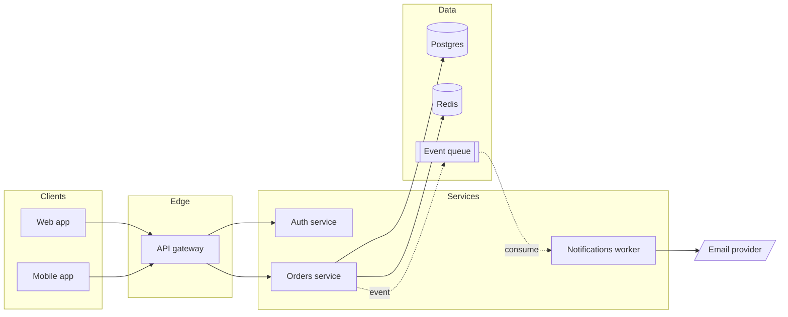

# SaaS app — architecture

End-to-end request and event flow for the order path, from clients through the services to the data stores and the async notification pipeline.

**Component legend**
- **API gateway** — single entry point; handles routing, rate limiting, and token validation with Auth.
- **Redis** — read cache + idempotency keys for the Orders service.
- **Event queue** — decouples order creation from notifications so a slow email provider never blocks checkout.

**Notes** — solid arrows are synchronous calls; dotted (`-.->`) are async events. Postgres is the single source of truth and a potential SPOF — worth a read replica. The third-party email provider is outside the trust boundary.
