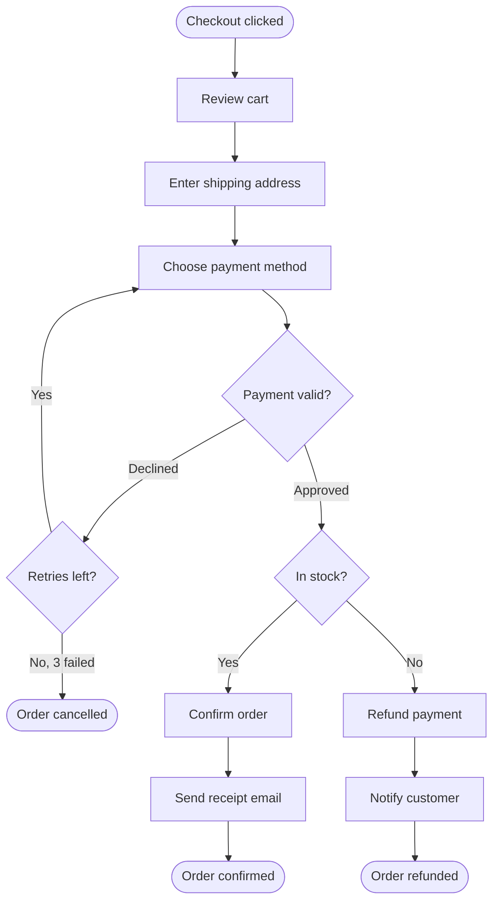

# Checkout — flowchart

The customer checkout flow, including the payment-retry loop and the inventory branch that can lead to a refund.

**Legend / notes**
- Rounded nodes `([ ])` = start/end states, rectangles = actions, diamonds = decisions.
- The retry loop is capped at 3 attempts before the order is cancelled — protects against endless failed charges.
- Out-of-stock is handled *after* a successful charge, so it always triggers a refund + notification (a known friction point worth fixing upstream by checking stock before payment).

**Assumptions** — inventory is checked after payment authorization; "retries left" counts up to 3 total attempts.
