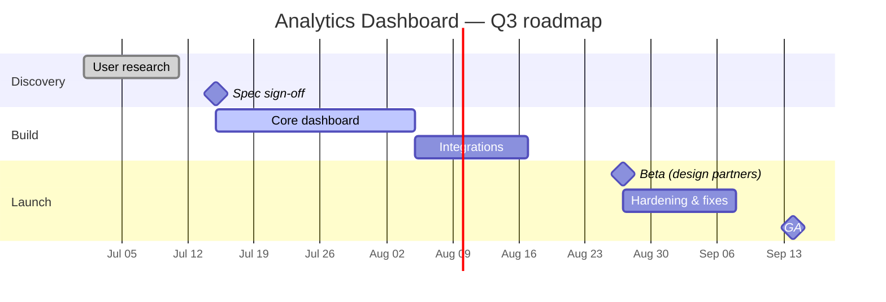

# Analytics Dashboard — Q3 roadmap

A ~10-week plan from discovery to GA, with the build phase gated on spec sign-off and integrations gated on the core build.

**Critical path** — Spec sign-off → Core dashboard → Integrations → Beta → Hardening → GA. Any slip in the core build pushes GA day-for-day.

**Risks / buffers** — Integrations depend on a third-party API still in review; if it slips, beta moves with it. The 12-day hardening window between beta and GA is the only real buffer — protect it.

**Assumptions** — durations are planning estimates from a single start date (2026-07-01); dates are ISO so this also exports straight to a calendar (.ics).
