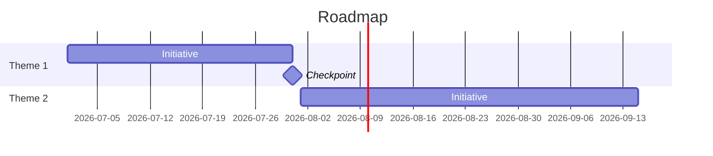

# Roadmap Narrative Skill

Convert a ranked list of product initiatives into a clear, strategic narrative that connects individual items to company goals and communicates a coherent product direction.

## Reads from / Writes to the Brain

If a [`professional-brain`](../professional-brain/SKILL.md) (`brain/`) exists, ground in it instead of re-asking for what you already know:

- **Read first:** `knowledge/strategy.md` (the direction the narrative must ladder to), priority `decisions/`, and feature `entities/`. Run `python3 ../professional-brain/scripts/brain_query.py ./brain "<roadmap theme>"` and carry each fact's provenance tag through.
- **📥 Propose to the Brain:** after producing, propose logging the sequencing/priority decisions to `decisions/` and updating the relevant feature `entities/`, each provenance-tagged. Show them, get a yes, then write with `../professional-brain/scripts/brain_write.py … --commit` (append-only, dry-run by default).

## Working from a brief

You will often get a short brief (a few themes, an audience) without a full initiative list or OKRs. **Always deliver the complete narrative anyway** — do not stop to ask questions and do not leave bracketed placeholders like `[Theme Name]`. Where detail is missing, infer specific, realistic themes, initiatives, and metrics from the brief and the domain, and mark any inferred fact or number as *(assumed — confirm)*. Fill every section with concrete content, not template brackets.

## Inputs (infer any not provided — label assumptions)

- **Prioritised initiative list** (with rough timelines or quarters)
- **Company OKRs or strategic priorities** (to connect roadmap to company goals)
- **Audience** (all-hands, board, investors, sales team — changes tone and depth)
- **Items explicitly NOT on the roadmap** (optional but strengthens credibility)

## Process
1. Review the prioritised initiative list and company OKRs provided
2. Identify 2-3 strategic themes that group the initiatives naturally
3. For each theme, articulate: the problem it addresses, the customer it serves, the metric it moves
4. Write a quarter-level narrative that shows progression — how does H1 set up H2?
5. Draft an executive summary (3-4 sentences max) that non-technical stakeholders can repeat
6. **Validate** — Confirm every initiative maps to a theme. If an initiative is orphaned, either create a theme or flag it as a narrative gap to address

## Output Structure

### Product Roadmap: [Quarter/Half/Year]
**Strategic Context:** [1 paragraph: market moment, key challenge, our response]

#### Theme 1: [Theme Name]
- Strategic rationale
- Initiatives included
- Primary metric impacted
- Dependencies

[Repeat for each theme]

**What's Not on the Roadmap (and Why):**
[2-3 items with rationale — shows strategic discipline, not just prioritisation]

**Executive Summary (shareable):**
[3-4 sentences that could be shared in an all-hands or board update]

## Tone Guidelines
- Write for a CFO, not an engineer
- Lead with customer outcomes, not features
- Be honest about what's NOT on the roadmap and why

## Timeline, drawn
When the themes have a sequence or dates, also render the roadmap as a Mermaid Gantt chart so the shape of the plan is visible (it renders live in the playground; with real ISO dates it also exports to a calendar .ics). Use `section` per theme/quarter and mark key checkpoints as milestones.

## Deeper Materials

This skill ships with support files — use them when they are available:

- **`references/now-next-later.md`** — Now/Next/Later Done Right: Commitment Gradients, Not Date Camouflage. Apply it while producing the output; it carries the calibration and judgment calls the method summary above compresses.
- **`templates/roadmap-onepager.md`** — a fill-in version of the deliverable with the quality gates inline. Offer it when the user wants to work the document themselves rather than have it generated.

## Scoring Rubric (0–40)

Score any output of this skill before handing it over; 32+ is ship-quality.

| Dimension | 0 | 5 | 10 |
|---|---|---|---|
| Thematic coherence | A feature list with dates relabelled as a "narrative"; no themes | Themes exist but one or more initiatives are orphaned without being flagged | Every initiative maps to a theme; anything that doesn't fit is explicitly flagged as a narrative gap, not smuggled in |
| Causal progression | Quarters are a chronological listing with no connection between them | Sequence is stated but the "Q1 enables Q2 because…" reasoning is missing or asserted without evidence | Each period visibly enables the next, with the causal dependency argued in prose and reflected in the timeline |
| Strategic candour | No "what's not on the roadmap" section | One exclusion with thin rationale ("not a priority right now") | ≥2 named exclusions with defensible strategic rationale — including at least one idea someone actually wants |
| Executive repeatability | Jargon-heavy; no standalone summary; a CFO couldn't retell any of it | Summary exists but is too long, too technical, or reads as compression rather than a story | 3–4 sentence summary a non-technical stakeholder could repeat correctly after one reading, zero engineering jargon |

## Quality Checks

- [ ] Every initiative in the input maps to a strategic theme
- [ ] The executive summary can stand alone and be repeated correctly after one reading
- [ ] Progression narrative shows causal links between quarters (not just chronological listing)
- [ ] "What's not on the roadmap" section includes at least 2 items with clear rationale
- [ ] Language throughout is free of engineering jargon — tested by asking: "could a CFO repeat this?"

## Anti-Patterns

- [ ] Do not produce a list of features with dates and call it a narrative — every initiative must connect to a strategic theme
- [ ] Do not omit the "what's not on the roadmap" section — without it, the narrative lacks strategic discipline
- [ ] Do not write progression as a chronological list — show causal links between quarters (Q1 enables Q2 because…)
- [ ] Do not write the executive summary last and treat it as a summary — write it as the version stakeholders will repeat
- [ ] Do not let orphaned initiatives appear without a theme — either create a theme or flag the gap explicitly
