> Traducción al español de [incident-postmortem](../../../skills/incident-postmortem/SKILL.md) — la versión en inglés es la canónica.

# Skill de Postmortem de Incidentes

Esta skill produce un documento de postmortem completo y sin culpas, siguiendo el formato estándar de la industria. La salida impone el enfoque sin culpas en todo momento — brechas del sistema por encima de fallos individuales — y empuja hacia acciones específicas y cerrables, no compromisos de proceso vagos.

## Propone acciones

Las acciones no tienen que quedarse en el papel: entrégalas a [`action-runner`](../action-runner/SKILL.md), que las previsualiza (dry-run, clasificadas por riesgo), ejecuta solo lo que apruebes mediante el MCP de acciones conectado, y registra lo hecho de vuelta en el brain. Típico: **abrir un issue de seguimiento por cada acción** (🟡), asignado a su responsable con fecha límite. Esta skill propone; action-runner controla y ejecuta — nunca en silencio.

## Entradas requeridas

Pídelas si no vienen ya en la solicitud:
- **Título / ID del incidente**
- **Severidad** (P1 / P2 / P3 o SEV1 / SEV2 / SEV3)
- **Fecha y duración** del incidente
- **Qué pasó** (notas sueltas sirven — la skill las estructura)
- **Servicios o sistemas afectados**
- **Impacto en clientes** (cuántos usuarios, qué se degradó)
- **Cómo se detectó**
- **Cómo se resolvió**
- **Hipótesis inicial de causa raíz**
- **Acciones ya identificadas** (opcional)
- **Quiénes respondieron** (guardia o respondedores — nombres o roles; para la línea de tiempo, no para culpar)
- **Comunicaciones externas enviadas** (opcional — actualizaciones de la página de estado, correos o mensajes de soporte, con horas)

## Lee y escribe en el Brain

Si existe un [`professional-brain`](../professional-brain/SKILL.md) (`brain/`), úsalo antes de preguntar:

- **Lee primero:** el archivo de `entities/` del sistema afectado y cualquier `decisions/` previa o incidentes pasados (las causas raíz recurrentes son lo más importante que se puede sacar a la superficie).
- **Escribe después:** registra las acciones y decisiones en `decisions/`, y el aprendizaje de causa raíz en `knowledge/` — etiqueta una causa medida como `[data]` y una sospechada como `[hunch]`, nunca al revés.

## Materiales de profundidad

- **`references/root-cause-digging.md`** — los cinco porqués bien hechos (detente en una propiedad del sistema que se pueda cambiar; ramifica en cadenas de causa/detección/respuesta), una taxonomía de factores contribuyentes para barrer, y reescrituras de lenguaje con forma de culpa → lenguaje sistémico. Úsalo al escribir la sección de Causa raíz y para reformular notas de entrada con tono de culpa.
- **`templates/review-meeting-agenda.md`** — una agenda de 45 minutos, documento-primero, para la reunión de revisión del postmortem, con reglas básicas y un control de calidad de las acciones. Ofrécela junto con el postmortem terminado.

## Formato de salida

---

# Postmortem de incidente: [Título del incidente]

**ID del incidente:** [ID]
**Severidad:** [P1/P2/P3]
**Fecha:** [Fecha]
**Duración:** [Hora de inicio → hora de resolución — duración total]
**Estado:** [Resuelto / En monitoreo / En curso]
**Autor:** [Dejar en blanco para que lo complete la persona]
**Última actualización:** [Fecha]

---

## Resumen ejecutivo

[3–5 frases. Qué pasó, quiénes se vieron afectados y qué se hizo para resolverlo. Escrito para un interesado no técnico. Sin jerga. Sin culpas.]

---

## Impacto

| Dimensión | Detalles |
|---|---|
| **Usuarios afectados** | [Número o porcentaje] |
| **Servicios degradados** | [Lista de servicios afectados] |
| **Impacto de negocio** | [Ingresos, incumplimiento de SLA, tickets de soporte, etc., si se conoce] |
| **Duración** | [Tiempo total desde la primera detección hasta la resolución completa] |

---

## Línea de tiempo

Enumera los eventos en orden cronológico. Cada entrada: `[HH:MM UTC] — [Qué pasó. Quién hizo qué. Qué cambió.]`

Reglas para la línea de tiempo:
- Usa lenguaje pasivo o centrado en el sistema — evita "X cometió un error"
- Incluye: primer síntoma, detección, escalamiento, hipótesis probada, corrección aplicada, confirmación de resolución
- Anota el tiempo entre eventos clave (p. ej., "22 minutos entre detección y escalamiento")

**La línea de tiempo, dibujada** — además, representa la línea de tiempo del incidente como un Gantt de Mermaid para que las brechas (p. ej., detección → escalamiento) se vean de un vistazo (se renderiza en vivo en el playground y se exporta como PNG). Usa las fases del incidente como barras; mantenlo sin culpas y centrado en el sistema:

```mermaid
gantt
    title Línea de tiempo del incidente (UTC)
    dateFormat HH:mm
    axisFormat %H:%M
    section Fases
        Impacto sin detectar :22:00, 18m
        Detección            :milestone, 22:18, 0m
        Investigación        :22:18, 22m
        Mitigación           :22:40, 15m
        Resuelto             :milestone, 22:55, 0m
```

---

## Causa raíz

**Causa raíz primaria:** [Una frase clara. Técnica pero llana. "Una configuración de despliegue incorrecta provocó..."]

**Factores contribuyentes:**
- [Factor 1 — p. ej., la ausencia de despliegue canario hizo que el cambio llegara de inmediato al 100% del tráfico]
- [Factor 2 — p. ej., el umbral de alerta estaba demasiado alto para captar la degradación inicial]
- [Factor 3 — agrega tantos como sean relevantes]

**¿Por qué nuestras salvaguardas existentes no lo evitaron?**
[Párrafo honesto que explique por qué el monitoreo, las pruebas o los procesos no lo detectaron antes. Aquí es donde más importa el análisis sin culpas — enfócate en brechas del sistema, no en fallos individuales.]

---

## Detección

- **¿Cómo se detectó primero?** [Reporte de cliente / alerta automática / monitoreo interno / observación manual]
- **Tiempo desde el inicio del incidente hasta la detección:** [X minutos]
- **¿Deberíamos haberlo detectado antes?** [Sí / No — y por qué]

---

## Resolución

**¿Qué lo arregló?** [Descripción clara de la corrección real — un párrafo]
**¿Por qué funcionó?** [Breve explicación técnica]
**¿Hubo una mitigación temporal antes de la resolución completa?** [Sí/No — descríbela si aplica]

---

## Acciones

| # | Acción | Responsable | Fecha límite | Prioridad |
|---|---|---|---|---|
| 1 | [Acción específica y verificable] | [Equipo o persona] | [Fecha] | P1/P2/P3 |

Reglas para las acciones:
- Cada acción debe ser lo bastante específica como para cerrarse como "hecha" o "no hecha" — nada vago como "mejorar el monitoreo"
- Distingue entre: **Prevenir la recurrencia** (arreglar la causa raíz), **Mejorar la detección** (captarlo antes la próxima vez), **Mejorar la respuesta** (resolverlo antes la próxima vez)
- Asigna un responsable real — no "el equipo" ni "por definir" si es evitable
- Marca como P1 las acciones que bloquean el cierre completo del incidente

---

## Qué salió bien

[3–5 observaciones honestas sobre la respuesta. Incluye: colaboración rápida, runbooks útiles, escalamiento efectivo, comunicación clara. Esta sección construye confianza en el equipo y refuerza buenos hábitos.]

---

## Lecciones aprendidas

[3–5 aprendizajes de este incidente que valga la pena compartir más allá de este equipo. Escríbelos como lecciones transferibles — p. ej., "Nuestro runbook de failover de base de datos no contemplaba el lag de las réplicas de lectura. Todos los runbooks con failover de base de datos deben revisarse."]

---

## Registro de comunicaciones

[Opcional — lista de comunicaciones externas enviadas: actualizaciones de la página de estado, correos a clientes, respuestas de soporte. Incluye horas.]

---

## Rúbrica de puntuación (0–40)

Califica cualquier salida de esta skill antes de entregarla; 32+ es calidad de entrega.

| Dimensión | 0 | 5 | 10 |
|---|---|---|---|
| Sin culpas, con verdad | Señala y avergüenza, o esteriliza tanto que la historia desaparece | Redacción sin culpas pero con las acciones individuales difuminadas | Las acciones de las personas constan de forma factual dentro de un marco sistémico — honesto y seguro a la vez |
| Profundidad de la causa raíz | Se detiene en el síntoma o en "error humano" | Nombra una brecha del sistema pero con un solo "porqué" de profundidad | La causa raíz más los factores contribuyentes explican por qué el sistema lo permitió, no solo qué se rompió |
| Calidad forense de la línea de tiempo | Escasa, desordenada o sin los hitos de detección a resolución | Completa pero sin horas ni puntos de decisión | Con horas, incluye el retraso de detección, los puntos de decisión y los callejones sin salida realmente explorados |
| Responsabilidad de las acciones | Mejoras vagas, sin responsables | Responsables asignados pero acciones no accionables o sin fecha | Cada acción es convertible en ticket, con responsable y fecha, y mapeada a una causa raíz o factor contribuyente |

## Controles de calidad

- [ ] La línea de tiempo no tiene lenguaje de culpa
- [ ] La causa raíz es específica (no "error humano")
- [ ] La causa raíz responde "¿por qué pasó?" y no solo "¿qué pasó?" — nombra una brecha de sistema o proceso, no un síntoma
- [ ] Los factores contribuyentes explican las brechas sistémicas
- [ ] Cada acción tiene responsable y fecha límite
- [ ] La sección "Qué salió bien" es genuina, no de compromiso
- [ ] Ninguna acción contiene lenguaje vago como "mejorar el monitoreo", "aumentar la resiliencia" o "probar mejor" — cada una nombra un cambio específico
- [ ] El resumen ejecutivo es legible por una dirección no técnica

## Anti-patrones

- [ ] No asignes culpas a personas — los postmortems se centran en fallos de sistema y proceso
- [ ] No escribas acciones con lenguaje vago como "mejorar el monitoreo" — cada una debe nombrar un cambio específico y con dueño
- [ ] No omitas los factores contribuyentes — la causa raíz por sí sola pierde los problemas sistémicos que habilitan incidentes
- [ ] No omitas la línea de tiempo de detección — cuánto tardó en detectarse importa tanto como cuánto tardó en resolverse
- [ ] No des por cerrado el postmortem hasta que todas las acciones tengan responsable y fecha límite

## Ejemplos de uso
- "Escribe un postmortem de la caída de [nombre del incidente]"
- "Ayúdame a escribir un informe de incidente P1"
- "Genera un documento de RCA por la caída de [servicio] el [fecha]"
- "Redacta un postmortem sin culpas a partir de estas notas: [pegar notas]"
