# Worked Example — Incident Postmortem Skill

## The brief

Tollgate Payments processes card authorizations for ~14,000 online merchants. On 18 June 2026, a routine deploy of the authorization service (`auth-svc`, 24 instances) raised the per-instance database connection pool from 20 to 60 to "fix" intermittent pool-wait timeouts — without raising PgBouncer's `max_client_conn`, which was set to 600. Old fleet demand was 24 × 20 = 480 client connections; mid-rollout demand crossed 600 about five minutes into the deploy, and PgBouncer began refusing new client connections. Requests that landed on an already-established connection succeeded; the rest errored — authorization success rate fell to 71% for 48 minutes during evening peak (~9,200 auths/min). The rollback restored the old pool size, but connections held by SIGKILLed pods lingered in PgBouncer's client slots, so recovery stalled at ~88% until an operator manually recycled the auth database's client connections from the PgBouncer admin console. The on-call engineer's notes are rough and slightly defensive ("Dev didn't check the bouncer config"); the postmortem below reframes them blamelessly.

## The output

---

# Incident Postmortem: Authorization Success Rate Degradation — PgBouncer Client-Connection Exhaustion

**Incident ID:** INC-2026-0618
**Severity:** P1
**Date:** 2026-06-18
**Duration:** 18:52 UTC → 19:40 UTC — 48 minutes
**Status:** Resolved
**Author:** [Leave blank for user to fill]
**Last updated:** 2026-06-20

---

## Executive Summary

On the evening of 18 June, roughly 29% of card authorization attempts failed for 48 minutes during peak shopping hours. A configuration change deployed to the authorization service tripled the number of database connections each server requests, exceeding the fixed limit on our connection-pooling layer (PgBouncer). New connections were refused, so a large share of authorization requests could not reach the database. Rolling back the change restored most capacity, but connections abandoned by the replaced servers continued to occupy slots in the pooling layer, and full recovery required an operator to manually clear them. Approximately 128,000 authorization attempts failed; most were retried successfully by merchants or card networks within the hour.

---

## Impact

| Dimension | Details |
|---|---|
| **Users affected** | ~2,150 merchants saw elevated decline/error rates; ~128,000 authorization attempts failed (29% of ~9,200/min over 48 min) |
| **Services degraded** | `auth-svc` (card authorization API); downstream merchant checkout flows |
| **Business impact** | ~$1.9M in payment volume delayed or declined; monthly 99.9% availability SLA breached for 3 enterprise merchants; 340 support tickets |
| **Duration** | 48 minutes from first customer impact to full resolution (14 minutes of that undetected) |

---

## Timeline

All times UTC, 2026-06-18.

- `[18:47]` — Deploy of `auth-svc` v2026.06.18.1 begins (rolling, 24 instances). The release includes a pool-size change: per-instance Postgres pool raised from 20 → 60, intended to eliminate intermittent pool-wait timeouts seen the prior week.
- `[18:52]` — Aggregate client-connection demand on PgBouncer crosses `max_client_conn = 600` (17 old instances × 20 + 7 new instances × 60 = 760). PgBouncer begins refusing new client connections (`no more connections allowed (max_client_conn)`). Authorization success rate starts falling. **First customer impact.**
- `[18:58]` — Merchant support receives the first cluster of "unexpected declines" tickets. These are handled in the support queue and not correlated with an ops signal — support tooling has no automated path to page on-call. (6 minutes of signal sitting outside the ops loop.)
- `[19:04]` — Automated alert `auth-success-rate-low` fires. The alert evaluates a 10-minute rolling window at an 85% threshold, so it fired ~12 minutes after impact began.
- `[19:06]` — On-call engineer acknowledges the page. **Detection, 14 minutes after first impact.**
- `[19:09]` — Postgres dashboards look healthy (low load, no lock contention), which initially points investigation away from the database layer. PgBouncer itself exports no metrics to Prometheus, so its saturation is invisible on dashboards.
- `[19:13]` — Application logs surface `no more connections allowed (max_client_conn)`; the pool-size change in the 18:47 release is identified as the likely trigger. (7 minutes from acknowledgement to correct hypothesis, extended by the missing PgBouncer telemetry.)
- `[19:15]` — Rollback to v2026.06.11.3 initiated.
- `[19:24]` — Rollback completes. Success rate recovers only to ~88% — below the healthy 99.5% baseline. During the rollback, several overloaded pods exceeded their termination grace period and were SIGKILLed; their TCP connections were never closed cleanly and continued to occupy PgBouncer client slots pending kernel keepalive expiry.
- `[19:31]` — PgBouncer admin console inspection confirms ~210 of ~530 occupied client slots belong to IPs of terminated pods.
- `[19:36]` — Operator recycles all client connections for the auth database (`KILL tollgate_auth`, then `RESUME tollgate_auth`), forcing a clean reconnect of the healthy fleet. Brief (~20s) reconnect blip, then pools fill normally.
- `[19:40]` — Success rate stable at 99.6% for 4 consecutive minutes. **Resolved.**
- `[19:55]` — Status page updated to "resolved"; monitoring continued through end of peak.

Gap callouts: 14 minutes impact → detection; 9 minutes detection → correct hypothesis; 16 minutes between "rollback complete" and full recovery due to the stale-connection side effect.

**Timeline, drawn:**

```mermaid
gantt
    title INC-2026-0618 — Authorization degradation (UTC)
    dateFormat HH:mm
    axisFormat %H:%M
    section Phases
        Undetected impact            :18:52, 14m
        Detection                    :milestone, 19:06, 0m
        Investigation                :19:06, 9m
        Rollback                     :19:15, 9m
        Partial recovery (stale conns) :19:24, 12m
        Manual connection recycle    :19:36, 4m
        Resolved                     :milestone, 19:40, 0m
```

---

## Root Cause

**Primary root cause:** The connection budget between `auth-svc` and PgBouncer exists in two places that can be changed independently — the per-instance pool size in the service's deploy config and `max_client_conn` in PgBouncer's config — with no automated check that fleet-wide demand (instances × pool size) stays within the PgBouncer limit.

**Contributing factors:**
- The pool-size change shipped inside a routine release with no capacity review; nothing in the deploy pipeline treats connection-pool parameters as capacity-sensitive.
- PgBouncer exports no metrics to Prometheus, so client-slot saturation — the direct leading indicator — was invisible before and during the incident, and initially steered investigation toward Postgres.
- The `auth-success-rate-low` alert uses a 10-minute rolling window, adding ~12 minutes of detection latency on a fast-onset failure.
- Rollback was assumed to be a complete remediation, but pods SIGKILLed under load leaked client connections that PgBouncer holds until TCP keepalive expiry — a known PgBouncer behaviour that no runbook covered.
- Merchant support ticket spikes have no automated bridge to on-call paging, leaving 6 minutes of early signal unused.

**Why did our existing safeguards not prevent this?**
Our safeguards were pointed one layer too deep. Postgres itself was well-monitored and never unhealthy; the failure lived entirely in the pooling layer in front of it, which had neither metrics nor alerts. Config review caught nothing because pool size looks like an application tuning knob, not a capacity commitment against a shared, fixed resource — no tooling encodes that relationship. And our recovery playbook equated "rollback complete" with "incident over", which was false here: the rollback fixed the code path but not the leaked connection state, and we had no documented procedure for recycling PgBouncer clients, so that step took 12 minutes of on-the-spot discovery.

---

## Detection

- **How was it first detected?** Automated alert (`auth-success-rate-low`) at 19:04; merchant support tickets began 6 minutes earlier but did not reach on-call.
- **Time from incident start to detection:** 14 minutes.
- **Should we have detected this faster?** Yes. A PgBouncer client-slot saturation alert would have fired within ~2 minutes of the rollout starting to exceed the limit — before most of the customer impact. Independently, a 3-minute alert window on the payment-path success SLI would have cut ~7 minutes. We are treating the absence of PgBouncer telemetry as the primary detection gap.

---

## Resolution

**What fixed it?** Two actions in sequence: (1) rolling back `auth-svc` to v2026.06.11.3, restoring the per-instance pool size to 20 and bringing fleet-wide demand back under the PgBouncer limit; (2) manually recycling all PgBouncer client connections for the auth database (`KILL` + `RESUME` from the admin console) to evict ~210 stale connections leaked by SIGKILLed pods.

**Why did this work?** The rollback removed the source of excess demand, but PgBouncer only frees a client slot when the TCP connection closes or keepalive declares it dead — the leaked slots would otherwise have taken tens of minutes to expire. Forcing a full client recycle released them immediately and let the healthy fleet rebuild clean pools within seconds.

**Was there a temporary mitigation before full resolution?** No. Raising `max_client_conn` on the fly was considered at 19:13 and rejected in the moment — the team was not confident about downstream `default_pool_size` implications on Postgres itself under peak load, and rollback was judged faster and safer. In hindsight this was the right call.

---

## Action Items

| # | Action | Owner | Due Date | Priority |
|---|---|---|---|---|
| 1 | Add a deploy-pipeline contract check: `auth-svc` pool_size × max replica count must be ≤ 80% of PgBouncer `max_client_conn`; fail the deploy otherwise (**Prevent recurrence**) | Daniel Okafor (Payments Core) | 2026-07-03 | P1 |
| 2 | Export PgBouncer metrics (client/server slot usage, waiting clients) to Prometheus and alert at 80% of `max_client_conn` (**Improve detection**) | Priya Nair (Platform) | 2026-06-26 | P1 |
| 3 | Write and drill a "PgBouncer client-connection recycle" runbook with the exact admin-console commands used at 19:36 (**Improve response**) | Mei Sato (SRE) | 2026-06-30 | P2 |
| 4 | Reduce `auth-success-rate-low` evaluation window from 10 minutes to 3 minutes for payment-path SLIs; validate against 90 days of history for false-positive rate (**Improve detection**) | Priya Nair (Platform) | 2026-06-27 | P2 |
| 5 | Auto-notify `#payments-oncall` when merchant support tickets tagged `declines` exceed 10 in 5 minutes (**Improve detection**) | Lena Fischer (Support Engineering) | 2026-07-10 | P3 |

P1 items (#1, #2) block this incident from being marked fully closed.

---

## What Went Well

- The rollback decision was made 9 minutes after acknowledgement, without waiting for full root-cause certainty — the team correctly optimised for restoring service over understanding everything first.
- The on-call engineer resisted the tempting live edit to `max_client_conn` under pressure, choosing the reversible action over the unfamiliar one.
- Once success rate plateaued at 88%, the team did not declare victory — the anomaly was chased down within 7 minutes rather than being written off as "settling".
- The 19:31 PgBouncer admin-console inspection was methodical: stale connections were confirmed against terminated pod IPs before any destructive action was taken.
- Status page communications went out at detection, at rollback, and at resolution, each within 5 minutes of the underlying event.

---

## Lessons Learned

- Any parameter that multiplies across a fleet against a fixed shared limit (connection pools, file handles, rate-limit quotas) is a capacity change, not a tuning change — it needs a capacity check in the pipeline, not just code review.
- Rollback restores code, not state. Post-rollback verification must confirm the system's *state* has recovered (here: PgBouncer slot occupancy), not just that the old version is running.
- Every hop in the request path needs its own telemetry. Monitoring the database behind a proxy while leaving the proxy dark meant the failing layer was the one place we could not see.
- Slow-window alerts trade detection speed for noise reduction; on money-path SLIs with fast-onset failure modes, that trade should be revisited deliberately rather than inherited.
- Early customer signal (support tickets) arrived 6 minutes before machine signal; a lightweight ticket-spike bridge to on-call is cheap insurance on any customer-facing payment system.

---

## Communication Log

- `[19:10 UTC]` Status page: "Investigating elevated authorization errors" (Incident opened, component: Authorization API — Degraded).
- `[19:26 UTC]` Status page update: "A fix has been applied; error rates are improving. We are monitoring."
- `[19:42 UTC]` Status page update: "Authorization success rates have returned to normal. We continue to monitor."
- `[19:55 UTC]` Status page: incident marked Resolved.
- `[2026-06-19 09:00 UTC]` Email to the 3 SLA-affected enterprise merchants from their account managers, with incident summary and SLA-credit process.

---

## Why it's shaped this way

- **The root cause names a changeable system property** — "the connection budget lives in two independently changeable places with no automated check" — not the config value, not the deploy, and not the engineer who changed it. This is the Quality Check "root cause answers *why*, not just *what*", and it's what makes action item #1 fall out naturally.
- **The input notes said "Dev didn't check the bouncer config"; the postmortem never does.** Blame-shaped language is rewritten into system gaps ("nothing in the deploy pipeline treats pool parameters as capacity-sensitive") per the skill's blameless framing rules and `references/root-cause-digging.md`.
- **The rollback is documented as partially failing** — code restored, leaked connection state not — and the Resolution and Timeline sections quantify the 16-minute gap it caused. Sanitising this to "rollback fixed it" is exactly the happy-path anti-pattern the skill warns against, and it would erase the justification for action item #3.
- **The detection gap is owned honestly**: "Should we have detected this faster? Yes", with the specific missing telemetry named and the 6 minutes of unused support-ticket signal counted. The Anti-Patterns list forbids omitting the detection timeline; the Gantt makes the 14-minute dark window visually undeniable.
- **Every action item is closeable as done/not-done** with a named owner and date, and each is tagged Prevent / Detect / Respond per the Action Items rules — no "improve monitoring". Item #2 says *which* metrics, *where*, and *what threshold*.
- **Contributing factors sweep beyond the trigger** — alert window, missing runbook, support-to-oncall gap — because root cause alone misses the systemic enablers (an explicit Anti-Pattern).
- **The Executive Summary contains zero jargon load-bearing terms** (PgBouncer is introduced as "our connection-pooling layer") so a non-technical stakeholder can read it standalone, per the Quality Check.
- **"What Went Well" contains real judgment calls** (rejecting the live config edit, not declaring victory at 88%) rather than token praise — the Quality Checks require it to be genuine, and these are the habits worth reinforcing.
