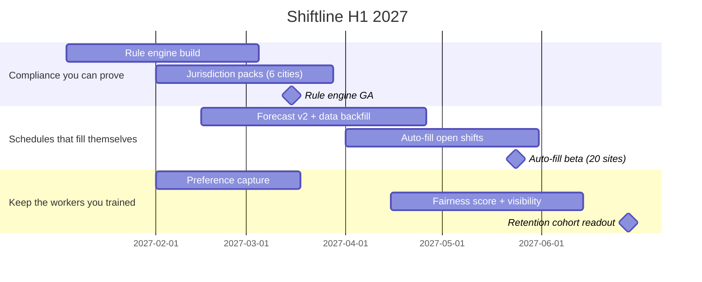

# Worked Example — Roadmap Narrative

A gold-standard run of this skill: nine ranked initiatives turned into a three-theme H1 story a board member could repeat — with one initiative honestly flagged as not fitting the narrative.

## The brief

Shiftline — a fictional B2B company selling workforce scheduling to grocery and quick-service chains (310 customers, ~92,000 scheduled workers) — needs an H1 2027 roadmap narrative for the January board meeting and revenue kickoff. Fair-workweek laws take effect in six new cities in 2027, and 8 of 11 open enterprise deals are stalled on compliance questions. Managers at customer sites spend ~6.5 hours a week building schedules; customers' loudest pain is 90-day frontline attrition. The PM has a ranked list of nine initiatives, including an engineering-committed React Native migration that maps to no customer outcome.

## The output

```
# Product Roadmap: H1 2027 — Shiftline

**Strategic Context:** 2027 is the year predictive-scheduling regulation goes from edge
case to buying criterion: six new cities enforce fair-workweek rules, and 8 of our 11 open
enterprise deals are stalled on compliance questions we currently answer with spreadsheets.
Meanwhile our customers' scarcest resources are manager hours (6.5 h/week per site spent
building schedules) and trained frontline workers (39% gone within 90 days). H1 builds the
compliance foundation first, then uses it to automate scheduling and make schedules fair
enough to keep workers — three themes, one causal chain.

## Theme 1: Compliance you can prove (Q1)

- **Strategic rationale:** Compliance is the wedge into enterprise. Today we pass 3 of 11
  active enterprise compliance reviews unaided *(assumed — confirm with sales ops)*; the
  rest need solutions-engineering heroics.
- **Initiatives included:** predictive-scheduling rule engine; premium-pay calculation with
  audit trail; jurisdiction packs for the six new fair-workweek cities.
- **Primary metric impacted:** enterprise deals passing compliance review unaided — 3/11 →
  9/11; zero customer fair-workweek penalty incidents.
- **Dependencies:** legal review of each jurisdiction pack; the rule engine is the
  foundation Theme 2 builds on.

## Theme 2: Schedules that fill themselves (Q2)

- **Strategic rationale:** Manager hours are the retention lever *for our buyer*. But
  auto-fill can only ship after the rule engine exists — an auto-scheduler that generates
  illegal schedules is a lawsuit generator. Q1 enables Q2; this is the causal spine of H1.
- **Initiatives included:** demand forecast v2; auto-fill for open shifts; self-serve shift
  swaps with compliance guardrails.
- **Primary metric impacted:** manager scheduling hours per site per week — 6.5 → 2.0
  (in-product time measurement).
- **Dependencies:** Theme 1 rule engine at GA (mid-March); 12 months of forecast training
  data backfilled by end of Q1.

## Theme 3: Keep the workers you trained (seeds in Q1, ships in Q2)

- **Strategic rationale:** Frontline attrition is our customers' #1 stated pain, and
  schedule unfairness is a leading driver they can actually control. Preference data
  collected here also feeds Theme 2's auto-fill — the themes reinforce each other rather
  than competing.
- **Initiatives included:** worker preference capture at onboarding; fairness score on
  every published schedule; hours-and-earnings visibility for workers.
- **Primary metric impacted:** 90-day frontline retention at instrumented customer sites —
  61% → 68% *(assumed — confirm against the pilot cohort)*.
- **Dependencies:** preference capture must ship in Q1 to have data by the time auto-fill
  goes to beta.

## Narrative gap — flagged, not smuggled

The **React Native app migration** (engineering-committed, ~2 squad-quarters) maps to no
theme and no customer outcome this half. We are carrying it honestly as a platform-health
line item rather than dressing it up as part of Theme 3. If the board asks what it buys:
release velocity on mobile in H2, not an H1 outcome.

## What's Not on the Roadmap (and Why)

- **Payroll processing** — adjacent, requested, and a capital-intensive domain with
  entrenched incumbents. We integrate with payroll partners instead; building it would
  starve all three themes.
- **Cross-employer shift marketplace** — contradicts the retention promise we make in
  Theme 3. A feature that helps workers leave our customers is strategy-negative revenue.
- **AI scheduling chat assistant** — until forecast accuracy (Theme 2) is earned, a chat
  layer is novelty on top of numbers nobody trusts. Revisit for H2 planning.

## Executive Summary (shareable)

In H1 we make Shiftline the scheduling platform that keeps enterprises legal and keeps
their workers. Q1 delivers provable fair-workweek compliance — the blocker on 8 of our 11
enterprise deals. That compliance engine is what lets Q2's auto-scheduling cut manager
schedule-building from 6.5 hours a week toward 2 while staying legal by construction, and
fair enough that frontline workers stay past 90 days. We are deliberately not building
payroll or a shift marketplace: everything in H1 serves compliance, manager time, or
worker retention.
```



## Why it's shaped this way

- **Q1 doesn't just precede Q2 — it enables it, and the text says so** — the anti-patterns forbid writing "progression as a chronological list"; the narrative names the causal spine twice ("an auto-scheduler that generates illegal schedules is a lawsuit generator"), so the sequencing survives being challenged in the board meeting.
- **The React Native migration is flagged as a narrative gap instead of being forced into a theme** — the process step says orphaned initiatives must be either themed or flagged; smuggling an engineering migration into "Keep the workers you trained" would be exactly the credibility leak the validate step exists to catch.
- **"What's Not on the Roadmap" contains real refusals with strategic teeth** — the quality checks demand "at least 2 items with clear rationale"; the shift-marketplace entry does the most work, because it shows a revenue idea being declined for contradicting the strategy, which is what "strategic discipline, not just prioritisation" looks like.
- **The executive summary is written to be repeated, not to summarise** — per the anti-pattern, it isn't a compression of the document but the four sentences a board member says to someone else; it survives the CFO test with no engineering vocabulary in it.
- **Every metric has a number, and the unverified ones are labelled** — the working-from-a-brief rule bans bracketed placeholders and demands inferred values marked *(assumed — confirm)*; the 3/11 compliance-pass rate and the 61% retention baseline carry that tag rather than posing as facts.
- **Each theme states the customer it serves and the single metric it moves** — the process requires problem + customer + metric per theme; Theme 2 is explicit that the *buyer's* manager-hours pain differs from Theme 3's *worker* retention pain, which stops the themes blurring into one "make scheduling better" mush.
- **The Gantt renders the causal chain visually** — rule-engine GA (March 15) sits as a milestone *before* auto-fill starts, so the dependency argued in prose is also visible in the drawn timeline, per the "Timeline, drawn" instruction to mark key checkpoints as milestones.
