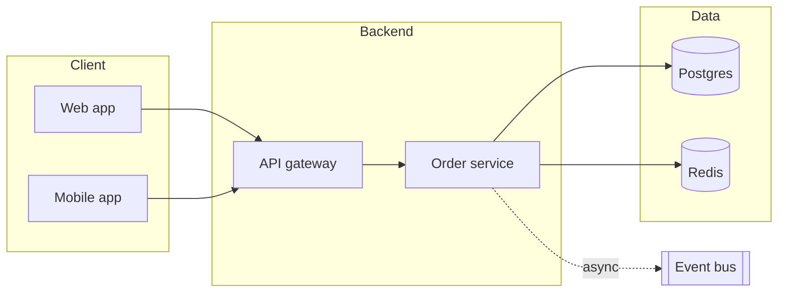

# Architecture Diagram Skill

"How does the system fit together?" is best answered with a picture. This skill turns a described system
into a clean **Mermaid architecture diagram** — clients, services, data stores, and third parties, grouped
into logical layers with labelled connections (sync vs async, protocols) — not an undifferentiated blob of
boxes.

## Required Inputs

Ask for these only if they aren't already provided:

- **The components** — services, apps, databases, queues, external APIs.
- **How they connect** — who calls whom; sync (HTTP/gRPC) vs async (queue/event); data flow direction.
- **Logical groupings** — frontend / backend / data / third-party, or by team/domain.
- **Focus** — the whole system or one slice (e.g. just the checkout path).

## Output Format

### [System name] — architecture

One line on what the diagram covers and its boundary.

**Component legend** — one line per non-obvious component (what it is, why it's there).

**Notes** — trust boundaries, single points of failure, sync vs async (`-.->` = async), anything to revisit.

## Mermaid Rules (so it renders)

- Use `flowchart LR` (or `TD`) with `subgraph Name ... end` for logical layers.
- Databases/stores read well as `[(name)]`; queues/buses as `[[name]]`.
- Solid arrows `-->` for synchronous calls, dotted `-.label.->` for async/events.
- Short node labels; keep IDs unique and simple. No parentheses/quotes inside labels.

## Quality Checks

- [ ] Components are grouped into meaningful layers (subgraphs), not one flat pile
- [ ] Connection direction reflects who calls whom; async vs sync is distinguished
- [ ] Data stores and external/third-party systems are visually distinct from services
- [ ] The legend explains anything non-obvious; trust boundaries / SPOFs are noted
- [ ] The Mermaid block renders without edits

## Anti-Patterns

- [ ] Do not draw every box the same with undifferentiated arrows — show layers and connection types
- [ ] Do not omit data stores or external dependencies — they're usually where the risk lives
- [ ] Do not blur sync and async — they have very different failure modes
- [ ] Do not cram the entire system when the ask is one slice — match the requested focus
- [ ] Do not break Mermaid with special characters in labels

## Based On

Architecture diagramming (C4-style grouping, logical layers, sync/async edges), expressed as renderable Mermaid.
