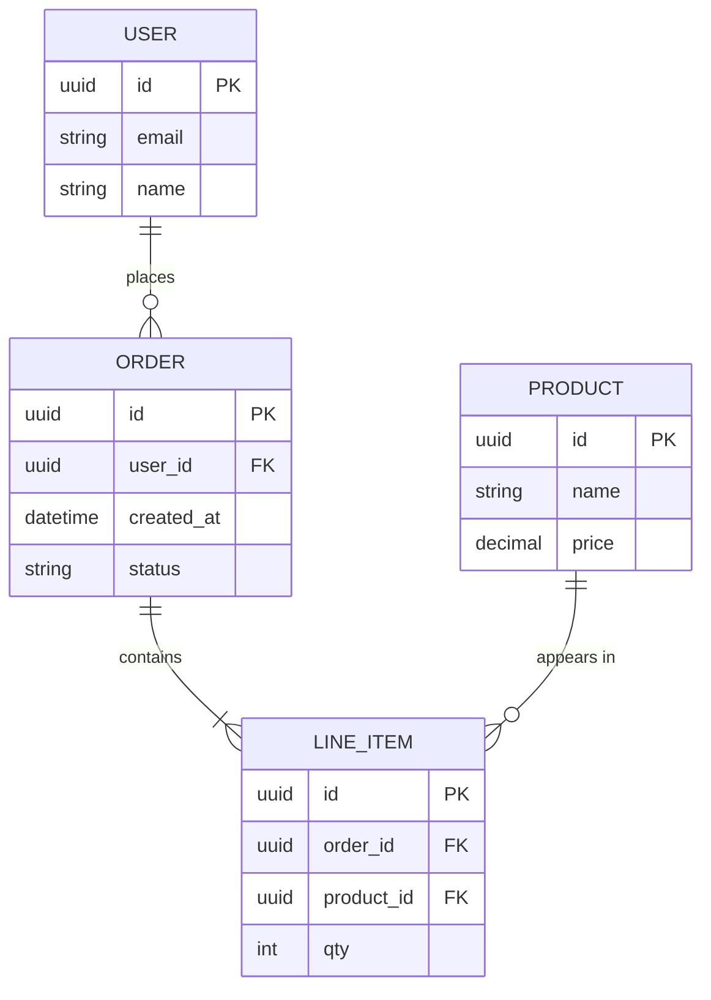

# Entity-Relationship Diagram Skill

Before you write a migration, it pays to see the data model: the entities, their key fields, and how they
relate (one-to-many, many-to-many). This skill turns a described domain into a clean **Mermaid ER diagram**
with proper cardinality notation and the attributes that matter.

## Required Inputs

Ask for these only if they aren't already provided:

- **The entities** — the core objects/tables (User, Order, Product…).
- **Relationships** — how they relate, and the cardinality (a user *has many* orders, an order *has many* line items).
- **Key attributes** — the important fields per entity (especially keys); full column lists aren't required.
- **The domain** — what the system does, so the model is realistic.

## Output Format

### [Domain] — data model

One line on the scope of the model.

**Cardinality key** — `||--o{` = one-to-many, `}o--o{` = many-to-many, `||--||` = one-to-one.

**Design notes** — normalization choices, where a join table is needed, indexes worth adding, anything deferred.

## Mermaid Rules (so it renders)

- Start with `erDiagram`. Relationship line: `A ||--o{ B : label`.
- Crow's-foot cardinality: `||` (exactly one), `o{` (zero-or-many), `|{` (one-or-many), `o|` (zero-or-one).
- Attribute blocks: `ENTITY { type name PK }` — mark keys with `PK` / `FK`.
- Entity names are usually UPPER_SNAKE; quote relationship labels that contain spaces.

## Quality Checks

- [ ] Every relationship has explicit, correct cardinality (not just a plain line)
- [ ] Primary and foreign keys are marked (PK/FK)
- [ ] Many-to-many relationships are resolved with a join entity where appropriate
- [ ] Attribute types are sensible for the domain
- [ ] The Mermaid block renders without edits

## Anti-Patterns

- [ ] Do not draw relationships without cardinality — "related" isn't a data model
- [ ] Do not leave many-to-many unresolved when a join table is the right call
- [ ] Do not dump every conceivable column — show the keys and the attributes that matter
- [ ] Do not omit foreign keys — they're how the relationships are actually enforced
- [ ] Do not break Mermaid with unquoted spaced labels

## Based On

Data modeling (entity-relationship modeling, crow's-foot notation, normalization), expressed as renderable Mermaid.
