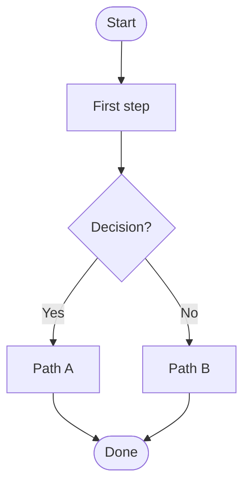

# Flowchart Skill

A wall of prose describing a process is hard to follow; a flowchart makes the steps, branches, and
dead-ends obvious at a glance. This skill turns a described process into a clean, correctly-structured
**Mermaid flowchart** — with real decision diamonds, parallel paths, and end states — not a vague
box-and-arrow sketch.

## Required Inputs

Ask for these only if they aren't already provided:

- **The process** — what happens, roughly in order (steps, who does what).
- **Decision points** — where the path branches, and on what condition.
- **Start and end states** — where it begins and the possible outcomes (success, rejection, error).
- **Direction preference** (optional) — top-down (`TD`) for most processes, left-right (`LR`) for pipelines.

If the process is ambiguous, state the assumption you made rather than inventing steps.

## Output Format

### [Process name] — flowchart

A one-line summary of what the chart shows.

**Legend / notes**
- Rounded nodes `([ ])` = start/end, rectangles `[ ]` = actions, diamonds `{ }` = decisions.
- Call out any swimlane/owner, SLA, or branch that needs attention.

**Assumptions** — anything you inferred about the process.

## Mermaid Rules (so it renders)

- Start with `flowchart TD` (or `LR`). Give every node a short ID (`A`, `step1`) and a label.
- Decisions are `{ }` with labelled edges: `C -->|Yes| D`.
- Keep labels short; put detail in the notes, not inside the node.
- Avoid unescaped parentheses/quotes inside labels — they break parsing. Use plain text.
- One concept per node; don't cram a sentence into a box.

## Quality Checks

- [ ] Every decision diamond has all its branches labelled and leading somewhere (no dangling paths)
- [ ] There is a clear start and at least one explicit end state
- [ ] Node shapes are used meaningfully (action vs decision vs start/end)
- [ ] The Mermaid block is syntactically valid and renders without edits
- [ ] Assumptions about ambiguous steps are stated, not silently invented

## Anti-Patterns

- [ ] Do not produce a linear chain when the real process has branches — capture the decisions
- [ ] Do not stuff full sentences into nodes — keep labels short, move detail to notes
- [ ] Do not leave a decision with only one labelled branch — show what happens on every condition
- [ ] Do not use parentheses or quotes inside labels in a way that breaks Mermaid
- [ ] Do not invent steps to fill gaps — flag what you assumed

## Based On

Process mapping / flowcharting practice (ANSI flowchart conventions), expressed as renderable Mermaid.
