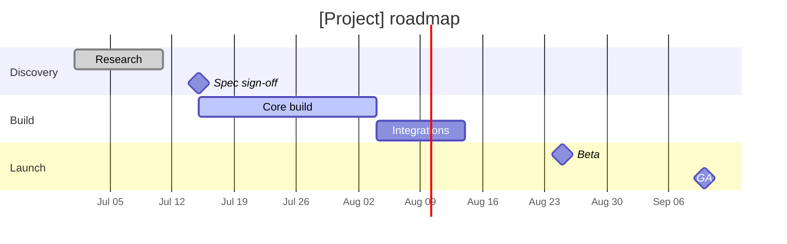

# Gantt / Roadmap Skill

A list of tasks doesn't show what runs in parallel, what blocks what, or where the crunch is. A Gantt chart
does. This skill turns a plan into a **Mermaid Gantt chart** with phases (sections), dated tasks, dependencies,
and milestones — a real schedule, not a wish list. Because the output carries real dates, the playground can
also export it straight to a calendar (`.ics`).

## Required Inputs

Ask for these only if they aren't already provided:

- **The work** — phases and tasks to schedule.
- **Timing** — a start date, and durations or end dates (or relative ordering you can date from the start).
- **Dependencies** — what must finish before what can start.
- **Milestones** — the dated checkpoints (kickoff, beta, GA, launch).

If exact dates aren't given, anchor to a start date and lay tasks out by stated duration/order; flag the dates as planning estimates.

## Output Format

### [Project] — roadmap

One line on the time span and goal.

**Critical path** — the chain of dependent tasks that sets the end date.

**Risks / buffers** — where the schedule is tight, what could slip, where buffer exists.

**Assumptions** — any dates you estimated rather than were given.

## Mermaid Rules (so it renders)

- Start with `gantt`, then `title`, `dateFormat YYYY-MM-DD`, optional `axisFormat`.
- Group with `section Name`. Task line: `Label : [status,] id, start, duration` (e.g. `:active, b1, 2026-07-01, 20d`).
- Dependencies use `after <id>` as the start. Milestones use the `milestone` tag with `0d`.
- Use real ISO dates (`YYYY-MM-DD`) so the calendar (.ics) export works.

## Quality Checks

- [ ] Tasks are grouped into phases (sections) and have real start dates/durations
- [ ] Dependencies use `after` so the schedule reflects what blocks what
- [ ] Milestones are marked as milestones, not full-width bars
- [ ] The critical path is identified, with risks/buffers noted
- [ ] The Mermaid block renders, and dates are ISO so .ics export works

## Anti-Patterns

- [ ] Do not list tasks with no dates or durations — that's a checklist, not a timeline
- [ ] Do not ignore dependencies — overlapping things that can't overlap is a fake plan
- [ ] Do not draw milestones as long bars — they're points in time
- [ ] Do not use ambiguous date formats — stick to `YYYY-MM-DD`
- [ ] Do not present estimated dates as commitments — flag assumptions

## Based On

Project scheduling (Gantt charts, critical path, milestones, dependencies), expressed as renderable Mermaid.
