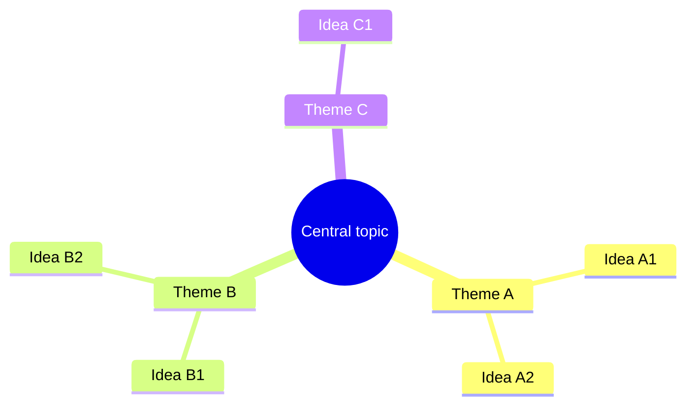

# Mind Map Skill

A mind map turns a fuzzy topic into a branching structure you can see — central idea in the middle, themes
radiating out, details hanging off each. This skill takes a topic, a brain-dump, or a document and organizes
it into a clean **Mermaid mindmap** with sensible, balanced branches.

## Required Inputs

Ask for these only if they aren't already provided:

- **The central topic** — the thing the map is about.
- **The raw material** — ideas, notes, or a document to organize (or "generate the branches" if it's a fresh brainstorm).
- **Depth / breadth** — roughly how many main branches, how deep to go.
- **Purpose** — exploring options, summarizing, planning — so the branching matches the use.

## Output Format

### [Topic] — mind map

One line on how you structured it (the organizing principle for the main branches).

**Structure note** — why these main branches, and anything that didn't fit (parked items).

## Mermaid Rules (so it renders)

- Start with `mindmap`. The center is `root((Text))`.
- Hierarchy is expressed purely by **indentation** — each deeper level is indented further. Be consistent.
- Keep node text short (a few words); no markdown, parentheses, or special characters inside nodes (except the `root(( ))`).
- Aim for balanced branches — not one giant branch and three stubs.

## Quality Checks

- [ ] Main branches are genuinely distinct themes, not overlapping or arbitrary
- [ ] Branches are reasonably balanced in depth — no single dominant limb
- [ ] Indentation is consistent so the hierarchy renders correctly
- [ ] Every item from the source material is placed or explicitly parked
- [ ] The Mermaid block renders without edits

## Anti-Patterns

- [ ] Do not produce a flat list dressed up as a map — there must be real hierarchy
- [ ] Do not make one branch huge and the rest empty — balance the structure
- [ ] Do not use long sentences as nodes — keep them to a few words
- [ ] Do not break indentation — Mermaid mindmaps derive structure from it
- [ ] Do not silently drop ideas from the source — place or park them

## Based On

Mind-mapping practice (radial hierarchy, balanced branches, MECE-ish themes), expressed as renderable Mermaid.
