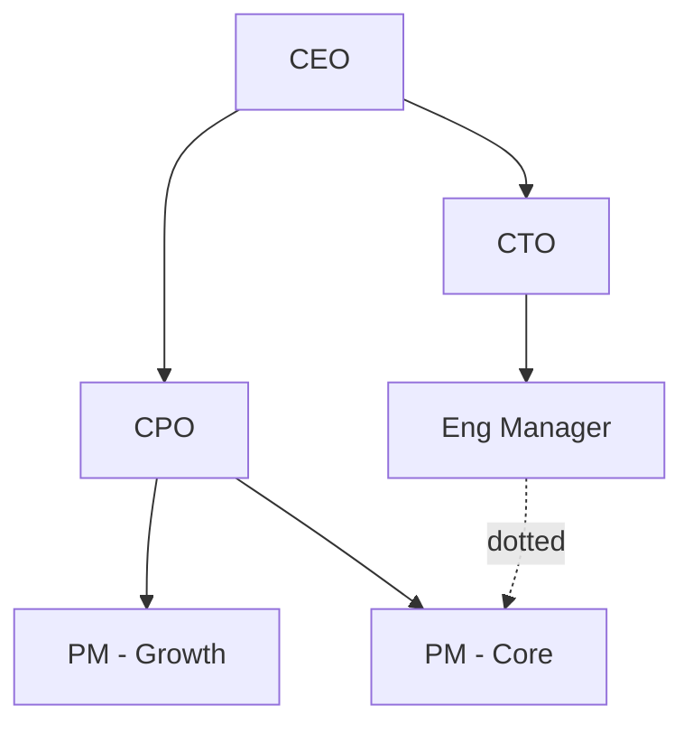

# Org Chart Skill

A reporting structure described in prose is hard to hold in your head; an org chart makes the hierarchy,
spans of control, and gaps obvious. This skill turns a described team into a clean **Mermaid org chart** —
correct reporting lines, grouped functions, and dotted lines for matrix/indirect reports.

## Required Inputs

Ask for these only if they aren't already provided:

- **The people / roles** — names and/or titles.
- **Reporting lines** — who reports to whom (the manager of each person).
- **Functional groups** (optional) — teams or departments to cluster.
- **Dotted-line relationships** (optional) — matrix or indirect reporting.

If only roles (not names) are given, chart the roles.

## Output Format

### [Team / org name] — structure

One line on scope (whole org, one department, etc.).

**Headcount** — totals by function or level, if known.

**Observations** (optional) — overloaded spans of control, vacant roles, single points of failure, unclear lines.

## Mermaid Rules (so it renders)

- Use `flowchart TD` so the hierarchy reads top-down.
- One node per person/role; manager `-->` report (arrow points down the hierarchy).
- Use dotted edges `-.dotted.->` for matrix/indirect reports so they're visually distinct.
- Keep labels to "Name - Title" or just the title; no parentheses/quotes inside labels.

## Quality Checks

- [ ] Every person/role has exactly one solid reporting line (except the top)
- [ ] Matrix/dotted relationships are shown as dotted, not solid
- [ ] Functional grouping is clear where it was provided
- [ ] Vacancies, overloaded managers, or unclear lines are noted if visible
- [ ] The Mermaid block renders without edits

## Anti-Patterns

- [ ] Do not invent reporting lines that weren't given — chart only what's known, flag gaps
- [ ] Do not mix solid and dotted lines arbitrarily — solid = direct, dotted = indirect
- [ ] Do not flatten a real hierarchy into a list — show the levels
- [ ] Do not break Mermaid with special characters in names/titles
- [ ] Do not editorialize on individuals — structural observations only

## Based On

Organizational charting (reporting lines, spans of control, matrix relationships), as renderable Mermaid.
