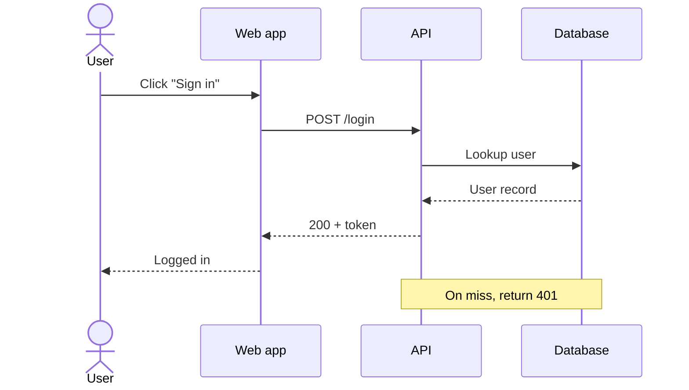

# Sequence Diagram Skill

When the question is *"in what order do these things talk to each other?"*, a sequence diagram is the
clearest answer. This skill turns a described interaction — an API call chain, an auth handshake, a webhook
flow — into a correct **Mermaid sequence diagram** with participants, ordered messages, return values, and
the important error/timeout paths.

## Required Inputs

Ask for these only if they aren't already provided:

- **The participants** — the actors/services/systems involved (client, API, DB, third party…).
- **The messages** — what each one sends to the next, in order; what comes back.
- **Sync vs async** — which calls block on a response vs fire-and-forget.
- **Edge cases** — the failure, timeout, or alternative path worth showing.

## Output Format

### [Interaction name] — sequence

One line on what flow this traces.

**Notes** — failure/timeout handling, retries, idempotency, anything async (`-)` ).

## Mermaid Rules (so it renders)

- Start with `sequenceDiagram`. Declare `participant X as Label` (or `actor`) up front.
- Solid arrow `->>` = call/request; dashed `-->>` = response/return; `-)` = async message.
- Use `Note over A,B: ...` for context and `alt/else/end` for alternative paths if needed.
- Keep message text short; no colons that aren't the message separator.

## Quality Checks

- [ ] Participants are declared and ordered to match the real call flow
- [ ] Requests and responses are distinguished (solid vs dashed arrows)
- [ ] At least one failure/edge path is shown or noted (not just the happy path)
- [ ] Sync vs async messages are visually distinct
- [ ] The Mermaid block renders without edits

## Anti-Patterns

- [ ] Do not show only the happy path when a failure path matters — note the 401/timeout/retry
- [ ] Do not blur requests and returns — use `->>` vs `-->>`
- [ ] Do not reorder messages for neatness — sequence order is the whole point
- [ ] Do not put colons inside message text — it breaks parsing
- [ ] Do not invent participants — model only the systems actually involved

## Based On

UML sequence diagramming (lifelines, sync/async messages, alt fragments), expressed as renderable Mermaid.
