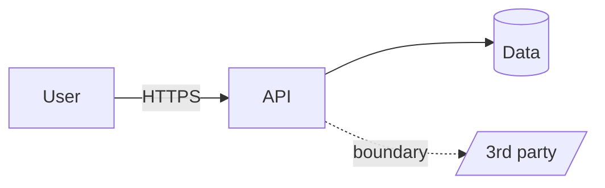

# Threat Model Skill

Security bugs are cheapest to fix at design time. Threat modeling asks, systematically, "what can go wrong
here?" — before code exists. This skill runs a structured pass: map what you're protecting and the trust
boundaries, enumerate threats with **STRIDE**, and prioritize mitigations by risk. It's for systems you own or
are authorized to assess.

## Required Inputs

Ask for these only if they aren't already provided:

- **The system/feature** — what it does, its components, and how data flows through it.
- **Assets** — what's worth protecting (data, credentials, funds, availability, reputation).
- **Trust boundaries** — where control changes hands (internet↔app, app↔DB, tenant↔tenant, user roles).
- **Actors & entry points** — users, admins, services, third parties; APIs, inputs, uploads, auth.

## Output Format

### Threat model: [system/feature]

**1. Scope & assets** — what's in scope, and the assets ranked by what their compromise would cost.

**2. Architecture & trust boundaries** — the components, data flows, and where trust boundaries sit. (A Mermaid diagram helps — the playground renders it.)

**3. Threats (STRIDE)** — walk each boundary/data-flow and enumerate threats by category:

| # | STRIDE category | Threat (how the attack works) | Asset at risk | Likelihood × Impact | Priority |
|---|---|---|---|---|---|

Cover **S**poofing, **T**ampering, **R**epudiation, **I**nformation disclosure, **D**enial of service, **E**levation of privilege — skip a category only with a reason.

**4. Mitigations (prioritized)** — for the top threats, the concrete control (authn/authz, validation, encryption, rate-limiting, logging, least privilege) and where it goes. Note residual risk you're accepting.

**5. Assumptions & out-of-scope** — trust assumptions and what this model deliberately doesn't cover.

## Quality Checks

- [ ] Assets and trust boundaries are explicit; the data-flow view makes the attack surface visible
- [ ] Threats are enumerated across all STRIDE categories (or a category is skipped with a stated reason)
- [ ] Each significant threat is rated by likelihood × impact and prioritized
- [ ] Top threats have concrete, placed mitigations — and accepted residual risk is named
- [ ] Trust assumptions and out-of-scope areas are stated

## Anti-Patterns

- [ ] Do not list generic threats — tie each to a specific boundary/data-flow in this system
- [ ] Do not skip categories silently — at least consider each STRIDE class
- [ ] Do not rate everything "high" — prioritize by realistic likelihood × impact
- [ ] Do not propose vague mitigations ("add security") — name the specific control and where it lives
- [ ] Do not model an attack on a system you don't own or aren't authorized to assess

## Based On

Threat-modeling practice (STRIDE, trust boundaries, data-flow diagrams, risk-ranked mitigations).
