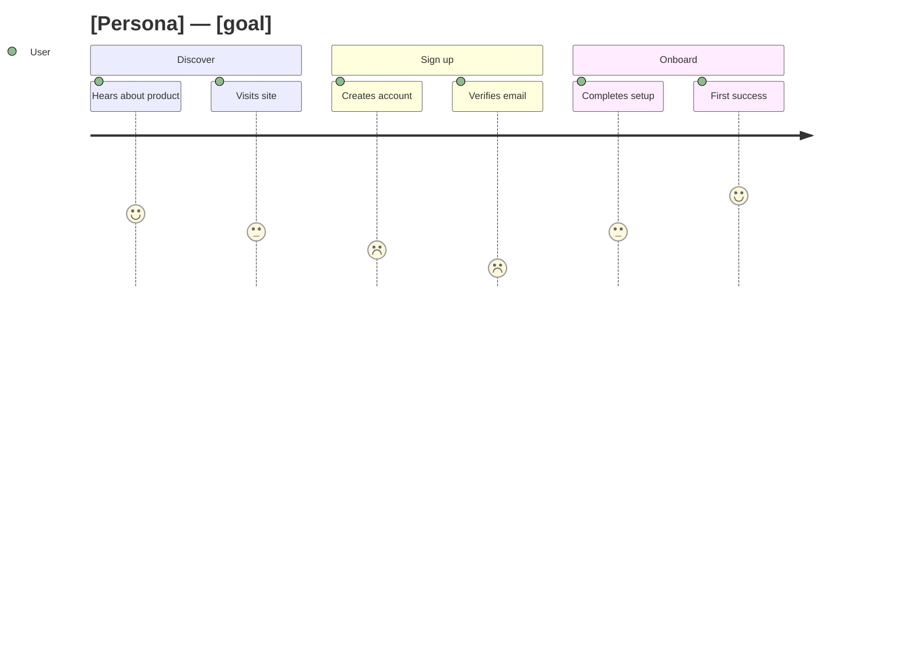

# User Journey Map Skill

A journey map shows the experience from the user's side — the steps they take, and how good or bad each
one feels — so friction becomes visible. This skill turns a described experience into a **Mermaid journey
diagram** (phases → tasks with satisfaction scores) and then calls out where the experience breaks down
and what to fix.

## Required Inputs

Ask for these only if they aren't already provided:

- **The user / persona** — whose journey this is, and their goal.
- **The phases** — the high-level stages (e.g. Discover → Sign up → Onboard → Use → Renew).
- **The steps in each phase** — the concrete actions the user takes.
- **Sentiment signal** — where it feels smooth vs painful (from research, support tickets, or stated assumptions).

## Output Format

### [Persona]'s journey: [goal]

One line on scope and goal.

(Scores are 1 = painful → 5 = delightful.)

**Friction points** — the lowest-scoring steps and *why* they hurt.

**Opportunities** — the highest-leverage fixes, tied to specific steps.

**Assumptions** — where sentiment was inferred rather than measured.

## Mermaid Rules (so it renders)

- Start with `journey` then `title ...`.
- Each `section Name` groups steps; each step is `Task name: score: Actor` (score 1–5).
- Keep task names short; no colons inside the task text (colon is the field separator).
- One actor is fine; multiple actors can share a step (`: 3: User, Support`).

## Quality Checks

- [ ] Phases follow the real order of the experience, end to end
- [ ] Each step has an honest 1–5 sentiment score (not all 3s or all 5s)
- [ ] The lowest scores are explained, and tied to concrete fixes
- [ ] Opportunities are specific and point at named steps, not generic advice
- [ ] The Mermaid block renders without edits

## Anti-Patterns

- [ ] Do not score everything positively — the map's value is exposing the painful steps
- [ ] Do not list features instead of the user's actions — stay on the user's side
- [ ] Do not skip the "why" behind low scores — a score without a reason isn't actionable
- [ ] Do not put colons inside task names — it breaks the Mermaid journey syntax
- [ ] Do not invent research — label inferred sentiment as an assumption

## Based On

Customer/user journey mapping (phases, actions, emotion curve, friction-to-opportunity), as renderable Mermaid.
